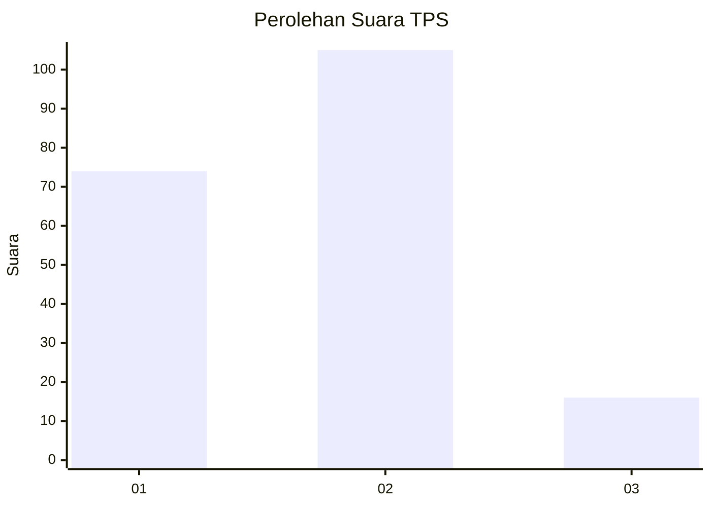
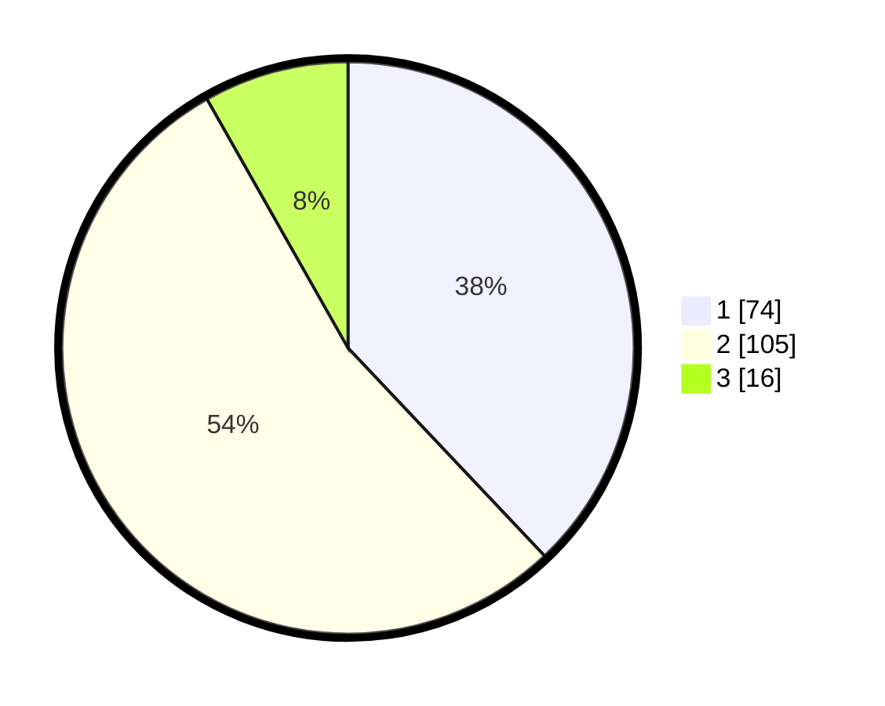

# Hasil

## Grafik

## Tabel

| No. | Nama Paslon    | Suara | Suara (raw) | Persentase |
|:--- |:-------------- | -----:| -----------:| ----------:|
| 1   | ANIES MUHAIMIN | 74    | [74][p-1]   | 37,95      |
| 2   | PRABOWO GIBRAN | 105   | [105][p-2]  | 53,85      |
| 3   | GANJAR MAHFUD  | 16    | [16][p-3]   | 8,21       |

[p-1]: https://github.com/gigit-pemilu/pemilu-2024/blob/main/pilpres/hitung-suara/sub/32-jawa-barat/sub/73-kota-bandung/sub/06-cicendo/sub/1001-husein-sastranegara/sub/005-tps/sub/paslon-1.txt
[p-2]: https://github.com/gigit-pemilu/pemilu-2024/blob/main/pilpres/hitung-suara/sub/32-jawa-barat/sub/73-kota-bandung/sub/06-cicendo/sub/1001-husein-sastranegara/sub/005-tps/sub/paslon-2.txt
[p-3]: https://github.com/gigit-pemilu/pemilu-2024/blob/main/pilpres/hitung-suara/sub/32-jawa-barat/sub/73-kota-bandung/sub/06-cicendo/sub/1001-husein-sastranegara/sub/005-tps/sub/paslon-3.txt

## Foto C Plano

https://sirekap-obj-formc.kpu.go.id/9319/pemilu/ppwp/32/73/06/10/01/3273061001005-20240214-201244--2f2f3d69-7503-44ff-820c-d3c76bba6175.jpg

https://sirekap-obj-formc.kpu.go.id/9319/pemilu/ppwp/32/73/06/10/01/3273061001005-20240214-201317--8286f592-702d-4d56-a3e5-97a4dce3a3be.jpg

https://sirekap-obj-formc.kpu.go.id/9319/pemilu/ppwp/32/73/06/10/01/3273061001005-20240214-201338--2f0889bc-6d84-4543-8b0d-c570abd72113.jpg

## Metadata

| Key        | Value               |
| ---------- | ------------------- |
| Time Stamp | 2024-02-15 12:00:28 |

