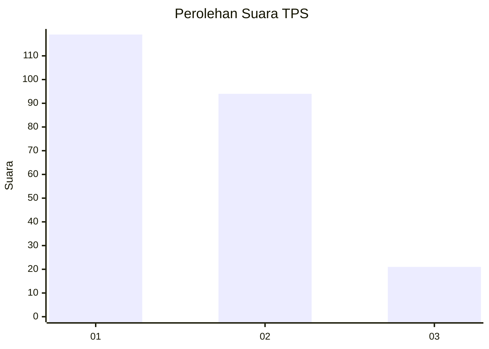
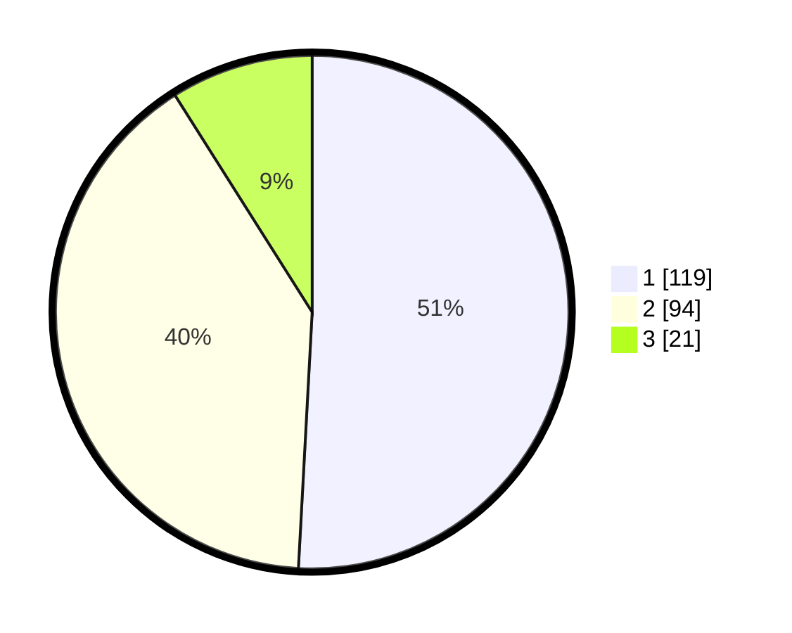

# Hasil

## Grafik

## Tabel

| No. | Nama Paslon    | Suara | Suara (raw) | Persentase |
|:--- |:-------------- | -----:| -----------:| ----------:|
| 1   | ANIES MUHAIMIN | 119   | [119][p-1]  | 50,85      |
| 2   | PRABOWO GIBRAN | 94    | [94][p-2]   | 40,17      |
| 3   | GANJAR MAHFUD  | 21    | [21][p-3]   | 8,97       |

[p-1]: https://github.com/gigit-pemilu/pemilu-2024/blob/main/pilpres/hitung-suara/sub/32-jawa-barat/sub/73-kota-bandung/sub/06-cicendo/sub/1001-husein-sastranegara/sub/008-tps/sub/paslon-1.txt
[p-2]: https://github.com/gigit-pemilu/pemilu-2024/blob/main/pilpres/hitung-suara/sub/32-jawa-barat/sub/73-kota-bandung/sub/06-cicendo/sub/1001-husein-sastranegara/sub/008-tps/sub/paslon-2.txt
[p-3]: https://github.com/gigit-pemilu/pemilu-2024/blob/main/pilpres/hitung-suara/sub/32-jawa-barat/sub/73-kota-bandung/sub/06-cicendo/sub/1001-husein-sastranegara/sub/008-tps/sub/paslon-3.txt

## Foto C Plano

https://sirekap-obj-formc.kpu.go.id/88c0/pemilu/ppwp/32/73/06/10/01/3273061001008-20240214-201208--498a99c3-c088-4724-b6f4-e5cf22869d4f.jpg

https://sirekap-obj-formc.kpu.go.id/88c0/pemilu/ppwp/32/73/06/10/01/3273061001008-20240214-201305--2fc3146d-6850-4cae-9a30-b09ff5545377.jpg

https://sirekap-obj-formc.kpu.go.id/88c0/pemilu/ppwp/32/73/06/10/01/3273061001008-20240214-201409--1c71eda1-c4d7-46e0-9d7f-3e2a11587a1f.jpg

## Metadata

| Key        | Value               |
| ---------- | ------------------- |
| Time Stamp | 2024-02-15 12:00:28 |

