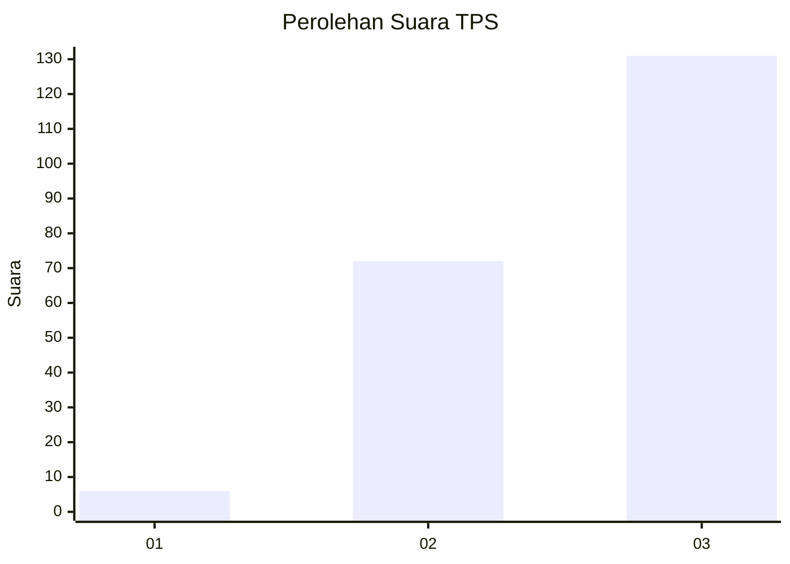
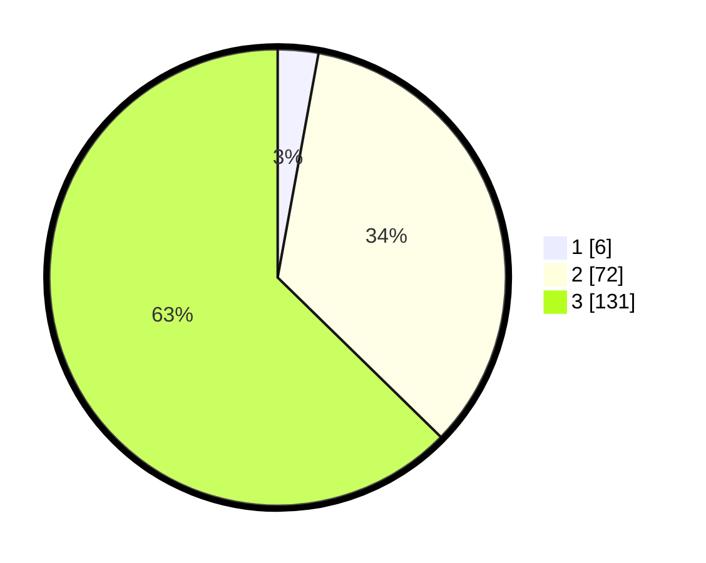

# Hasil

## Grafik

## Tabel

| No. | Nama Paslon    | Suara | Suara (raw) | Persentase |
|:--- |:-------------- | -----:| -----------:| ----------:|
| 1   | ANIES MUHAIMIN | 6     | [6][p-1]    | 2,87       |
| 2   | PRABOWO GIBRAN | 72    | [72][p-2]   | 34,45      |
| 3   | GANJAR MAHFUD  | 131   | [131][p-3]  | 62,68      |

[p-1]: https://github.com/gigit-pemilu/pemilu-2024/blob/main/pilpres/hitung-suara/sub/32-jawa-barat/sub/73-kota-bandung/sub/06-cicendo/sub/1002-arjuna/sub/001-tps/sub/paslon-1.txt
[p-2]: https://github.com/gigit-pemilu/pemilu-2024/blob/main/pilpres/hitung-suara/sub/32-jawa-barat/sub/73-kota-bandung/sub/06-cicendo/sub/1002-arjuna/sub/001-tps/sub/paslon-2.txt
[p-3]: https://github.com/gigit-pemilu/pemilu-2024/blob/main/pilpres/hitung-suara/sub/32-jawa-barat/sub/73-kota-bandung/sub/06-cicendo/sub/1002-arjuna/sub/001-tps/sub/paslon-3.txt

## Foto C Plano

https://sirekap-obj-formc.kpu.go.id/2c5c/pemilu/ppwp/32/73/06/10/02/3273061002001-20240214-204215--7709910b-b0de-4b15-a06d-d29cd6a1706e.jpg

https://sirekap-obj-formc.kpu.go.id/2c5c/pemilu/ppwp/32/73/06/10/02/3273061002001-20240214-204255--3b17a38f-68bc-4eda-b861-149dc41ab817.jpg

https://sirekap-obj-formc.kpu.go.id/2c5c/pemilu/ppwp/32/73/06/10/02/3273061002001-20240214-204310--f5f96d04-04fd-4a72-94f6-915f1e1bc78d.jpg

## Metadata

| Key        | Value               |
| ---------- | ------------------- |
| Time Stamp | 2024-02-15 01:47:43 |

