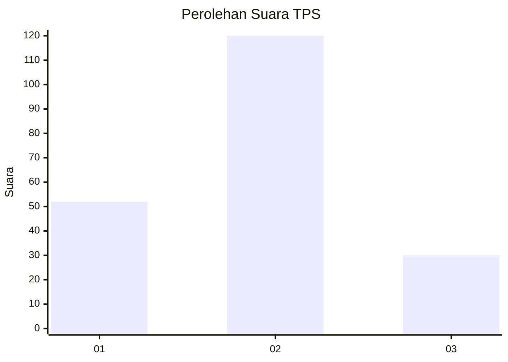
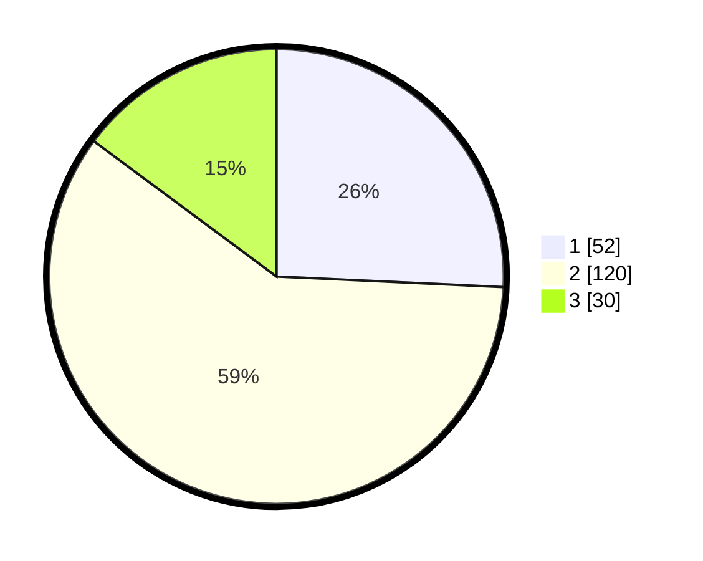

# Hasil

## Grafik

## Tabel

| No. | Nama Paslon    | Suara | Suara (raw) | Persentase |
|:--- |:-------------- | -----:| -----------:| ----------:|
| 1   | ANIES MUHAIMIN | 52    | [52][p-1]   | 25,74      |
| 2   | PRABOWO GIBRAN | 120   | [120][p-2]  | 59,41      |
| 3   | GANJAR MAHFUD  | 30    | [30][p-3]   | 14,85      |

[p-1]: https://github.com/gigit-pemilu/pemilu-2024/blob/main/pilpres/hitung-suara/sub/32-jawa-barat/sub/73-kota-bandung/sub/08-cidadap/sub/1001-hegarmanah/sub/003-tps/sub/paslon-1.txt
[p-2]: https://github.com/gigit-pemilu/pemilu-2024/blob/main/pilpres/hitung-suara/sub/32-jawa-barat/sub/73-kota-bandung/sub/08-cidadap/sub/1001-hegarmanah/sub/003-tps/sub/paslon-2.txt
[p-3]: https://github.com/gigit-pemilu/pemilu-2024/blob/main/pilpres/hitung-suara/sub/32-jawa-barat/sub/73-kota-bandung/sub/08-cidadap/sub/1001-hegarmanah/sub/003-tps/sub/paslon-3.txt

## Foto C Plano

https://sirekap-obj-formc.kpu.go.id/fa3c/pemilu/ppwp/32/73/08/10/01/3273081001003-20240214-211313--4b53d176-d714-47cd-8c4a-e7d8e4ecef47.jpg

https://sirekap-obj-formc.kpu.go.id/fa3c/pemilu/ppwp/32/73/08/10/01/3273081001003-20240214-211556--a8fd9e89-c693-4dae-9080-514ffce1a8df.jpg

https://sirekap-obj-formc.kpu.go.id/fa3c/pemilu/ppwp/32/73/08/10/01/3273081001003-20240214-211913--26442a5d-557b-4ad4-b050-944b3f82ee46.jpg

## Metadata

| Key        | Value               |
| ---------- | ------------------- |
| Time Stamp | 2024-02-24 22:31:28 |

