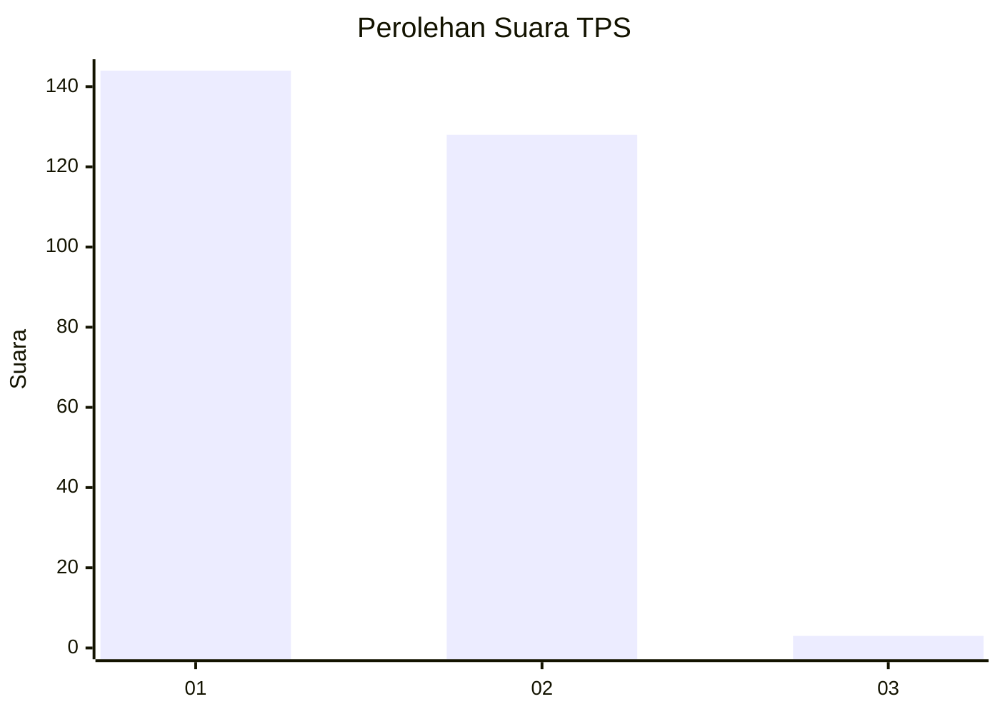
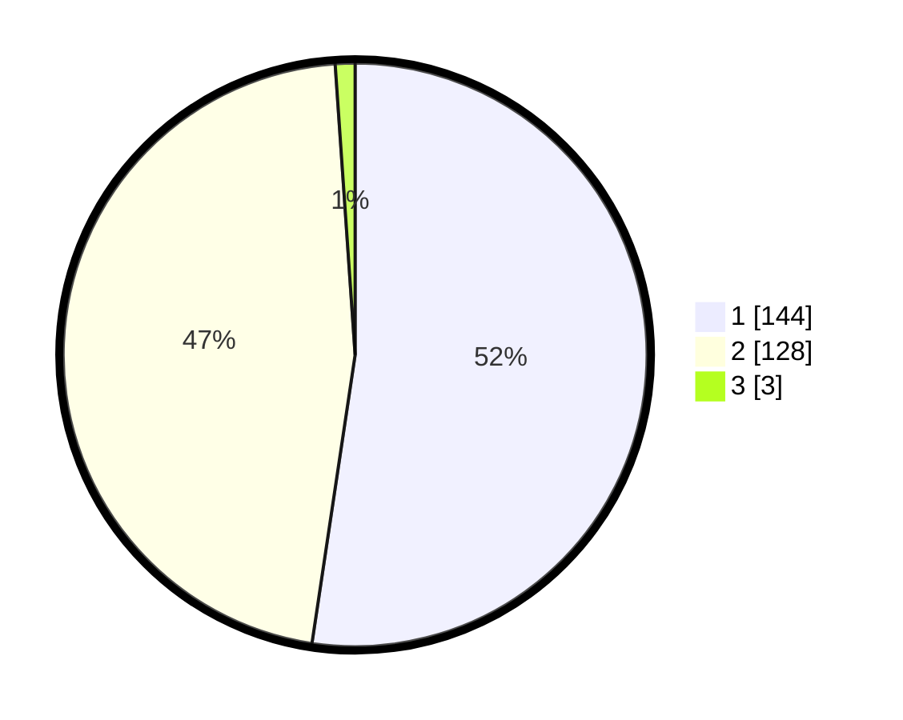

# Hasil

## Grafik

## Tabel

| No. | Nama Paslon    | Suara | Suara (raw) | Persentase |
|:--- |:-------------- | -----:| -----------:| ----------:|
| 1   | ANIES MUHAIMIN | 144   | [144][p-1]  | 52,36      |
| 2   | PRABOWO GIBRAN | 128   | [128][p-2]  | 46,55      |
| 3   | GANJAR MAHFUD  | 3     | [3][p-3]    | 1,09       |

[p-1]: https://github.com/gigit-pemilu/pemilu-2024-32-jawa-barat/blob/main/pilpres/hitung-suara/sub/32-jawa-barat/sub/73-kota-bandung/sub/08-cidadap/sub/1001-hegarmanah/sub/033-tps/sub/paslon-1.txt
[p-2]: https://github.com/gigit-pemilu/pemilu-2024-32-jawa-barat/blob/main/pilpres/hitung-suara/sub/32-jawa-barat/sub/73-kota-bandung/sub/08-cidadap/sub/1001-hegarmanah/sub/033-tps/sub/paslon-2.txt
[p-3]: https://github.com/gigit-pemilu/pemilu-2024-32-jawa-barat/blob/main/pilpres/hitung-suara/sub/32-jawa-barat/sub/73-kota-bandung/sub/08-cidadap/sub/1001-hegarmanah/sub/033-tps/sub/paslon-3.txt

## Foto C Plano

https://sirekap-obj-formc.kpu.go.id/a61e/pemilu/ppwp/32/73/08/10/01/3273081001033-20240216-163820--089b1e5c-c766-4785-8fdd-8d1f5e1cc785.jpg

https://sirekap-obj-formc.kpu.go.id/a61e/pemilu/ppwp/32/73/08/10/01/3273081001033-20240216-190333--70dcc9f4-3cb8-4f20-aaea-8035dd39a4d5.jpg

https://sirekap-obj-formc.kpu.go.id/a61e/pemilu/ppwp/32/73/08/10/01/3273081001033-20240217-061636--35551d67-53b5-4511-9eaa-790fa3116b87.jpg

## Metadata

| Key        | Value               |
| ---------- | ------------------- |
| Time Stamp | 2024-02-24 22:31:28 |

