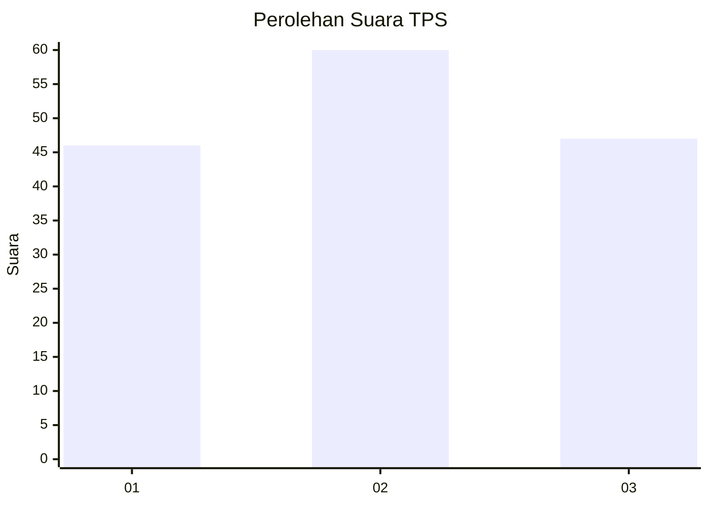
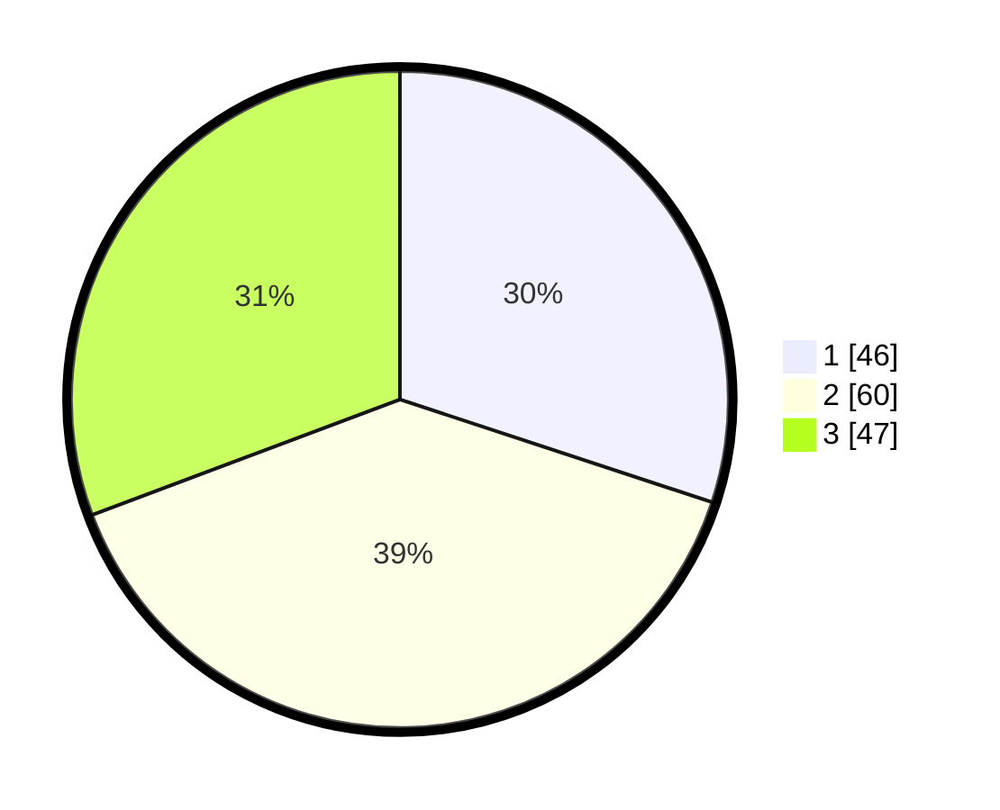

# Hasil

## Grafik

## Tabel

| No. | Nama Paslon    | Suara | Suara (raw) | Persentase |
|:--- |:-------------- | -----:| -----------:| ----------:|
| 1   | ANIES MUHAIMIN | 46    | [46][p-1]   | 30,07      |
| 2   | PRABOWO GIBRAN | 60    | [60][p-2]   | 39,22      |
| 3   | GANJAR MAHFUD  | 47    | [47][p-3]   | 30,72      |

[p-1]: https://github.com/gigit-pemilu/pemilu-2024/blob/main/pilpres/hitung-suara/sub/32-jawa-barat/sub/73-kota-bandung/sub/09-bandung-wetan/sub/1001-cihapit/sub/004-tps/sub/paslon-1.txt
[p-2]: https://github.com/gigit-pemilu/pemilu-2024/blob/main/pilpres/hitung-suara/sub/32-jawa-barat/sub/73-kota-bandung/sub/09-bandung-wetan/sub/1001-cihapit/sub/004-tps/sub/paslon-2.txt
[p-3]: https://github.com/gigit-pemilu/pemilu-2024/blob/main/pilpres/hitung-suara/sub/32-jawa-barat/sub/73-kota-bandung/sub/09-bandung-wetan/sub/1001-cihapit/sub/004-tps/sub/paslon-3.txt

## Foto C Plano

https://sirekap-obj-formc.kpu.go.id/c55e/pemilu/ppwp/32/73/09/10/01/3273091001004-20240215-012924--a491135e-c9e8-41df-89c6-93e4ec199dc6.jpg

https://sirekap-obj-formc.kpu.go.id/c55e/pemilu/ppwp/32/73/09/10/01/3273091001004-20240215-012928--93f5f1e5-5ccb-4bd7-914b-739277cf2fcf.jpg

https://sirekap-obj-formc.kpu.go.id/c55e/pemilu/ppwp/32/73/09/10/01/3273091001004-20240215-012930--7604e25b-0d51-4478-a99d-aba72a36ad08.jpg

## Metadata

| Key        | Value               |
| ---------- | ------------------- |
| Time Stamp | 2024-02-24 22:31:28 |

