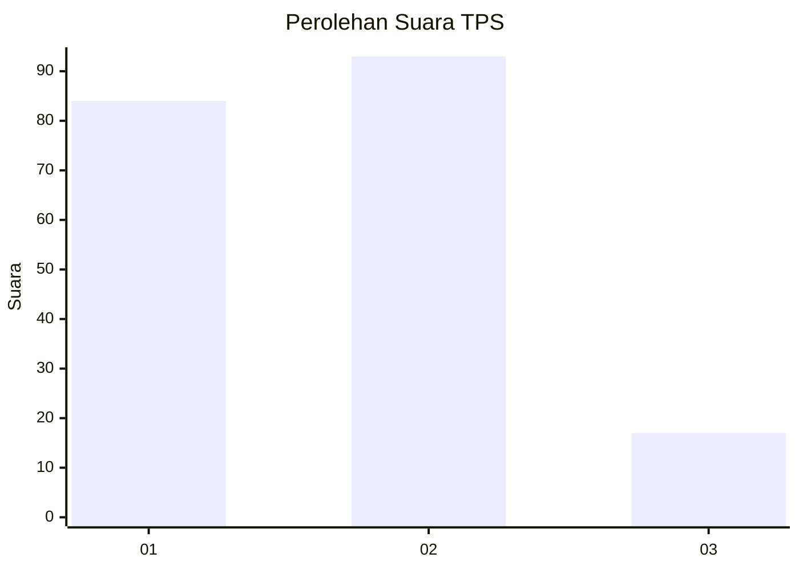
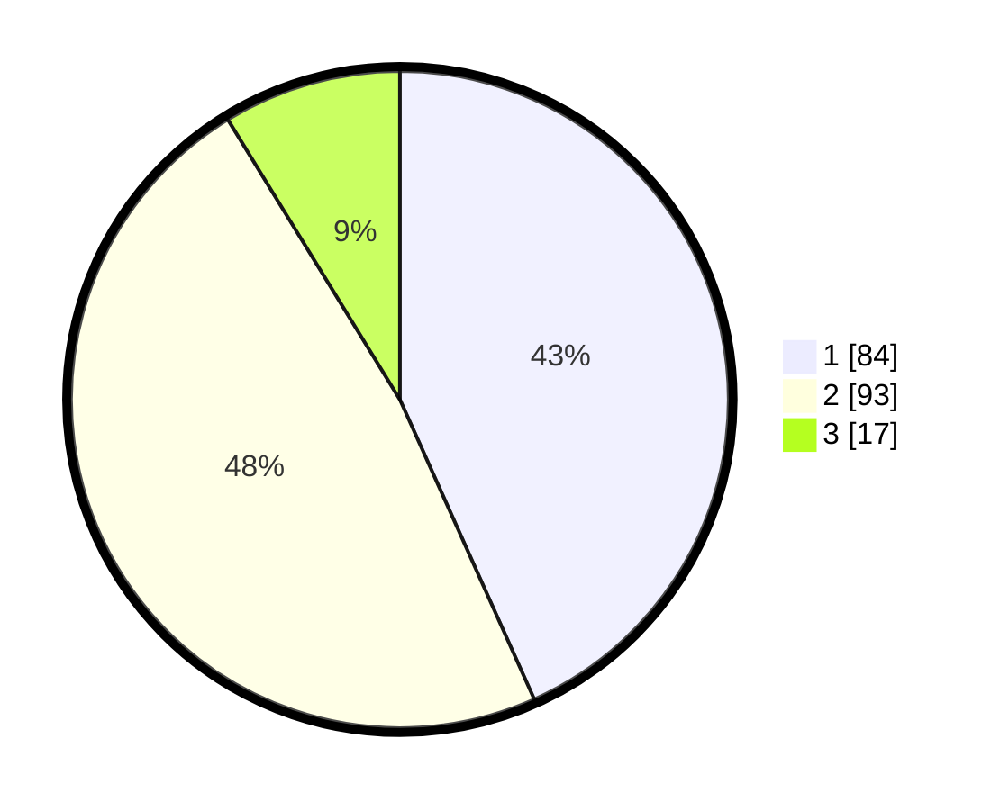

# Hasil

## Grafik

## Tabel

| No. | Nama Paslon    | Suara | Suara (raw) | Persentase |
|:--- |:-------------- | -----:| -----------:| ----------:|
| 1   | ANIES MUHAIMIN | 84    | [84][p-1]   | 43,30      |
| 2   | PRABOWO GIBRAN | 93    | [93][p-2]   | 47,94      |
| 3   | GANJAR MAHFUD  | 17    | [17][p-3]   | 8,76       |

[p-1]: https://github.com/gigit-pemilu/pemilu-2024/blob/main/pilpres/hitung-suara/sub/32-jawa-barat/sub/73-kota-bandung/sub/10-astana-anyar/sub/1006-pelindung-hewan/sub/043-tps/sub/paslon-1.txt
[p-2]: https://github.com/gigit-pemilu/pemilu-2024/blob/main/pilpres/hitung-suara/sub/32-jawa-barat/sub/73-kota-bandung/sub/10-astana-anyar/sub/1006-pelindung-hewan/sub/043-tps/sub/paslon-2.txt
[p-3]: https://github.com/gigit-pemilu/pemilu-2024/blob/main/pilpres/hitung-suara/sub/32-jawa-barat/sub/73-kota-bandung/sub/10-astana-anyar/sub/1006-pelindung-hewan/sub/043-tps/sub/paslon-3.txt

## Foto C Plano

https://sirekap-obj-formc.kpu.go.id/c1d2/pemilu/ppwp/32/73/10/10/06/3273101006043-20240214-205143--a9082d08-52ad-4bba-962a-2f3175edb7b0.jpg

https://sirekap-obj-formc.kpu.go.id/c1d2/pemilu/ppwp/32/73/10/10/06/3273101006043-20240214-205146--e16bd9a5-94ba-4d62-b54a-382b844638df.jpg

https://sirekap-obj-formc.kpu.go.id/c1d2/pemilu/ppwp/32/73/10/10/06/3273101006043-20240216-172404--8c2ab1ef-4b74-40ed-b048-ec8d702e220d.jpg

## Metadata

| Key        | Value               |
| ---------- | ------------------- |
| Time Stamp | 2024-02-16 17:30:00 |

## DATA PEMILIH TETAP

Jumlah pemilih dalam DPT: **227**.
 * L: **467**.
 * P: **420**.

## DATA PENGGUNA HAK PILIH

Jumlah pengguna hak pilih dalam DPT: **494**.
 * L: **92**.
 * P: **2**.

Jumlah pengguna hak pilih dalam DPTb: **0**.
 * L: **9**.
 * P: **7**.

Jumlah pengguna hak pilih dalam DPK: **6**.
 * L: **0**.
 * P: **4**.

Jumlah pengguna hak pilih: **495**.
 * L: **92**.
 * P: **493**.

## JUMLAH SUARA SAH DAN TIDAK SAH

JUMLAH SELURUH SUARA SAH: **194**.

JUMLAH SUARA TIDAK SAH: **1**.

JUMLAH SELURUH SUARA SAH DAN SUARA TIDAK SAH: **195**.

