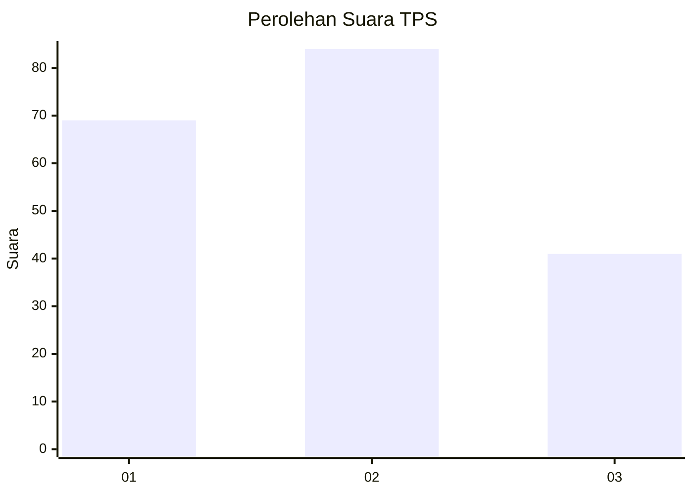
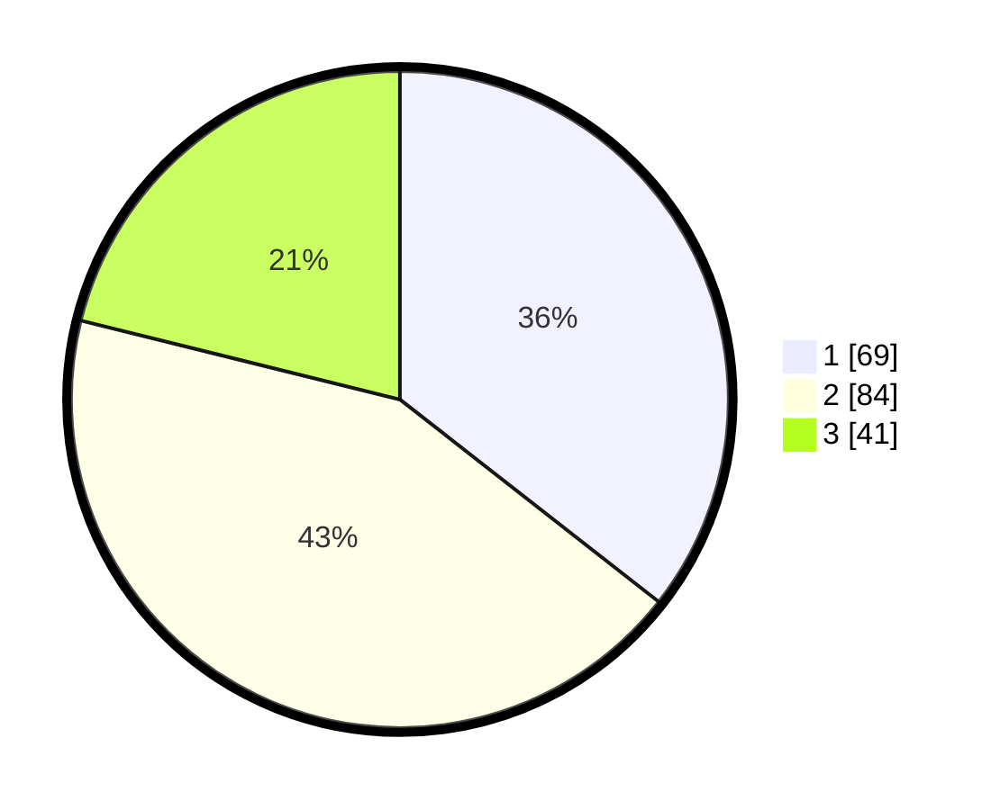

# Hasil

## Grafik

## Tabel

| No. | Nama Paslon    | Suara | Suara (raw) | Persentase |
|:--- |:-------------- | -----:| -----------:| ----------:|
| 1   | ANIES MUHAIMIN | 69    | [69][p-1]   | 35,57      |
| 2   | PRABOWO GIBRAN | 84    | [84][p-2]   | 43,30      |
| 3   | GANJAR MAHFUD  | 41    | [41][p-3]   | 21,13      |

[p-1]: https://github.com/gigit-pemilu/pemilu-2024-32-jawa-barat/blob/main/pilpres/hitung-suara/sub/32-jawa-barat/sub/73-kota-bandung/sub/11-regol/sub/1001-cigereleng/sub/002-tps/sub/paslon-1.txt
[p-2]: https://github.com/gigit-pemilu/pemilu-2024-32-jawa-barat/blob/main/pilpres/hitung-suara/sub/32-jawa-barat/sub/73-kota-bandung/sub/11-regol/sub/1001-cigereleng/sub/002-tps/sub/paslon-2.txt
[p-3]: https://github.com/gigit-pemilu/pemilu-2024-32-jawa-barat/blob/main/pilpres/hitung-suara/sub/32-jawa-barat/sub/73-kota-bandung/sub/11-regol/sub/1001-cigereleng/sub/002-tps/sub/paslon-3.txt

## Foto C Plano

https://sirekap-obj-formc.kpu.go.id/a5d4/pemilu/ppwp/32/73/11/10/01/3273111001002-20240215-030147--6371fbcc-d5d1-4d2e-9233-bdc1b608ad6a.jpg

https://sirekap-obj-formc.kpu.go.id/a5d4/pemilu/ppwp/32/73/11/10/01/3273111001002-20240215-030200--d22379e8-2826-499f-9c8f-19d4569775df.jpg

https://sirekap-obj-formc.kpu.go.id/a5d4/pemilu/ppwp/32/73/11/10/01/3273111001002-20240215-030204--ca90abe7-9d0f-403c-8782-0802dc739a51.jpg

## Metadata

| Key        | Value               |
| ---------- | ------------------- |
| Time Stamp | 2024-02-15 15:00:29 |

