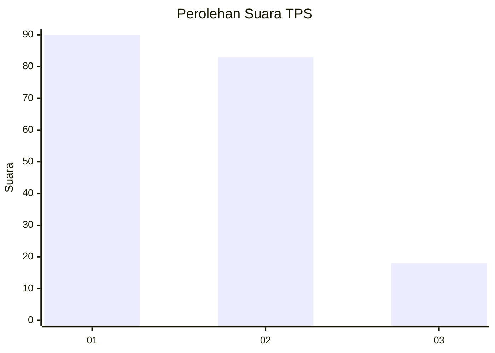
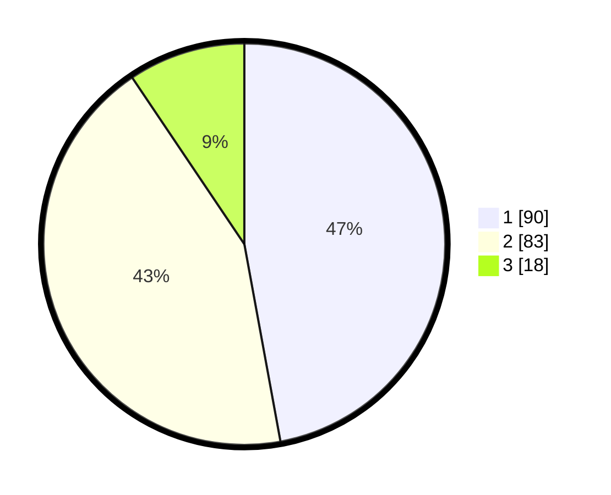

# Hasil

## Grafik

## Tabel

| No. | Nama Paslon    | Suara | Suara (raw) | Persentase |
|:--- |:-------------- | -----:| -----------:| ----------:|
| 1   | ANIES MUHAIMIN | 90    | [90][p-1]   | 47,12      |
| 2   | PRABOWO GIBRAN | 83    | [83][p-2]   | 43,46      |
| 3   | GANJAR MAHFUD  | 18    | [18][p-3]   | 9,42       |

[p-1]: https://github.com/gigit-pemilu/pemilu-2024/blob/main/pilpres/hitung-suara/sub/32-jawa-barat/sub/73-kota-bandung/sub/13-lengkong/sub/1001-cijagra/sub/004-tps/sub/paslon-1.txt
[p-2]: https://github.com/gigit-pemilu/pemilu-2024/blob/main/pilpres/hitung-suara/sub/32-jawa-barat/sub/73-kota-bandung/sub/13-lengkong/sub/1001-cijagra/sub/004-tps/sub/paslon-2.txt
[p-3]: https://github.com/gigit-pemilu/pemilu-2024/blob/main/pilpres/hitung-suara/sub/32-jawa-barat/sub/73-kota-bandung/sub/13-lengkong/sub/1001-cijagra/sub/004-tps/sub/paslon-3.txt

## Foto C Plano

https://sirekap-obj-formc.kpu.go.id/7906/pemilu/ppwp/32/73/13/10/01/3273131001004-20240217-094620--83925651-c51d-4dd8-bb3f-cc67f4d27de7.jpg

https://sirekap-obj-formc.kpu.go.id/7906/pemilu/ppwp/32/73/13/10/01/3273131001004-20240214-155450--f1c29398-bdb2-447d-a431-aba0a4df6c54.jpg

https://sirekap-obj-formc.kpu.go.id/7906/pemilu/ppwp/32/73/13/10/01/3273131001004-20240214-155532--c2630bb8-2c87-4777-aaba-ed6d1f1b301e.jpg

## Metadata

| Key        | Value               |
| ---------- | ------------------- |
| Time Stamp | 2024-02-17 10:00:02 |

