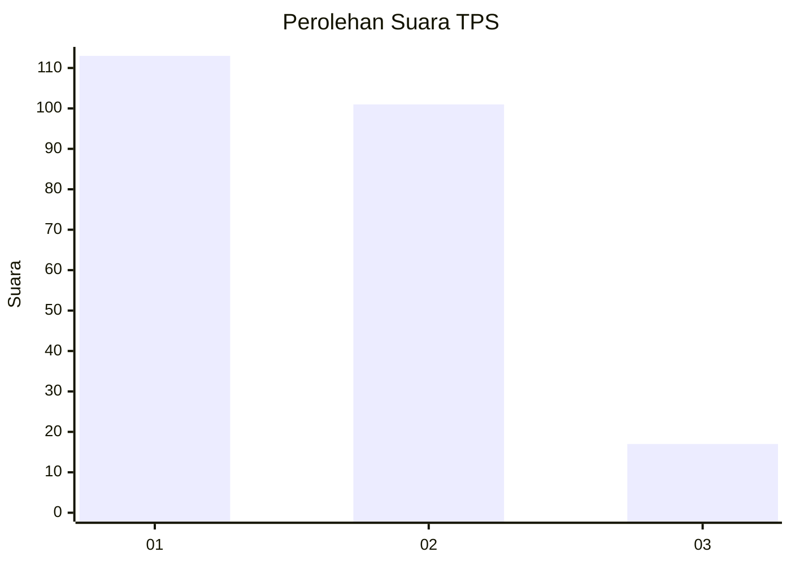
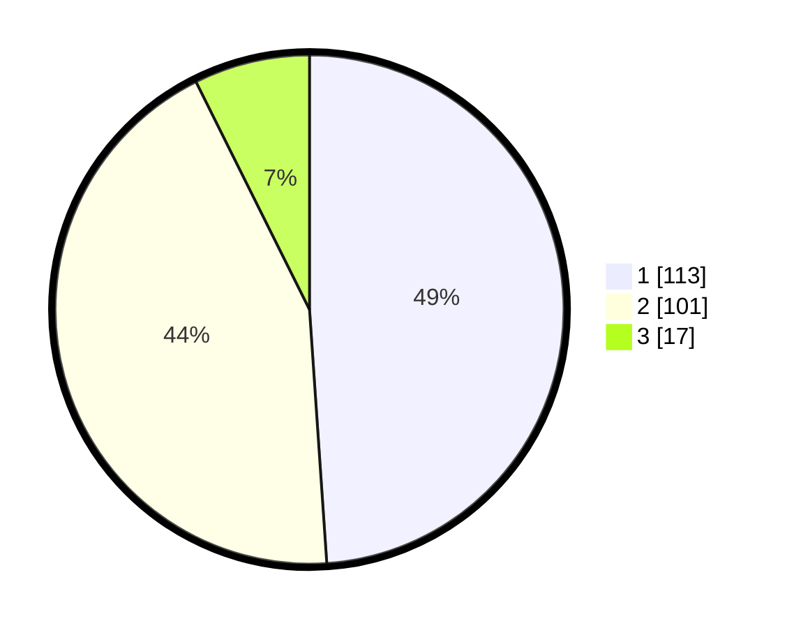

# Hasil

## Grafik

## Tabel

| No. | Nama Paslon    | Suara | Suara (raw) | Persentase |
|:--- |:-------------- | -----:| -----------:| ----------:|
| 1   | ANIES MUHAIMIN | 113   | [113][p-1]  | 48,92      |
| 2   | PRABOWO GIBRAN | 101   | [101][p-2]  | 43,72      |
| 3   | GANJAR MAHFUD  | 17    | [17][p-3]   | 7,36       |

[p-1]: https://github.com/gigit-pemilu/pemilu-2024/blob/main/pilpres/hitung-suara/sub/32-jawa-barat/sub/73-kota-bandung/sub/13-lengkong/sub/1001-cijagra/sub/005-tps/sub/paslon-1.txt
[p-2]: https://github.com/gigit-pemilu/pemilu-2024/blob/main/pilpres/hitung-suara/sub/32-jawa-barat/sub/73-kota-bandung/sub/13-lengkong/sub/1001-cijagra/sub/005-tps/sub/paslon-2.txt
[p-3]: https://github.com/gigit-pemilu/pemilu-2024/blob/main/pilpres/hitung-suara/sub/32-jawa-barat/sub/73-kota-bandung/sub/13-lengkong/sub/1001-cijagra/sub/005-tps/sub/paslon-3.txt

## Foto C Plano

https://sirekap-obj-formc.kpu.go.id/bc39/pemilu/ppwp/32/73/13/10/01/3273131001005-20240217-124513--ab5d4a32-f67f-4789-acb2-11e80ad86ab8.jpg

https://sirekap-obj-formc.kpu.go.id/bc39/pemilu/ppwp/32/73/13/10/01/3273131001005-20240215-130456--be52fcdf-8144-4b85-9ed6-8466d203f097.jpg

https://sirekap-obj-formc.kpu.go.id/bc39/pemilu/ppwp/32/73/13/10/01/3273131001005-20240215-130458--e89a61cd-a793-49eb-9b71-e1ccb448e541.jpg

## Metadata

| Key        | Value               |
| ---------- | ------------------- |
| Time Stamp | 2024-02-17 13:37:34 |

