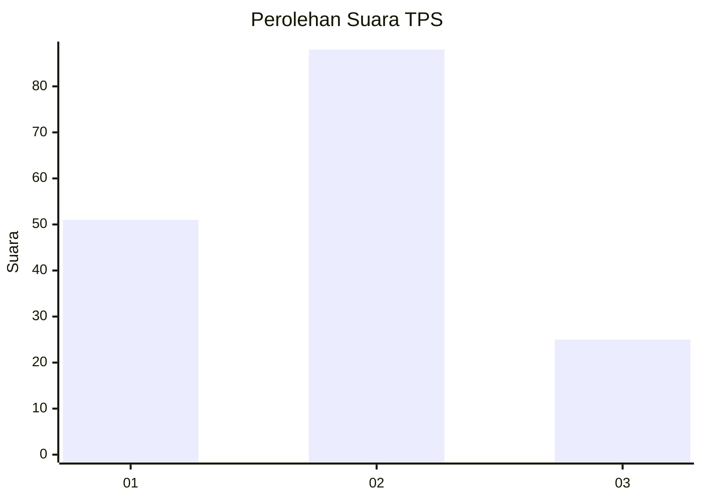
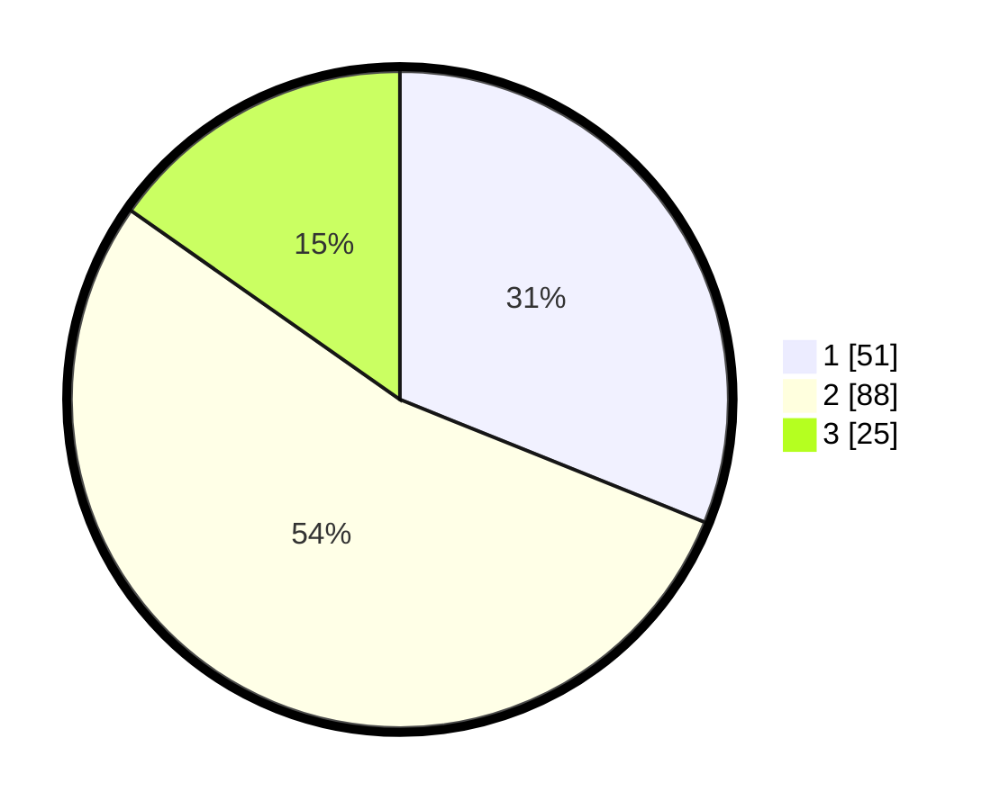

# Hasil

## Grafik

## Tabel

| No. | Nama Paslon    | Suara | Suara (raw) | Persentase |
|:--- |:-------------- | -----:| -----------:| ----------:|
| 1   | ANIES MUHAIMIN | 51    | [51][p-1]   | 31,10      |
| 2   | PRABOWO GIBRAN | 88    | [88][p-2]   | 53,66      |
| 3   | GANJAR MAHFUD  | 25    | [25][p-3]   | 15,24      |

[p-1]: https://github.com/gigit-pemilu/pemilu-2024-32-jawa-barat/blob/main/pilpres/hitung-suara/sub/32-jawa-barat/sub/73-kota-bandung/sub/14-cibeunying-kidul/sub/1001-padasuka/sub/002-tps/sub/paslon-1.txt
[p-2]: https://github.com/gigit-pemilu/pemilu-2024-32-jawa-barat/blob/main/pilpres/hitung-suara/sub/32-jawa-barat/sub/73-kota-bandung/sub/14-cibeunying-kidul/sub/1001-padasuka/sub/002-tps/sub/paslon-2.txt
[p-3]: https://github.com/gigit-pemilu/pemilu-2024-32-jawa-barat/blob/main/pilpres/hitung-suara/sub/32-jawa-barat/sub/73-kota-bandung/sub/14-cibeunying-kidul/sub/1001-padasuka/sub/002-tps/sub/paslon-3.txt

## Foto C Plano

https://sirekap-obj-formc.kpu.go.id/89c9/pemilu/ppwp/32/73/14/10/01/3273141001002-20240215-181358--5195b7f1-633f-46ae-a7ba-2deea82e0e24.jpg

https://sirekap-obj-formc.kpu.go.id/89c9/pemilu/ppwp/32/73/14/10/01/3273141001002-20240215-181617--53cae063-27e8-4cf0-a004-d1ffa7ae3938.jpg

https://sirekap-obj-formc.kpu.go.id/89c9/pemilu/ppwp/32/73/14/10/01/3273141001002-20240215-181820--0328c32b-829e-4bb2-94aa-91636891af31.jpg

## Metadata

| Key        | Value               |
| ---------- | ------------------- |
| Time Stamp | 2024-02-16 11:00:29 |

