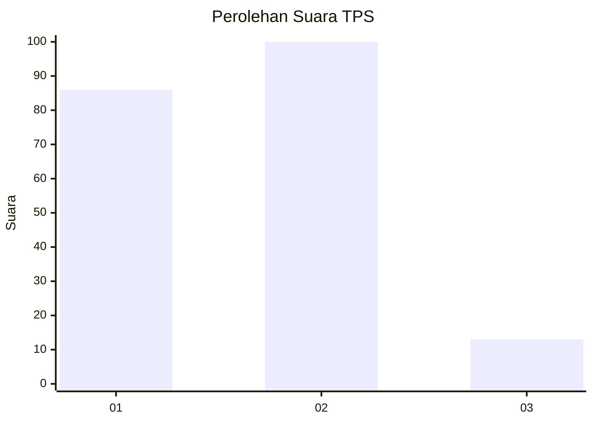
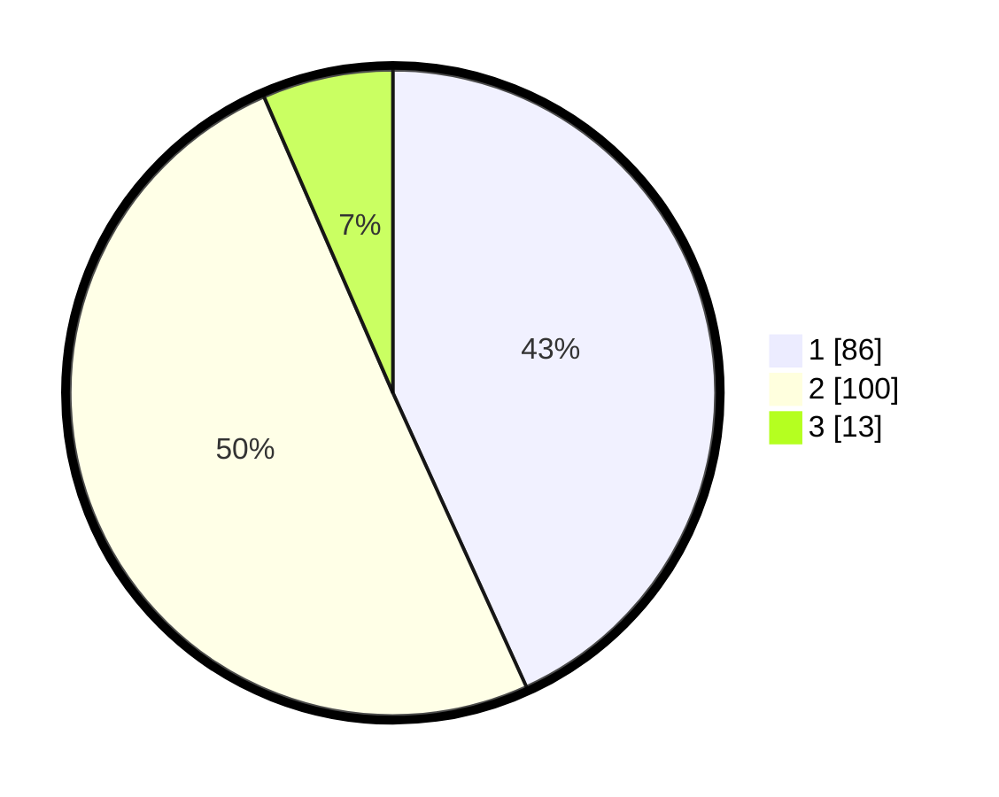

# Hasil

## Grafik

## Tabel

| No. | Nama Paslon    | Suara | Suara (raw) | Persentase |
|:--- |:-------------- | -----:| -----------:| ----------:|
| 1   | ANIES MUHAIMIN | 86    | [86][p-1]   | 43,22      |
| 2   | PRABOWO GIBRAN | 100   | [100][p-2]  | 50,25      |
| 3   | GANJAR MAHFUD  | 13    | [13][p-3]   | 6,53       |

[p-1]: https://github.com/gigit-pemilu/pemilu-2024/blob/main/pilpres/hitung-suara/sub/32-jawa-barat/sub/73-kota-bandung/sub/15-bandung-kulon/sub/1001-cijerah/sub/010-tps/sub/paslon-1.txt
[p-2]: https://github.com/gigit-pemilu/pemilu-2024/blob/main/pilpres/hitung-suara/sub/32-jawa-barat/sub/73-kota-bandung/sub/15-bandung-kulon/sub/1001-cijerah/sub/010-tps/sub/paslon-2.txt
[p-3]: https://github.com/gigit-pemilu/pemilu-2024/blob/main/pilpres/hitung-suara/sub/32-jawa-barat/sub/73-kota-bandung/sub/15-bandung-kulon/sub/1001-cijerah/sub/010-tps/sub/paslon-3.txt

## Foto C Plano

https://sirekap-obj-formc.kpu.go.id/9760/pemilu/ppwp/32/73/15/10/01/3273151001010-20240214-223140--419ccc91-d5c5-46ae-86de-5851ea3b9c97.jpg

https://sirekap-obj-formc.kpu.go.id/9760/pemilu/ppwp/32/73/15/10/01/3273151001010-20240214-155205--45e04366-8c7b-46ea-91b8-70fab0d0c212.jpg

https://sirekap-obj-formc.kpu.go.id/9760/pemilu/ppwp/32/73/15/10/01/3273151001010-20240214-155311--1cdd98ba-23a0-4332-b646-91c4f769c23f.jpg

## Metadata

| Key        | Value               |
| ---------- | ------------------- |
| Time Stamp | 2024-02-15 16:00:26 |

