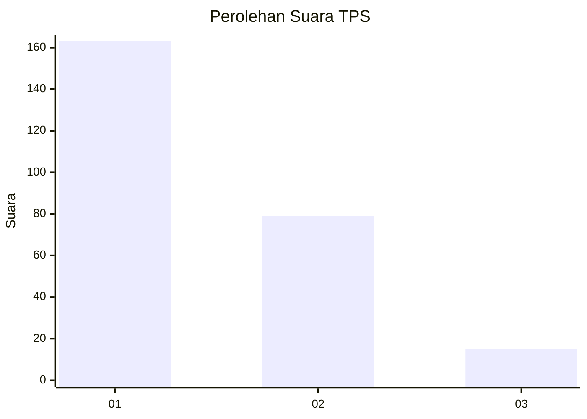
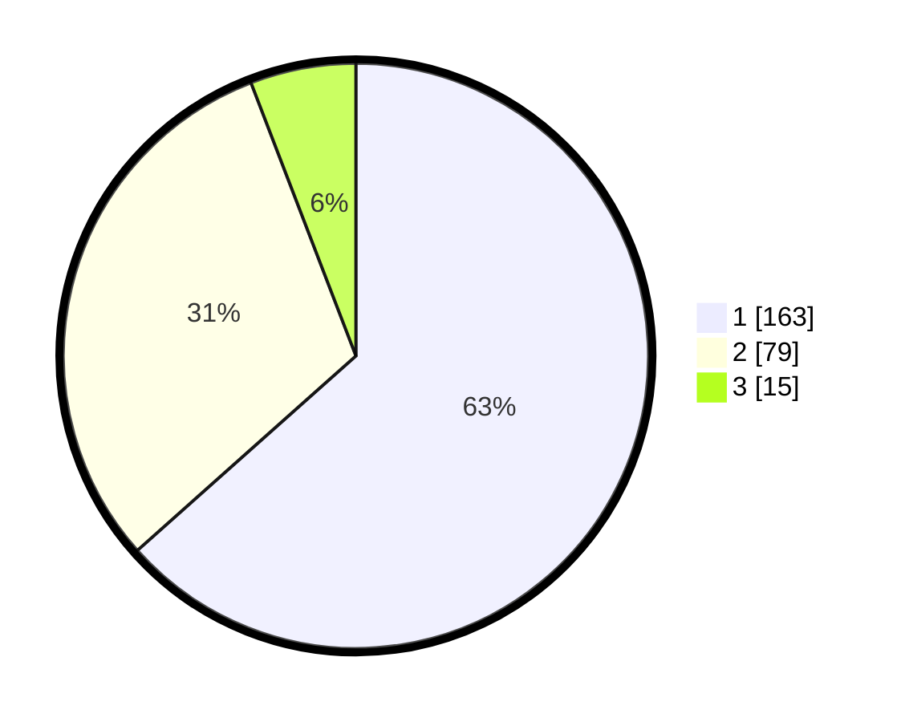

# Hasil

## Grafik

## Tabel

| No. | Nama Paslon    | Suara | Suara (raw) | Persentase |
|:--- |:-------------- | -----:| -----------:| ----------:|
| 1   | ANIES MUHAIMIN | 163   | [163][p-1]  | 63,42      |
| 2   | PRABOWO GIBRAN | 79    | [79][p-2]   | 30,74      |
| 3   | GANJAR MAHFUD  | 15    | [15][p-3]   | 5,84       |

[p-1]: https://github.com/gigit-pemilu/pemilu-2024-32-jawa-barat/blob/main/pilpres/hitung-suara/sub/32-jawa-barat/sub/73-kota-bandung/sub/15-bandung-kulon/sub/1006-gempol-sari/sub/019-tps/sub/paslon-1.txt
[p-2]: https://github.com/gigit-pemilu/pemilu-2024-32-jawa-barat/blob/main/pilpres/hitung-suara/sub/32-jawa-barat/sub/73-kota-bandung/sub/15-bandung-kulon/sub/1006-gempol-sari/sub/019-tps/sub/paslon-2.txt
[p-3]: https://github.com/gigit-pemilu/pemilu-2024-32-jawa-barat/blob/main/pilpres/hitung-suara/sub/32-jawa-barat/sub/73-kota-bandung/sub/15-bandung-kulon/sub/1006-gempol-sari/sub/019-tps/sub/paslon-3.txt

## Foto C Plano

https://sirekap-obj-formc.kpu.go.id/1233/pemilu/ppwp/32/73/15/10/06/3273151006019-20240215-013557--5f3c9f7e-87f2-48ba-bca0-06652f7a1215.jpg

https://sirekap-obj-formc.kpu.go.id/1233/pemilu/ppwp/32/73/15/10/06/3273151006019-20240215-013702--9aa1e63b-fdc7-4ffd-8bb5-2fa62c1368f5.jpg

https://sirekap-obj-formc.kpu.go.id/1233/pemilu/ppwp/32/73/15/10/06/3273151006019-20240215-013805--f931c1c2-9dff-49f3-afa0-d6b2df14008c.jpg

## Metadata

| Key        | Value               |
| ---------- | ------------------- |
| Time Stamp | 2024-02-24 22:31:28 |

