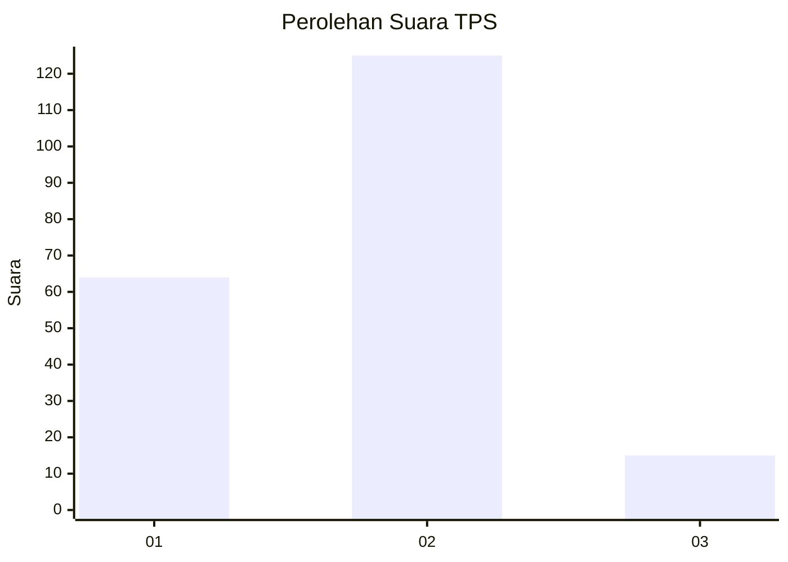
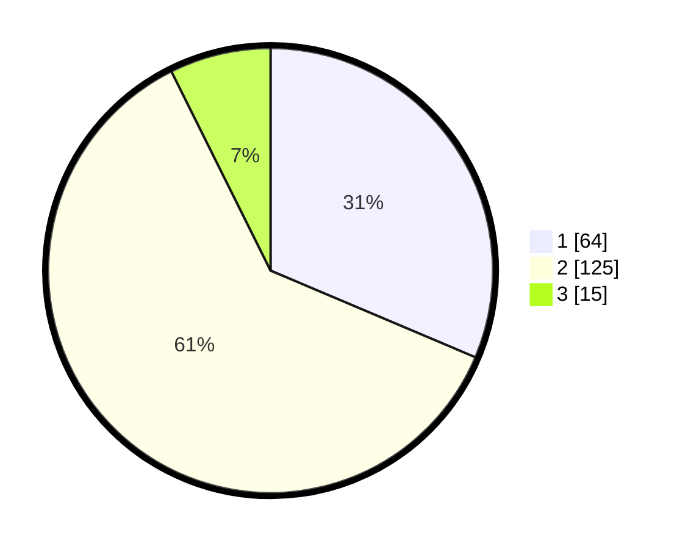

# Hasil

## Grafik

## Tabel

| No. | Nama Paslon    | Suara | Suara (raw) | Persentase |
|:--- |:-------------- | -----:| -----------:| ----------:|
| 1   | ANIES MUHAIMIN | 64    | [64][p-1]   | 31,37      |
| 2   | PRABOWO GIBRAN | 125   | [125][p-2]  | 61,27      |
| 3   | GANJAR MAHFUD  | 15    | [15][p-3]   | 7,35       |

[p-1]: https://github.com/gigit-pemilu/pemilu-2024-32-jawa-barat/blob/main/pilpres/hitung-suara/sub/32-jawa-barat/sub/73-kota-bandung/sub/16-kiaracondong/sub/1001-sukapura/sub/002-tps/sub/paslon-1.txt
[p-2]: https://github.com/gigit-pemilu/pemilu-2024-32-jawa-barat/blob/main/pilpres/hitung-suara/sub/32-jawa-barat/sub/73-kota-bandung/sub/16-kiaracondong/sub/1001-sukapura/sub/002-tps/sub/paslon-2.txt
[p-3]: https://github.com/gigit-pemilu/pemilu-2024-32-jawa-barat/blob/main/pilpres/hitung-suara/sub/32-jawa-barat/sub/73-kota-bandung/sub/16-kiaracondong/sub/1001-sukapura/sub/002-tps/sub/paslon-3.txt

## Foto C Plano

https://sirekap-obj-formc.kpu.go.id/58d2/pemilu/ppwp/32/73/16/10/01/3273161001002-20240215-020706--0e5ab7e1-7016-44f1-93de-4604fc5af736.jpg

https://sirekap-obj-formc.kpu.go.id/58d2/pemilu/ppwp/32/73/16/10/01/3273161001002-20240215-020802--4ed0c10e-5c9a-4419-b190-93fc2ca35f51.jpg

https://sirekap-obj-formc.kpu.go.id/58d2/pemilu/ppwp/32/73/16/10/01/3273161001002-20240215-020856--9bc19cbc-a947-4350-b08c-e1502381b4bf.jpg

## Metadata

| Key        | Value               |
| ---------- | ------------------- |
| Time Stamp | 2024-02-24 22:31:28 |

