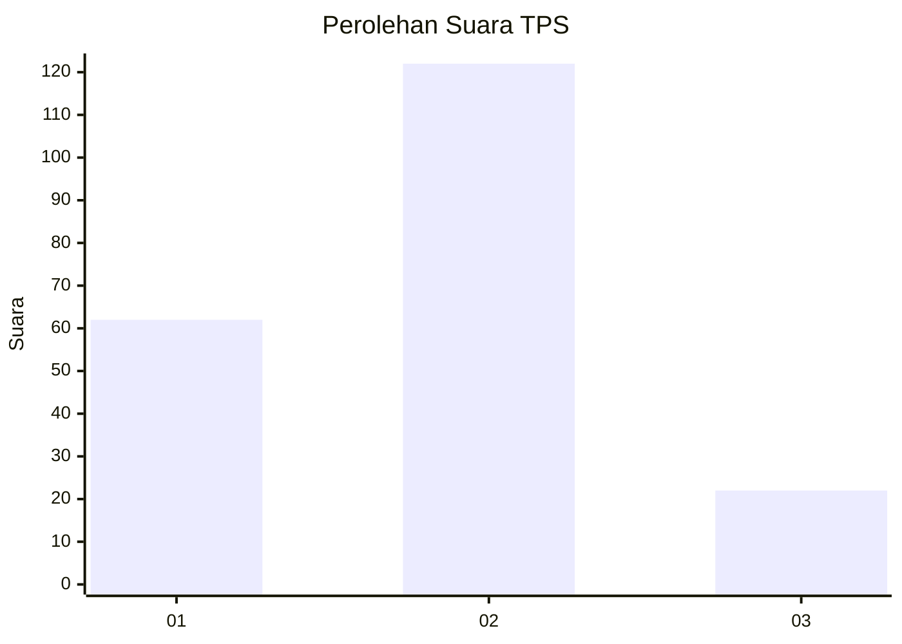
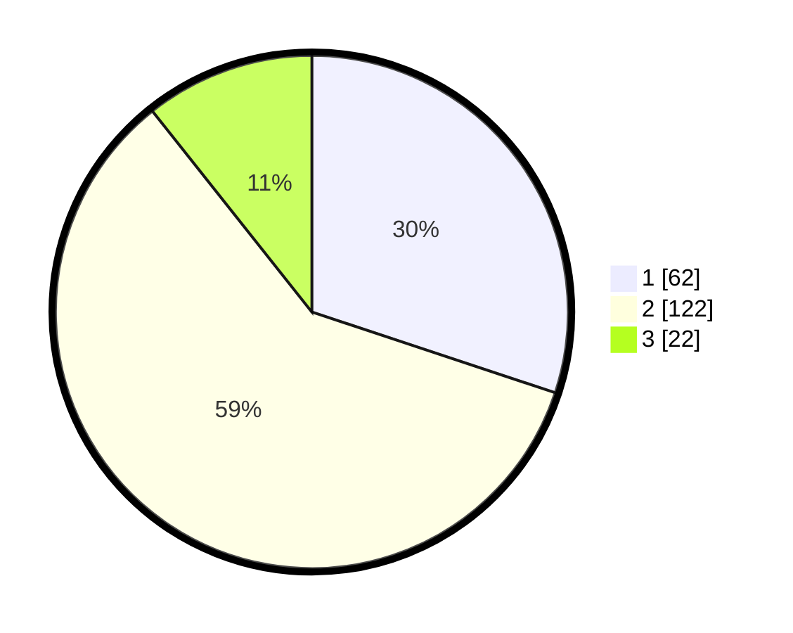

# Hasil

## Grafik

## Tabel

| No. | Nama Paslon    | Suara | Suara (raw) | Persentase |
|:--- |:-------------- | -----:| -----------:| ----------:|
| 1   | ANIES MUHAIMIN | 62    | [62][p-1]   | 30,10      |
| 2   | PRABOWO GIBRAN | 122   | [122][p-2]  | 59,22      |
| 3   | GANJAR MAHFUD  | 22    | [22][p-3]   | 10,68      |

[p-1]: https://github.com/gigit-pemilu/pemilu-2024/blob/main/pilpres/hitung-suara/sub/32-jawa-barat/sub/73-kota-bandung/sub/16-kiaracondong/sub/1001-sukapura/sub/003-tps/sub/paslon-1.txt
[p-2]: https://github.com/gigit-pemilu/pemilu-2024/blob/main/pilpres/hitung-suara/sub/32-jawa-barat/sub/73-kota-bandung/sub/16-kiaracondong/sub/1001-sukapura/sub/003-tps/sub/paslon-2.txt
[p-3]: https://github.com/gigit-pemilu/pemilu-2024/blob/main/pilpres/hitung-suara/sub/32-jawa-barat/sub/73-kota-bandung/sub/16-kiaracondong/sub/1001-sukapura/sub/003-tps/sub/paslon-3.txt

## Foto C Plano

https://sirekap-obj-formc.kpu.go.id/0489/pemilu/ppwp/32/73/16/10/01/3273161001003-20240215-003846--da54702c-4cc4-4b69-b7f3-54bfd2f112dc.jpg

https://sirekap-obj-formc.kpu.go.id/0489/pemilu/ppwp/32/73/16/10/01/3273161001003-20240215-003936--5b5b2467-e6c3-4034-9f9c-9fdcbe915f24.jpg

https://sirekap-obj-formc.kpu.go.id/0489/pemilu/ppwp/32/73/16/10/01/3273161001003-20240215-004031--c70c7bde-bbb1-426b-a8eb-4c0a7c6a62a0.jpg

## Metadata

| Key        | Value               |
| ---------- | ------------------- |
| Time Stamp | 2024-02-15 16:00:26 |

