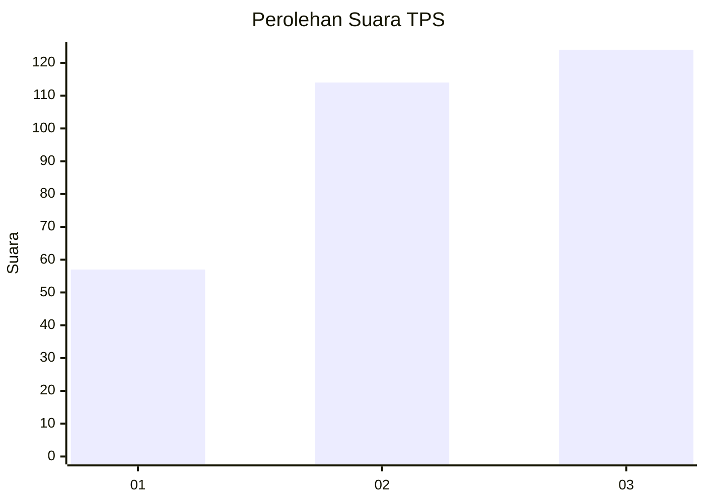
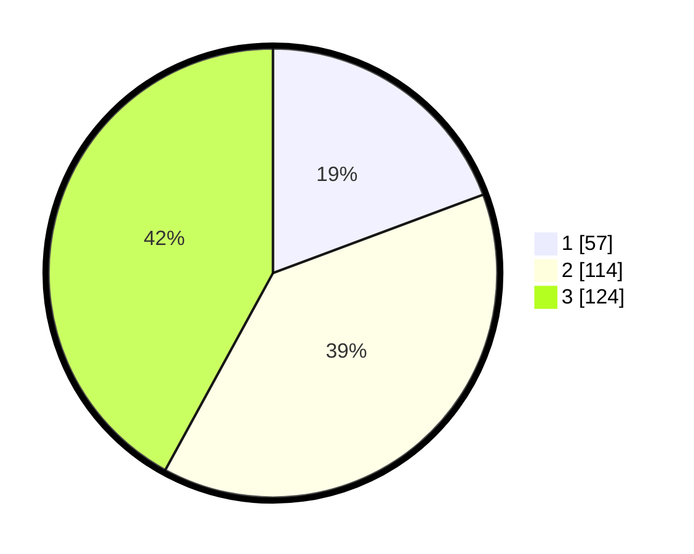

# Hasil

## Grafik

## Tabel

| No. | Nama Paslon    | Suara | Suara (raw) | Persentase |
|:--- |:-------------- | -----:| -----------:| ----------:|
| 1   | ANIES MUHAIMIN | 57    | [57][p-1]   | 19,32      |
| 2   | PRABOWO GIBRAN | 114   | [114][p-2]  | 38,64      |
| 3   | GANJAR MAHFUD  | 124   | [124][p-3]  | 42,03      |

[p-1]: https://github.com/gigit-pemilu/pemilu-2024/blob/main/pilpres/hitung-suara/sub/32-jawa-barat/sub/73-kota-bandung/sub/16-kiaracondong/sub/1001-sukapura/sub/057-tps/sub/paslon-1.txt
[p-2]: https://github.com/gigit-pemilu/pemilu-2024/blob/main/pilpres/hitung-suara/sub/32-jawa-barat/sub/73-kota-bandung/sub/16-kiaracondong/sub/1001-sukapura/sub/057-tps/sub/paslon-2.txt
[p-3]: https://github.com/gigit-pemilu/pemilu-2024/blob/main/pilpres/hitung-suara/sub/32-jawa-barat/sub/73-kota-bandung/sub/16-kiaracondong/sub/1001-sukapura/sub/057-tps/sub/paslon-3.txt

## Foto C Plano

https://sirekap-obj-formc.kpu.go.id/5b2d/pemilu/ppwp/32/73/16/10/01/3273161001057-20240215-011252--7306f04d-5d24-475d-b9ca-d04caa1f70a2.jpg

https://sirekap-obj-formc.kpu.go.id/5b2d/pemilu/ppwp/32/73/16/10/01/3273161001057-20240215-013030--09a7437e-5ed6-4472-8b69-27fc1ce217ae.jpg

https://sirekap-obj-formc.kpu.go.id/5b2d/pemilu/ppwp/32/73/16/10/01/3273161001057-20240215-013154--42be08ee-3b28-4053-8641-8844dd587575.jpg

## Metadata

| Key        | Value               |
| ---------- | ------------------- |
| Time Stamp | 2024-02-25 12:00:00 |

