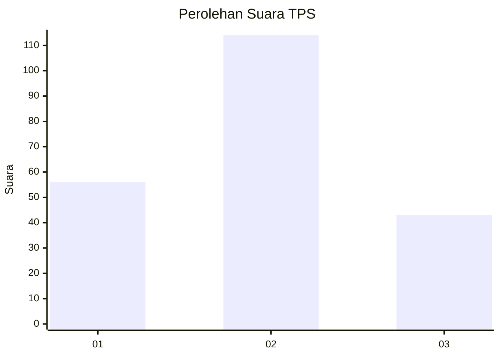
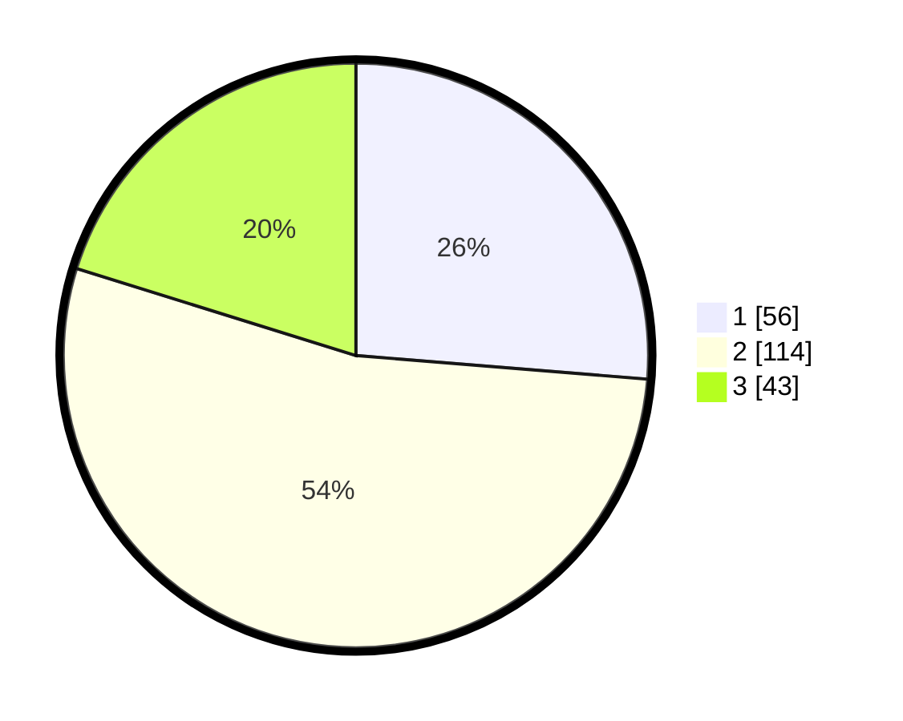

# Hasil

## Grafik

## Tabel

| No. | Nama Paslon    | Suara | Suara (raw) | Persentase |
|:--- |:-------------- | -----:| -----------:| ----------:|
| 1   | ANIES MUHAIMIN | 56    | [56][p-1]   | 26,29      |
| 2   | PRABOWO GIBRAN | 114   | [114][p-2]  | 53,52      |
| 3   | GANJAR MAHFUD  | 43    | [43][p-3]   | 20,19      |

[p-1]: https://github.com/gigit-pemilu/pemilu-2024-32-jawa-barat/blob/main/pilpres/hitung-suara/sub/32-jawa-barat/sub/73-kota-bandung/sub/17-bojongloa-kidul/sub/1001-situsaeur/sub/002-tps/sub/paslon-1.txt
[p-2]: https://github.com/gigit-pemilu/pemilu-2024-32-jawa-barat/blob/main/pilpres/hitung-suara/sub/32-jawa-barat/sub/73-kota-bandung/sub/17-bojongloa-kidul/sub/1001-situsaeur/sub/002-tps/sub/paslon-2.txt
[p-3]: https://github.com/gigit-pemilu/pemilu-2024-32-jawa-barat/blob/main/pilpres/hitung-suara/sub/32-jawa-barat/sub/73-kota-bandung/sub/17-bojongloa-kidul/sub/1001-situsaeur/sub/002-tps/sub/paslon-3.txt

## Foto C Plano

https://sirekap-obj-formc.kpu.go.id/cb53/pemilu/ppwp/32/73/17/10/01/3273171001002-20240215-060025--f56ae631-8f34-4e62-8b52-2d327e1b8f74.jpg

https://sirekap-obj-formc.kpu.go.id/cb53/pemilu/ppwp/32/73/17/10/01/3273171001002-20240215-060222--8418255d-2cbf-49d0-bf41-9bbed6b2663d.jpg

https://sirekap-obj-formc.kpu.go.id/cb53/pemilu/ppwp/32/73/17/10/01/3273171001002-20240215-060356--3aaed78d-0cda-482e-a056-9d0b758a5740.jpg

## Metadata

| Key        | Value               |
| ---------- | ------------------- |
| Time Stamp | 2024-02-16 12:51:22 |

