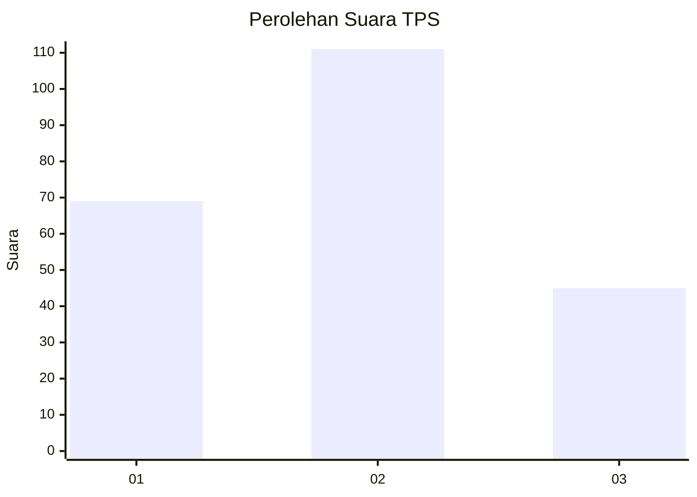
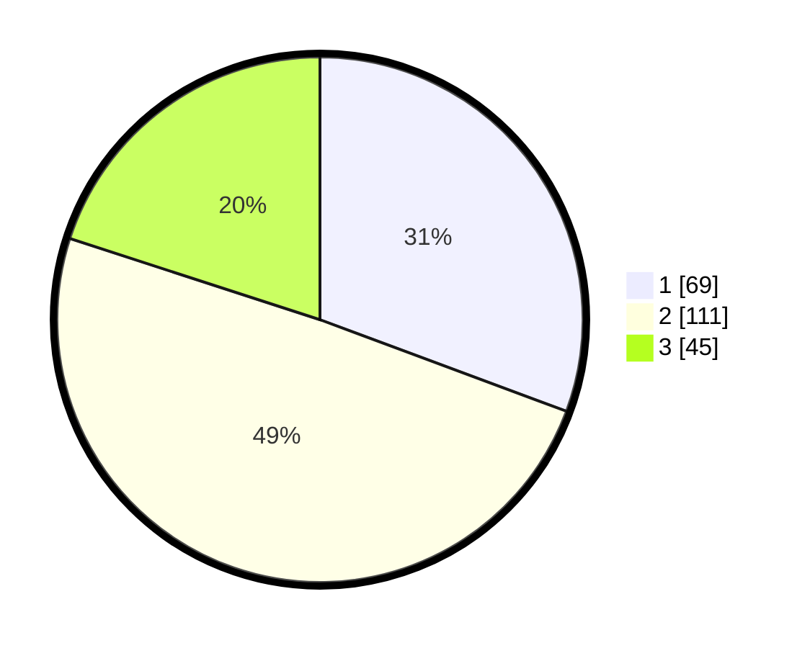

# Hasil

## Grafik

## Tabel

| No. | Nama Paslon    | Suara | Suara (raw) | Persentase |
|:--- |:-------------- | -----:| -----------:| ----------:|
| 1   | ANIES MUHAIMIN | 69    | [69][p-1]   | 30,67      |
| 2   | PRABOWO GIBRAN | 111   | [111][p-2]  | 49,33      |
| 3   | GANJAR MAHFUD  | 45    | [45][p-3]   | 20,00      |

[p-1]: https://github.com/gigit-pemilu/pemilu-2024-32-jawa-barat/blob/main/pilpres/hitung-suara/sub/32-jawa-barat/sub/73-kota-bandung/sub/17-bojongloa-kidul/sub/1001-situsaeur/sub/003-tps/sub/paslon-1.txt
[p-2]: https://github.com/gigit-pemilu/pemilu-2024-32-jawa-barat/blob/main/pilpres/hitung-suara/sub/32-jawa-barat/sub/73-kota-bandung/sub/17-bojongloa-kidul/sub/1001-situsaeur/sub/003-tps/sub/paslon-2.txt
[p-3]: https://github.com/gigit-pemilu/pemilu-2024-32-jawa-barat/blob/main/pilpres/hitung-suara/sub/32-jawa-barat/sub/73-kota-bandung/sub/17-bojongloa-kidul/sub/1001-situsaeur/sub/003-tps/sub/paslon-3.txt

## Foto C Plano

https://sirekap-obj-formc.kpu.go.id/7587/pemilu/ppwp/32/73/17/10/01/3273171001003-20240214-175305--1bfa33dc-94f7-4716-82a6-eefaab435a1a.jpg

https://sirekap-obj-formc.kpu.go.id/7587/pemilu/ppwp/32/73/17/10/01/3273171001003-20240214-155203--cce70b74-5dfb-450e-85e2-f63d1f95bbbf.jpg

https://sirekap-obj-formc.kpu.go.id/7587/pemilu/ppwp/32/73/17/10/01/3273171001003-20240214-180817--27b4055e-6b22-47d1-bb90-516f87c023e4.jpg

## Metadata

| Key        | Value               |
| ---------- | ------------------- |
| Time Stamp | 2024-02-15 15:00:29 |

