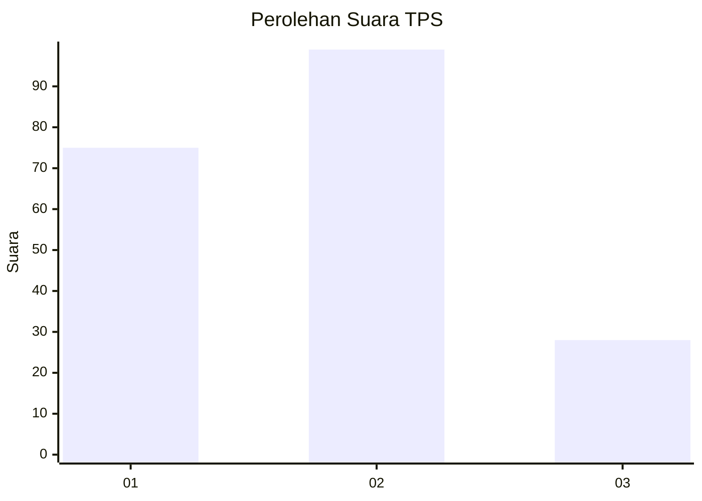
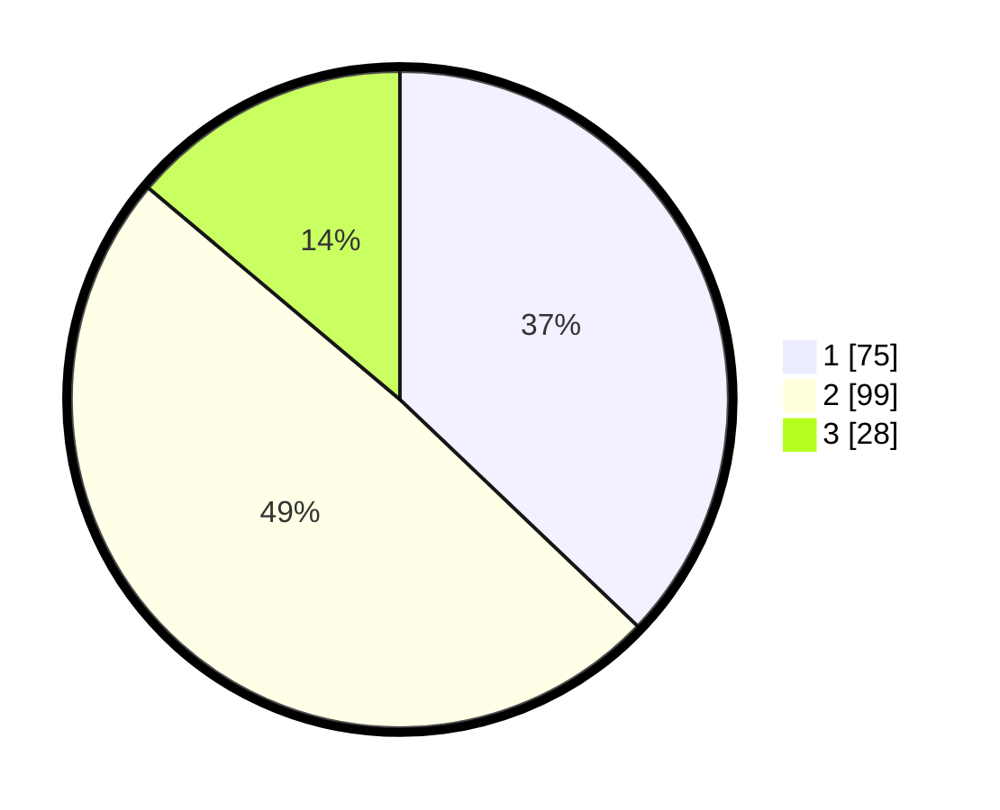

# Hasil

## Grafik

## Tabel

| No. | Nama Paslon    | Suara | Suara (raw) | Persentase |
|:--- |:-------------- | -----:| -----------:| ----------:|
| 1   | ANIES MUHAIMIN | 75    | [75][p-1]   | 37,13      |
| 2   | PRABOWO GIBRAN | 99    | [99][p-2]   | 49,01      |
| 3   | GANJAR MAHFUD  | 28    | [28][p-3]   | 13,86      |

[p-1]: https://github.com/gigit-pemilu/pemilu-2024/blob/main/pilpres/hitung-suara/sub/32-jawa-barat/sub/73-kota-bandung/sub/17-bojongloa-kidul/sub/1001-situsaeur/sub/008-tps/sub/paslon-1.txt
[p-2]: https://github.com/gigit-pemilu/pemilu-2024/blob/main/pilpres/hitung-suara/sub/32-jawa-barat/sub/73-kota-bandung/sub/17-bojongloa-kidul/sub/1001-situsaeur/sub/008-tps/sub/paslon-2.txt
[p-3]: https://github.com/gigit-pemilu/pemilu-2024/blob/main/pilpres/hitung-suara/sub/32-jawa-barat/sub/73-kota-bandung/sub/17-bojongloa-kidul/sub/1001-situsaeur/sub/008-tps/sub/paslon-3.txt

## Foto C Plano

https://sirekap-obj-formc.kpu.go.id/666e/pemilu/ppwp/32/73/17/10/01/3273171001008-20240214-222818--e1d5988d-2885-44a0-b2f3-b95bed46c123.jpg

https://sirekap-obj-formc.kpu.go.id/666e/pemilu/ppwp/32/73/17/10/01/3273171001008-20240214-223231--ac039b35-311d-46f0-8440-440d2727dc21.jpg

https://sirekap-obj-formc.kpu.go.id/666e/pemilu/ppwp/32/73/17/10/01/3273171001008-20240214-194332--a0c8ad9b-5608-4b5e-9c38-ffce922aff5a.jpg

## Metadata

| Key        | Value               |
| ---------- | ------------------- |
| Time Stamp | 2024-02-15 15:00:29 |

