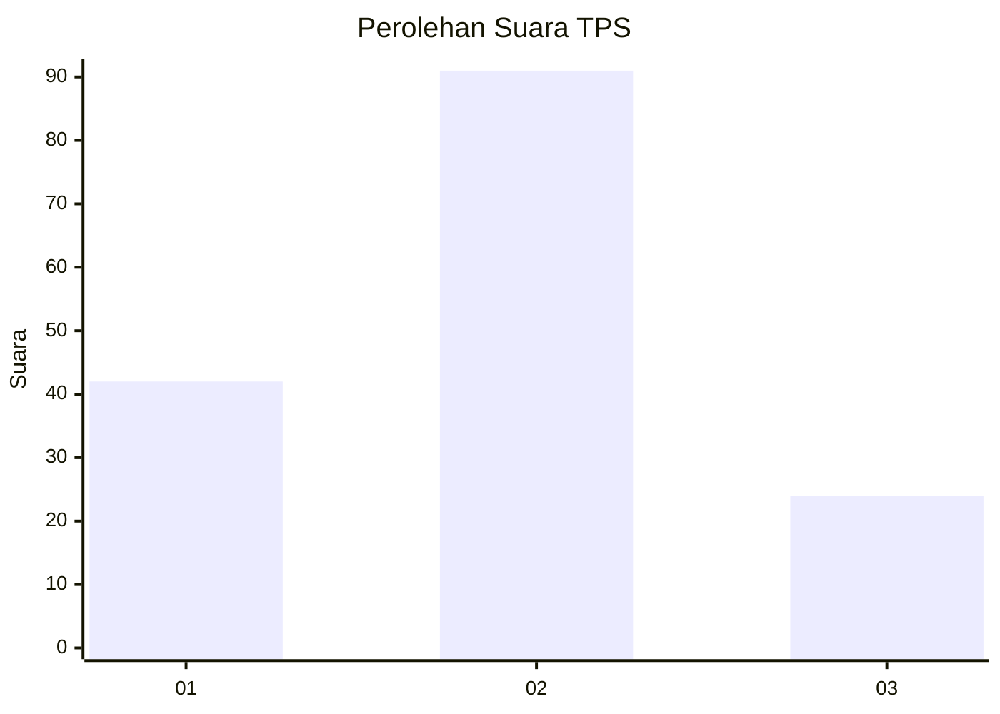
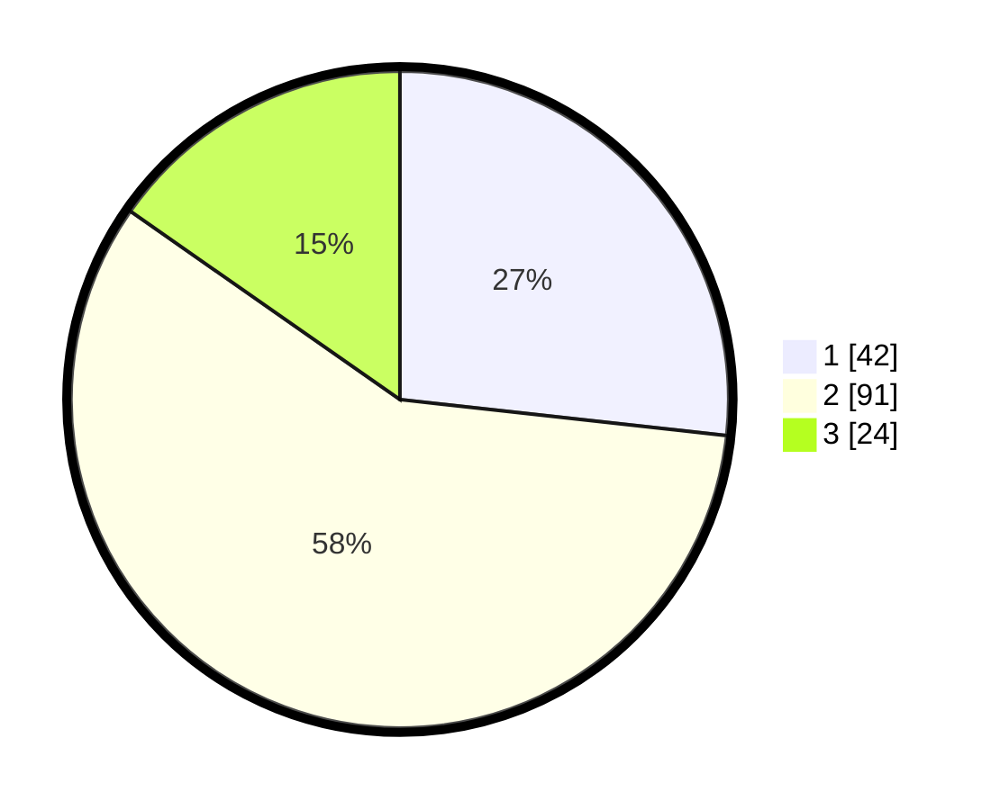

# Hasil

## Grafik

## Tabel

| No. | Nama Paslon    | Suara | Suara (raw) | Persentase |
|:--- |:-------------- | -----:| -----------:| ----------:|
| 1   | ANIES MUHAIMIN | 42    | [42][p-1]   | 26,75      |
| 2   | PRABOWO GIBRAN | 91    | [91][p-2]   | 57,96      |
| 3   | GANJAR MAHFUD  | 24    | [24][p-3]   | 15,29      |

[p-1]: https://github.com/gigit-pemilu/pemilu-2024-32-jawa-barat/blob/main/pilpres/hitung-suara/sub/32-jawa-barat/sub/73-kota-bandung/sub/18-cibeunying-kaler/sub/1001-cihaur-geulis/sub/001-tps/sub/paslon-1.txt
[p-2]: https://github.com/gigit-pemilu/pemilu-2024-32-jawa-barat/blob/main/pilpres/hitung-suara/sub/32-jawa-barat/sub/73-kota-bandung/sub/18-cibeunying-kaler/sub/1001-cihaur-geulis/sub/001-tps/sub/paslon-2.txt
[p-3]: https://github.com/gigit-pemilu/pemilu-2024-32-jawa-barat/blob/main/pilpres/hitung-suara/sub/32-jawa-barat/sub/73-kota-bandung/sub/18-cibeunying-kaler/sub/1001-cihaur-geulis/sub/001-tps/sub/paslon-3.txt

## Foto C Plano

https://sirekap-obj-formc.kpu.go.id/5630/pemilu/ppwp/32/73/18/10/01/3273181001001-20240215-041203--0cf5a844-cc93-4114-afdc-18c32764aee3.jpg

https://sirekap-obj-formc.kpu.go.id/5630/pemilu/ppwp/32/73/18/10/01/3273181001001-20240215-041206--fae44b3c-1c29-4aa6-98e8-c17df36aa36c.jpg

https://sirekap-obj-formc.kpu.go.id/5630/pemilu/ppwp/32/73/18/10/01/3273181001001-20240215-041210--db8e862e-97ca-4ca1-97c2-d1db529a29b6.jpg

## Metadata

| Key        | Value               |
| ---------- | ------------------- |
| Time Stamp | 2024-02-25 17:00:00 |

