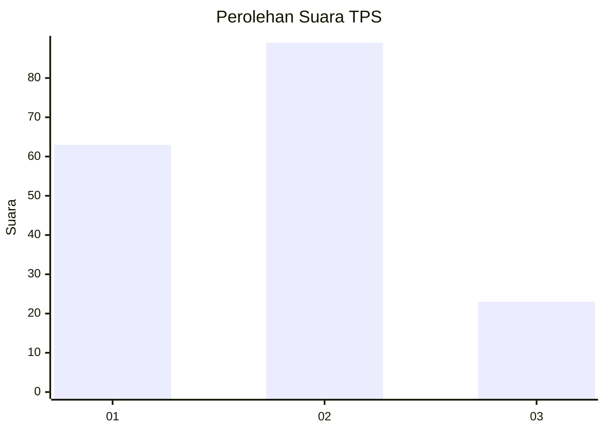
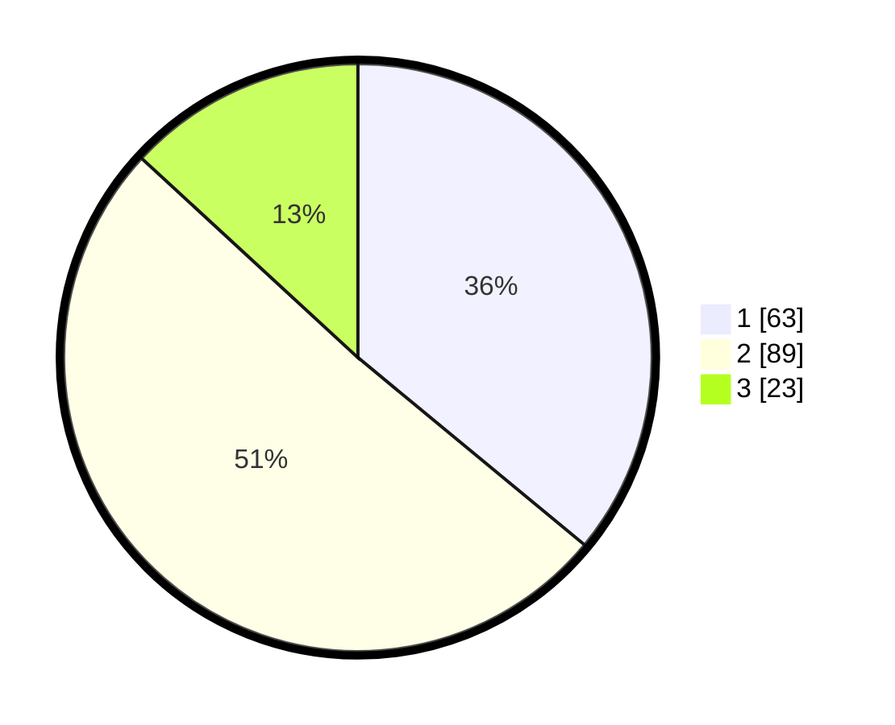

# Hasil

## Grafik

## Tabel

| No. | Nama Paslon    | Suara | Suara (raw) | Persentase |
|:--- |:-------------- | -----:| -----------:| ----------:|
| 1   | ANIES MUHAIMIN | 63    | [63][p-1]   | 36,00      |
| 2   | PRABOWO GIBRAN | 89    | [89][p-2]   | 50,86      |
| 3   | GANJAR MAHFUD  | 23    | [23][p-3]   | 13,14      |

[p-1]: https://github.com/gigit-pemilu/pemilu-2024-32-jawa-barat/blob/main/pilpres/hitung-suara/sub/32-jawa-barat/sub/73-kota-bandung/sub/18-cibeunying-kaler/sub/1001-cihaur-geulis/sub/002-tps/sub/paslon-1.txt
[p-2]: https://github.com/gigit-pemilu/pemilu-2024-32-jawa-barat/blob/main/pilpres/hitung-suara/sub/32-jawa-barat/sub/73-kota-bandung/sub/18-cibeunying-kaler/sub/1001-cihaur-geulis/sub/002-tps/sub/paslon-2.txt
[p-3]: https://github.com/gigit-pemilu/pemilu-2024-32-jawa-barat/blob/main/pilpres/hitung-suara/sub/32-jawa-barat/sub/73-kota-bandung/sub/18-cibeunying-kaler/sub/1001-cihaur-geulis/sub/002-tps/sub/paslon-3.txt

## Foto C Plano

https://sirekap-obj-formc.kpu.go.id/820d/pemilu/ppwp/32/73/18/10/01/3273181001002-20240215-034822--37151b86-41a3-4581-ba89-5005e92def5d.jpg

https://sirekap-obj-formc.kpu.go.id/820d/pemilu/ppwp/32/73/18/10/01/3273181001002-20240215-035359--8ee9ffcf-d5b0-459b-9119-a6d58550ad14.jpg

https://sirekap-obj-formc.kpu.go.id/820d/pemilu/ppwp/32/73/18/10/01/3273181001002-20240215-141457--3dce606f-372d-4712-bee7-cdddbcdb1a91.jpg

## Metadata

| Key        | Value               |
| ---------- | ------------------- |
| Time Stamp | 2024-02-25 17:00:00 |

