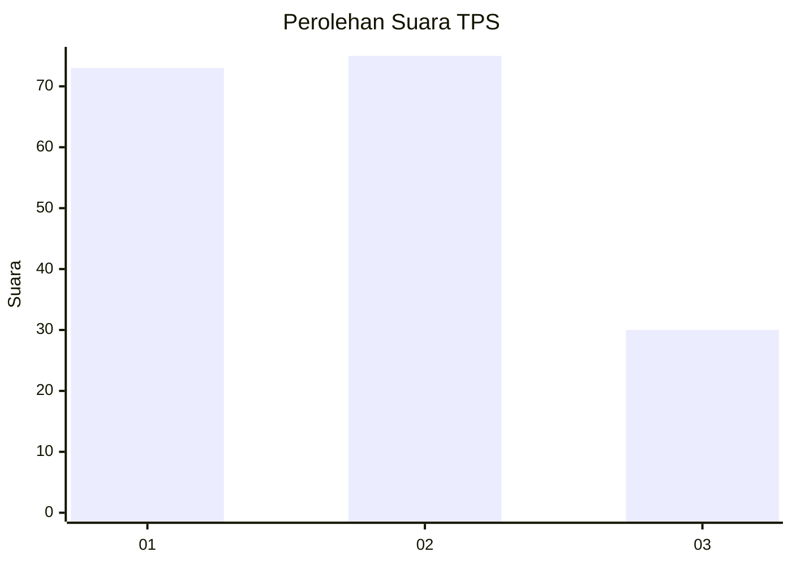
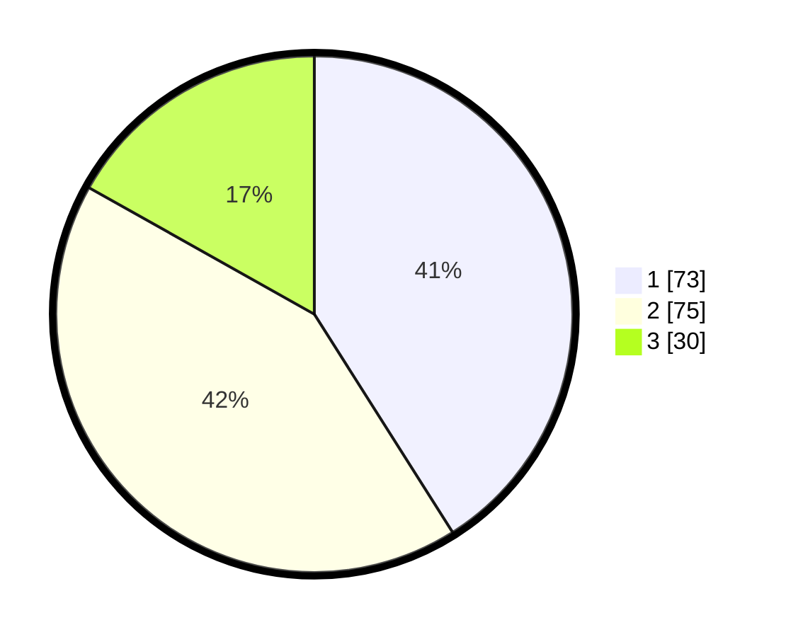

# Hasil

## Grafik

## Tabel

| No. | Nama Paslon    | Suara | Suara (raw) | Persentase |
|:--- |:-------------- | -----:| -----------:| ----------:|
| 1   | ANIES MUHAIMIN | 73    | [73][p-1]   | 41,01      |
| 2   | PRABOWO GIBRAN | 75    | [75][p-2]   | 42,13      |
| 3   | GANJAR MAHFUD  | 30    | [30][p-3]   | 16,85      |

[p-1]: https://github.com/gigit-pemilu/pemilu-2024-32-jawa-barat/blob/main/pilpres/hitung-suara/sub/32-jawa-barat/sub/73-kota-bandung/sub/18-cibeunying-kaler/sub/1001-cihaur-geulis/sub/003-tps/sub/paslon-1.txt
[p-2]: https://github.com/gigit-pemilu/pemilu-2024-32-jawa-barat/blob/main/pilpres/hitung-suara/sub/32-jawa-barat/sub/73-kota-bandung/sub/18-cibeunying-kaler/sub/1001-cihaur-geulis/sub/003-tps/sub/paslon-2.txt
[p-3]: https://github.com/gigit-pemilu/pemilu-2024-32-jawa-barat/blob/main/pilpres/hitung-suara/sub/32-jawa-barat/sub/73-kota-bandung/sub/18-cibeunying-kaler/sub/1001-cihaur-geulis/sub/003-tps/sub/paslon-3.txt

## Foto C Plano

https://sirekap-obj-formc.kpu.go.id/28da/pemilu/ppwp/32/73/18/10/01/3273181001003-20240215-034715--5a62d393-aa77-4257-a8df-fef1ffa25e3c.jpg

https://sirekap-obj-formc.kpu.go.id/28da/pemilu/ppwp/32/73/18/10/01/3273181001003-20240215-034759--ed38cd26-de41-45f7-869e-e0adbde6369f.jpg

https://sirekap-obj-formc.kpu.go.id/28da/pemilu/ppwp/32/73/18/10/01/3273181001003-20240215-034843--5b6ee9d8-ecfd-4cea-b83d-bcd5a6810557.jpg

## Metadata

| Key        | Value               |
| ---------- | ------------------- |
| Time Stamp | 2024-02-24 22:31:28 |

