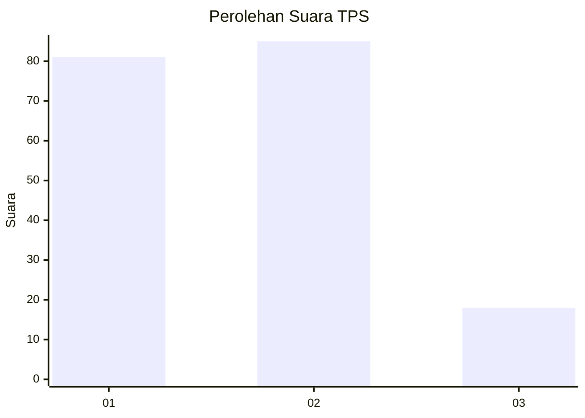
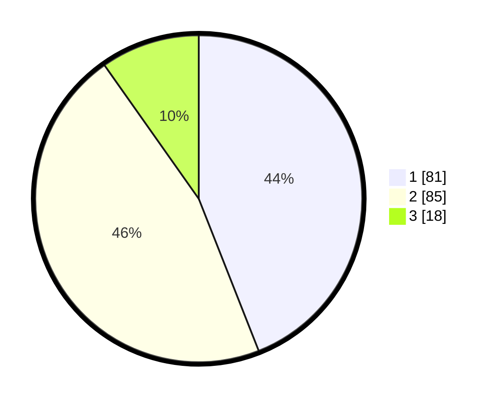

# Hasil

## Grafik

## Tabel

| No. | Nama Paslon    | Suara | Suara (raw) | Persentase |
|:--- |:-------------- | -----:| -----------:| ----------:|
| 1   | ANIES MUHAIMIN | 81    | [81][p-1]   | 44,02      |
| 2   | PRABOWO GIBRAN | 85    | [85][p-2]   | 46,20      |
| 3   | GANJAR MAHFUD  | 18    | [18][p-3]   | 9,78       |

[p-1]: https://github.com/gigit-pemilu/pemilu-2024-32-jawa-barat/blob/main/pilpres/hitung-suara/sub/32-jawa-barat/sub/73-kota-bandung/sub/18-cibeunying-kaler/sub/1001-cihaur-geulis/sub/004-tps/sub/paslon-1.txt
[p-2]: https://github.com/gigit-pemilu/pemilu-2024-32-jawa-barat/blob/main/pilpres/hitung-suara/sub/32-jawa-barat/sub/73-kota-bandung/sub/18-cibeunying-kaler/sub/1001-cihaur-geulis/sub/004-tps/sub/paslon-2.txt
[p-3]: https://github.com/gigit-pemilu/pemilu-2024-32-jawa-barat/blob/main/pilpres/hitung-suara/sub/32-jawa-barat/sub/73-kota-bandung/sub/18-cibeunying-kaler/sub/1001-cihaur-geulis/sub/004-tps/sub/paslon-3.txt

## Foto C Plano

https://sirekap-obj-formc.kpu.go.id/79bf/pemilu/ppwp/32/73/18/10/01/3273181001004-20240214-232953--0470222f-e8a7-49b0-b5c7-5a01f8b895a7.jpg

https://sirekap-obj-formc.kpu.go.id/79bf/pemilu/ppwp/32/73/18/10/01/3273181001004-20240214-233617--ed60dbc6-178b-4ff2-853e-39e2e0766e71.jpg

https://sirekap-obj-formc.kpu.go.id/79bf/pemilu/ppwp/32/73/18/10/01/3273181001004-20240214-233836--9b619766-d78c-48d3-9438-8976e026e1d9.jpg

## Metadata

| Key        | Value               |
| ---------- | ------------------- |
| Time Stamp | 2024-02-25 15:00:00 |

