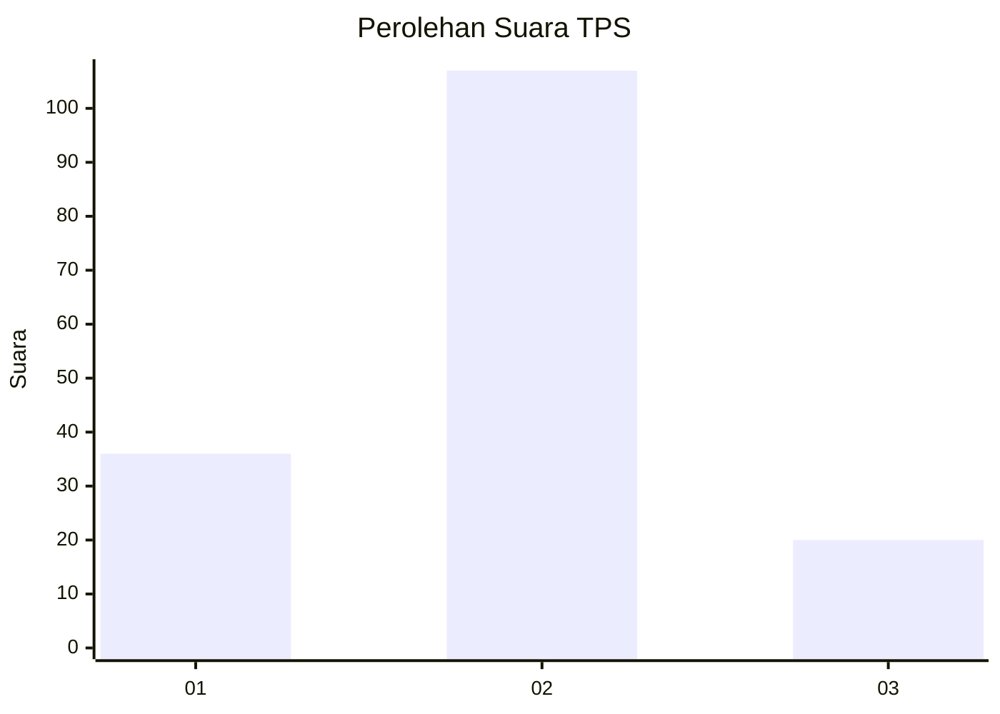
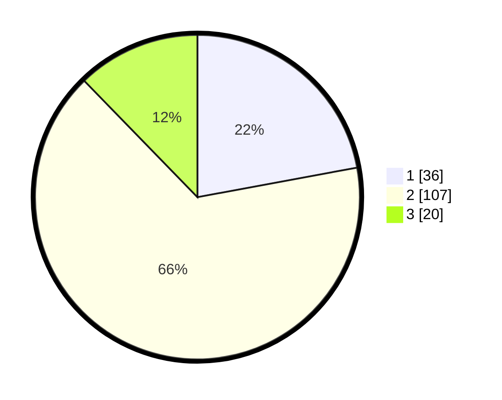

# Hasil

## Grafik

## Tabel

| No. | Nama Paslon    | Suara | Suara (raw) | Persentase |
|:--- |:-------------- | -----:| -----------:| ----------:|
| 1   | ANIES MUHAIMIN | 36    | [36][p-1]   | 22,09      |
| 2   | PRABOWO GIBRAN | 107   | [107][p-2]  | 65,64      |
| 3   | GANJAR MAHFUD  | 20    | [20][p-3]   | 12,27      |

[p-1]: https://github.com/gigit-pemilu/pemilu-2024/blob/main/pilpres/hitung-suara/sub/32-jawa-barat/sub/73-kota-bandung/sub/19-sumur-bandung/sub/1001-braga/sub/004-tps/sub/paslon-1.txt
[p-2]: https://github.com/gigit-pemilu/pemilu-2024/blob/main/pilpres/hitung-suara/sub/32-jawa-barat/sub/73-kota-bandung/sub/19-sumur-bandung/sub/1001-braga/sub/004-tps/sub/paslon-2.txt
[p-3]: https://github.com/gigit-pemilu/pemilu-2024/blob/main/pilpres/hitung-suara/sub/32-jawa-barat/sub/73-kota-bandung/sub/19-sumur-bandung/sub/1001-braga/sub/004-tps/sub/paslon-3.txt

## Foto C Plano

https://sirekap-obj-formc.kpu.go.id/fa1b/pemilu/ppwp/32/73/19/10/01/3273191001004-20240219-075308--2f7d516b-87a3-4a51-a680-a71f3efc5c3e.jpg

https://sirekap-obj-formc.kpu.go.id/fa1b/pemilu/ppwp/32/73/19/10/01/3273191001004-20240219-075315--3b7b63c6-cdf2-4621-9da3-f58c7e34179f.jpg

https://sirekap-obj-formc.kpu.go.id/fa1b/pemilu/ppwp/32/73/19/10/01/3273191001004-20240219-075320--020697dc-8026-45c2-bb95-d2354fc14421.jpg

## Metadata

| Key        | Value               |
| ---------- | ------------------- |
| Time Stamp | 2024-02-25 14:00:00 |

