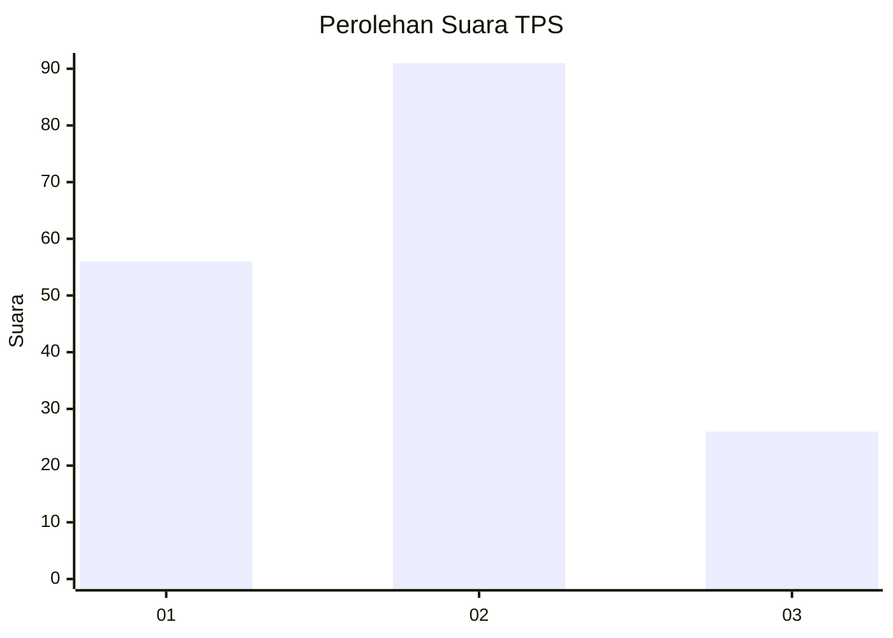
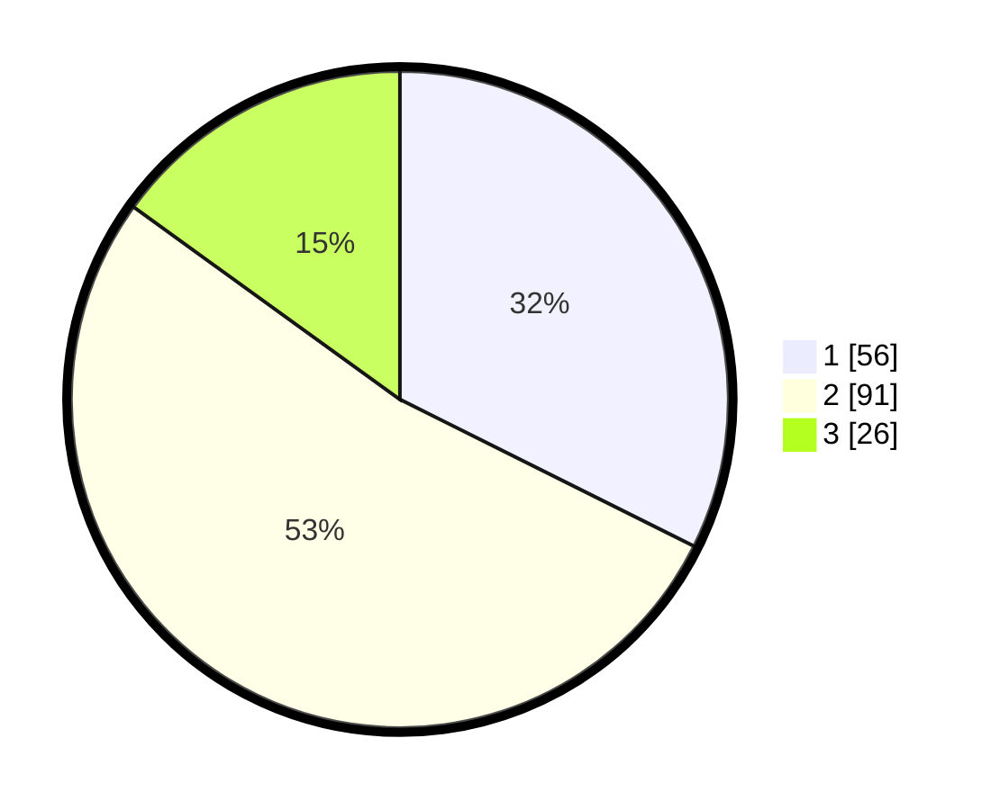

# Hasil

## Grafik

## Tabel

| No. | Nama Paslon    | Suara | Suara (raw) | Persentase |
|:--- |:-------------- | -----:| -----------:| ----------:|
| 1   | ANIES MUHAIMIN | 56    | [56][p-1]   | 32,37      |
| 2   | PRABOWO GIBRAN | 91    | [91][p-2]   | 52,60      |
| 3   | GANJAR MAHFUD  | 26    | [26][p-3]   | 15,03      |

[p-1]: https://github.com/gigit-pemilu/pemilu-2024/blob/main/pilpres/hitung-suara/sub/32-jawa-barat/sub/73-kota-bandung/sub/19-sumur-bandung/sub/1001-braga/sub/006-tps/sub/paslon-1.txt
[p-2]: https://github.com/gigit-pemilu/pemilu-2024/blob/main/pilpres/hitung-suara/sub/32-jawa-barat/sub/73-kota-bandung/sub/19-sumur-bandung/sub/1001-braga/sub/006-tps/sub/paslon-2.txt
[p-3]: https://github.com/gigit-pemilu/pemilu-2024/blob/main/pilpres/hitung-suara/sub/32-jawa-barat/sub/73-kota-bandung/sub/19-sumur-bandung/sub/1001-braga/sub/006-tps/sub/paslon-3.txt

## Foto C Plano

https://sirekap-obj-formc.kpu.go.id/8fec/pemilu/ppwp/32/73/19/10/01/3273191001006-20240215-012921--325646c5-f310-4ab1-b4d9-b14201e7ba06.jpg

https://sirekap-obj-formc.kpu.go.id/8fec/pemilu/ppwp/32/73/19/10/01/3273191001006-20240215-013040--82b0a584-18fb-4352-a8dd-940cf885a5d9.jpg

https://sirekap-obj-formc.kpu.go.id/8fec/pemilu/ppwp/32/73/19/10/01/3273191001006-20240215-013148--25d7782a-1f17-477b-b437-155c46ba6ee6.jpg

## Metadata

| Key        | Value               |
| ---------- | ------------------- |
| Time Stamp | 2024-02-15 12:00:28 |

