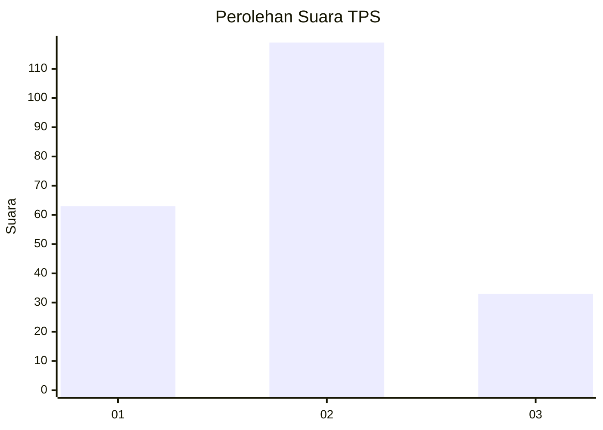
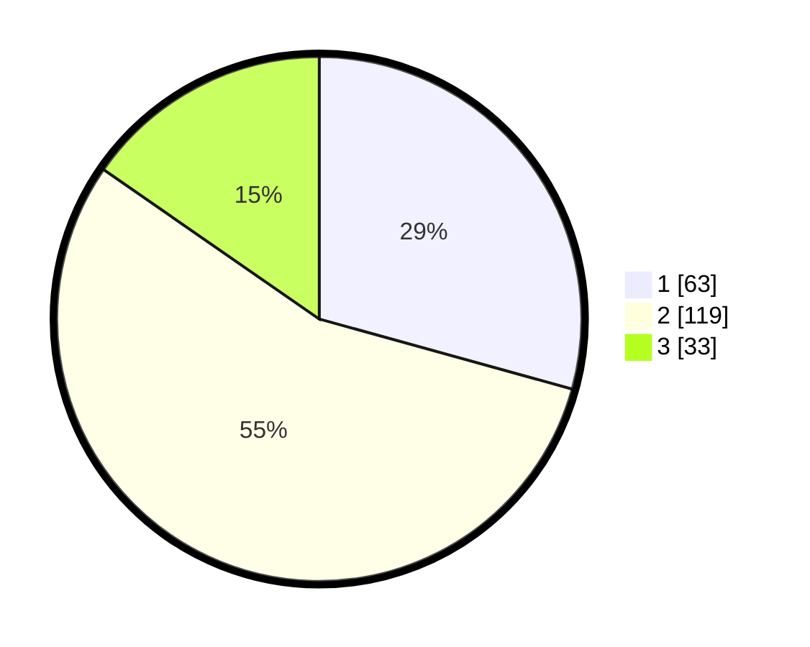

# Hasil

## Grafik

## Tabel

| No. | Nama Paslon    | Suara | Suara (raw) | Persentase |
|:--- |:-------------- | -----:| -----------:| ----------:|
| 1   | ANIES MUHAIMIN | 63    | [63][p-1]   | 29,30      |
| 2   | PRABOWO GIBRAN | 119   | [119][p-2]  | 55,35      |
| 3   | GANJAR MAHFUD  | 33    | [33][p-3]   | 15,35      |

[p-1]: https://github.com/gigit-pemilu/pemilu-2024/blob/main/pilpres/hitung-suara/sub/32-jawa-barat/sub/73-kota-bandung/sub/19-sumur-bandung/sub/1001-braga/sub/011-tps/sub/paslon-1.txt
[p-2]: https://github.com/gigit-pemilu/pemilu-2024/blob/main/pilpres/hitung-suara/sub/32-jawa-barat/sub/73-kota-bandung/sub/19-sumur-bandung/sub/1001-braga/sub/011-tps/sub/paslon-2.txt
[p-3]: https://github.com/gigit-pemilu/pemilu-2024/blob/main/pilpres/hitung-suara/sub/32-jawa-barat/sub/73-kota-bandung/sub/19-sumur-bandung/sub/1001-braga/sub/011-tps/sub/paslon-3.txt

## Foto C Plano

https://sirekap-obj-formc.kpu.go.id/3d7e/pemilu/ppwp/32/73/19/10/01/3273191001011-20240214-215349--1569d9f4-4f24-481a-928f-7db2b51922c2.jpg

https://sirekap-obj-formc.kpu.go.id/3d7e/pemilu/ppwp/32/73/19/10/01/3273191001011-20240214-221336--48ead0ff-b298-4e54-a147-4f1ad7fc1cb7.jpg

https://sirekap-obj-formc.kpu.go.id/3d7e/pemilu/ppwp/32/73/19/10/01/3273191001011-20240214-230459--b41997d0-7182-4cf3-85ae-3f643528a7ff.jpg

## Metadata

| Key        | Value               |
| ---------- | ------------------- |
| Time Stamp | 2024-02-15 15:00:29 |

