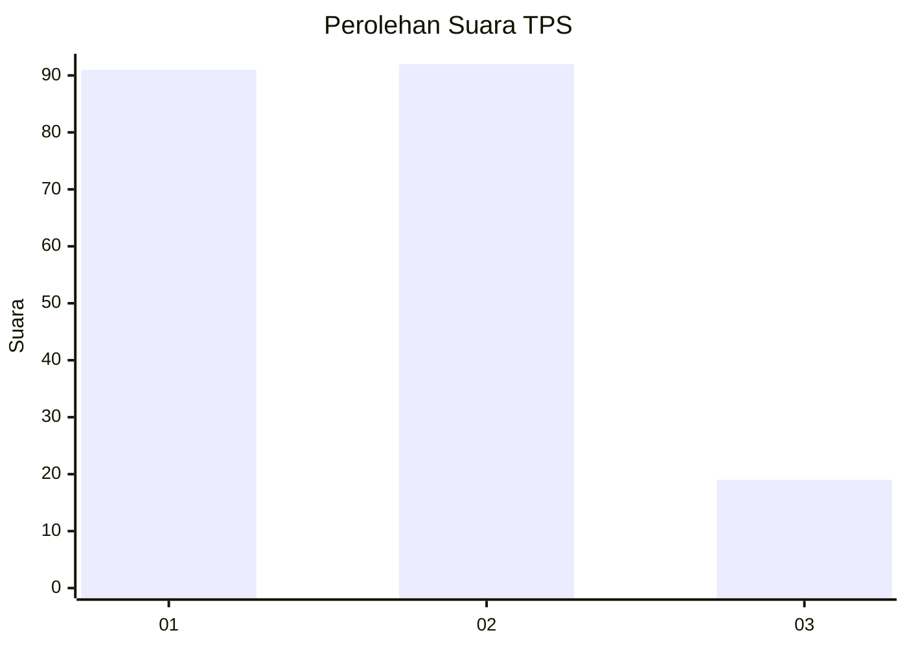
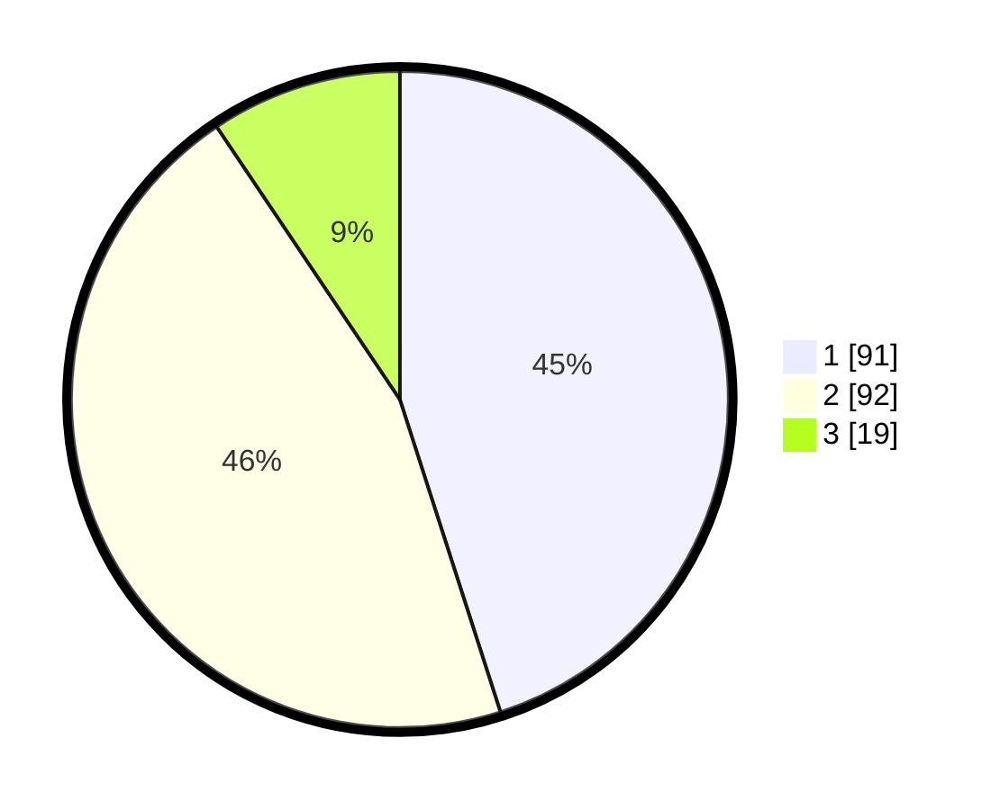

# Hasil

## Grafik

## Tabel

| No. | Nama Paslon    | Suara | Suara (raw) | Persentase |
|:--- |:-------------- | -----:| -----------:| ----------:|
| 1   | ANIES MUHAIMIN | 91    | [91][p-1]   | 45,05      |
| 2   | PRABOWO GIBRAN | 92    | [92][p-2]   | 45,54      |
| 3   | GANJAR MAHFUD  | 19    | [19][p-3]   | 9,41       |

[p-1]: https://github.com/gigit-pemilu/pemilu-2024/blob/main/pilpres/hitung-suara/sub/32-jawa-barat/sub/73-kota-bandung/sub/19-sumur-bandung/sub/1004-babakan-ciamis/sub/007-tps/sub/paslon-1.txt
[p-2]: https://github.com/gigit-pemilu/pemilu-2024/blob/main/pilpres/hitung-suara/sub/32-jawa-barat/sub/73-kota-bandung/sub/19-sumur-bandung/sub/1004-babakan-ciamis/sub/007-tps/sub/paslon-2.txt
[p-3]: https://github.com/gigit-pemilu/pemilu-2024/blob/main/pilpres/hitung-suara/sub/32-jawa-barat/sub/73-kota-bandung/sub/19-sumur-bandung/sub/1004-babakan-ciamis/sub/007-tps/sub/paslon-3.txt

## Foto C Plano

https://sirekap-obj-formc.kpu.go.id/7ffc/pemilu/ppwp/32/73/19/10/04/3273191004007-20240215-201042--d06009c4-5f58-408b-b17c-88aa6b939703.jpg

https://sirekap-obj-formc.kpu.go.id/7ffc/pemilu/ppwp/32/73/19/10/04/3273191004007-20240215-201053--aa58ded6-a3c7-4228-a854-6486fd1b33d3.jpg

https://sirekap-obj-formc.kpu.go.id/7ffc/pemilu/ppwp/32/73/19/10/04/3273191004007-20240215-201102--8ff459db-b282-44de-97b5-9cd0acf2093e.jpg

## Metadata

| Key        | Value               |
| ---------- | ------------------- |
| Time Stamp | 2024-02-16 14:00:34 |

