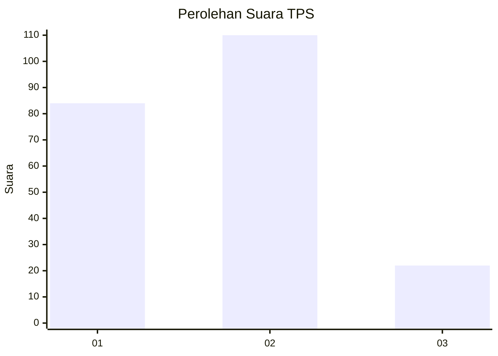
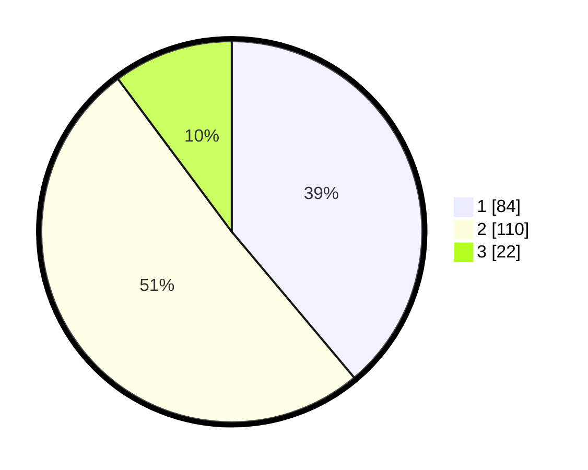

# Hasil

## Grafik

## Tabel

| No. | Nama Paslon    | Suara | Suara (raw) | Persentase |
|:--- |:-------------- | -----:| -----------:| ----------:|
| 1   | ANIES MUHAIMIN | 84    | [84][p-1]   | 38,89      |
| 2   | PRABOWO GIBRAN | 110   | [110][p-2]  | 50,93      |
| 3   | GANJAR MAHFUD  | 22    | [22][p-3]   | 10,19      |

[p-1]: https://github.com/gigit-pemilu/pemilu-2024-32-jawa-barat/blob/main/pilpres/hitung-suara/sub/32-jawa-barat/sub/73-kota-bandung/sub/20-antapani/sub/1001-antapani-kulon/sub/001-tps/sub/paslon-1.txt
[p-2]: https://github.com/gigit-pemilu/pemilu-2024-32-jawa-barat/blob/main/pilpres/hitung-suara/sub/32-jawa-barat/sub/73-kota-bandung/sub/20-antapani/sub/1001-antapani-kulon/sub/001-tps/sub/paslon-2.txt
[p-3]: https://github.com/gigit-pemilu/pemilu-2024-32-jawa-barat/blob/main/pilpres/hitung-suara/sub/32-jawa-barat/sub/73-kota-bandung/sub/20-antapani/sub/1001-antapani-kulon/sub/001-tps/sub/paslon-3.txt

## Foto C Plano

https://sirekap-obj-formc.kpu.go.id/6da5/pemilu/ppwp/32/73/20/10/01/3273201001001-20240215-222731--2fac0921-baa3-4129-95eb-0db15901786a.jpg

https://sirekap-obj-formc.kpu.go.id/6da5/pemilu/ppwp/32/73/20/10/01/3273201001001-20240214-232636--bd8bc6f6-ae3f-4606-8942-43fac1566e18.jpg

https://sirekap-obj-formc.kpu.go.id/6da5/pemilu/ppwp/32/73/20/10/01/3273201001001-20240214-232717--4b112fc4-5c55-4874-aa1a-c3af3bd3d022.jpg

## Metadata

| Key        | Value               |
| ---------- | ------------------- |
| Time Stamp | 2024-02-15 22:30:27 |

