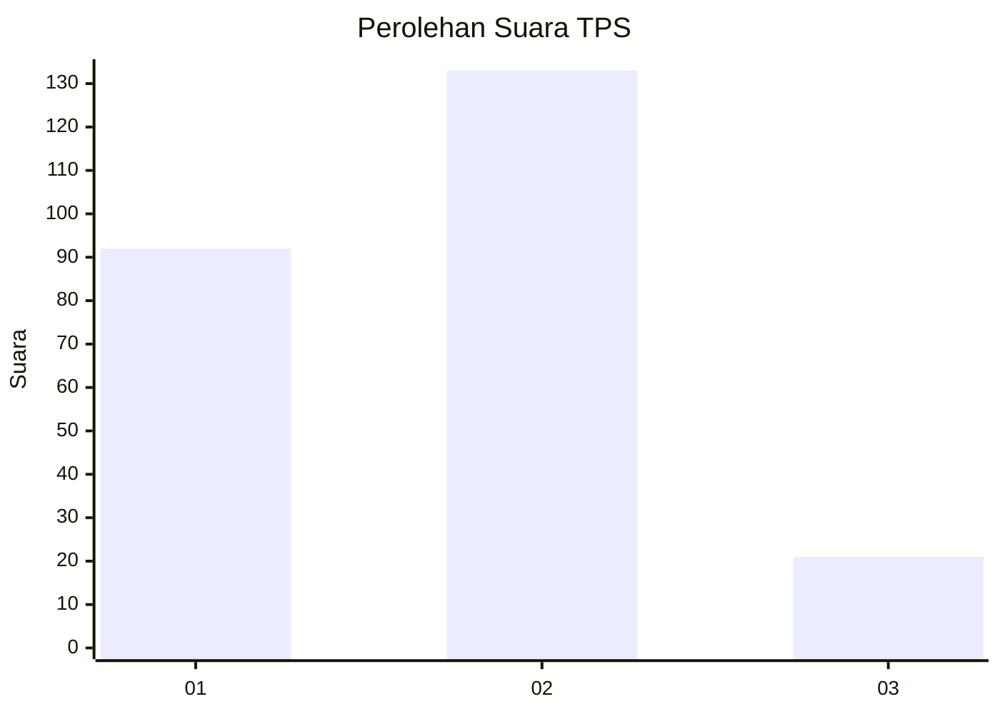

# Hasil

## Grafik

## Tabel

| No. | Nama Paslon    | Suara | Suara (raw) | Persentase |
|:--- |:-------------- | -----:| -----------:| ----------:|
| 1   | ANIES MUHAIMIN | 92    | [92][p-1]   | 37,40      |
| 2   | PRABOWO GIBRAN | 133   | [133][p-2]  | 54,07      |
| 3   | GANJAR MAHFUD  | 21    | [21][p-3]   | 8,54       |

[p-1]: https://github.com/gigit-pemilu/pemilu-2024/blob/main/pilpres/hitung-suara/sub/32-jawa-barat/sub/73-kota-bandung/sub/20-antapani/sub/1001-antapani-kulon/sub/004-tps/sub/paslon-1.txt
[p-2]: https://github.com/gigit-pemilu/pemilu-2024/blob/main/pilpres/hitung-suara/sub/32-jawa-barat/sub/73-kota-bandung/sub/20-antapani/sub/1001-antapani-kulon/sub/004-tps/sub/paslon-2.txt
[p-3]: https://github.com/gigit-pemilu/pemilu-2024/blob/main/pilpres/hitung-suara/sub/32-jawa-barat/sub/73-kota-bandung/sub/20-antapani/sub/1001-antapani-kulon/sub/004-tps/sub/paslon-3.txt

## Foto C Plano

https://sirekap-obj-formc.kpu.go.id/447d/pemilu/ppwp/32/73/20/10/01/3273201001004-20240215-235405--9561149e-c4ff-45ee-b576-ca432aca96d1.jpg

https://sirekap-obj-formc.kpu.go.id/447d/pemilu/ppwp/32/73/20/10/01/3273201001004-20240215-005220--9cf2fb8b-14af-472d-aa65-980d5f2bbb1f.jpg

https://sirekap-obj-formc.kpu.go.id/447d/pemilu/ppwp/32/73/20/10/01/3273201001004-20240217-105927--a8b159f1-f2ff-4a18-96f6-262f0a93a9fa.jpg

## Metadata

| Key        | Value               |
| ---------- | ------------------- |
| Time Stamp | 2024-02-17 11:00:02 |

