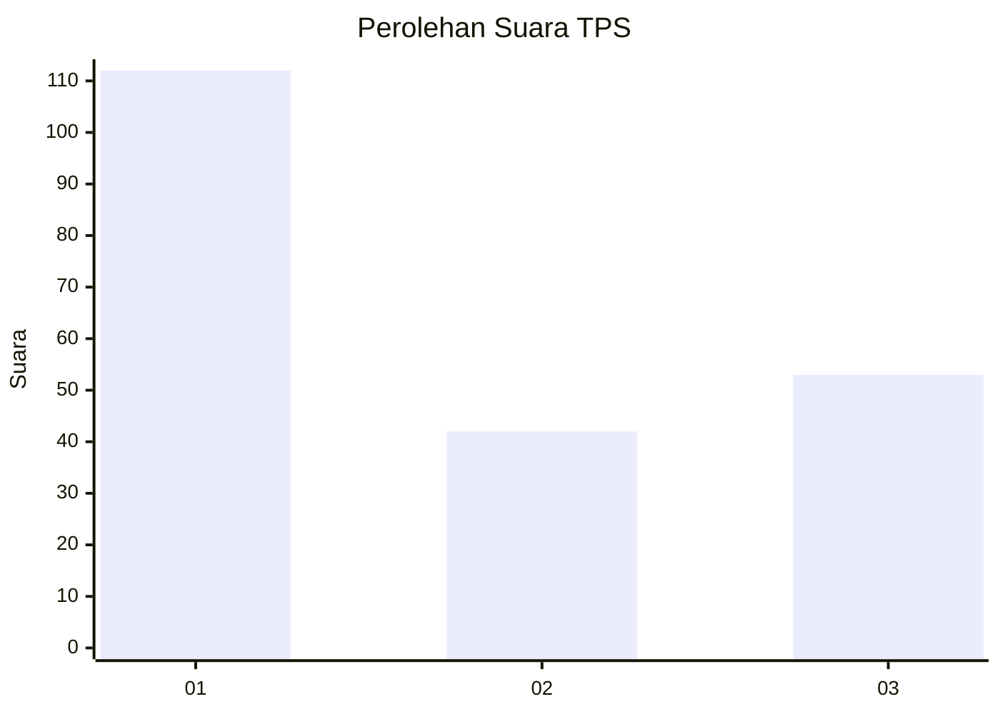
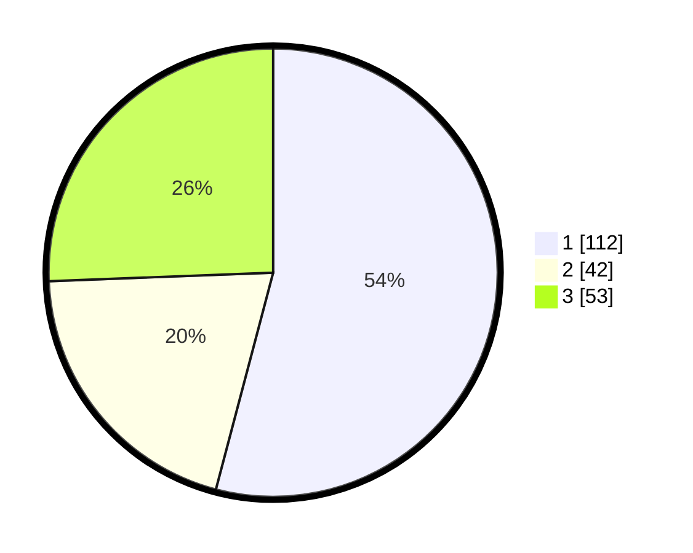

# Hasil

## Grafik

## Tabel

| No. | Nama Paslon    | Suara | Suara (raw) | Persentase |
|:--- |:-------------- | -----:| -----------:| ----------:|
| 1   | ANIES MUHAIMIN | 112   | [112][p-1]  | 54,11      |
| 2   | PRABOWO GIBRAN | 42    | [42][p-2]   | 20,29      |
| 3   | GANJAR MAHFUD  | 53    | [53][p-3]   | 25,60      |

[p-1]: https://github.com/gigit-pemilu/pemilu-2024/blob/main/pilpres/hitung-suara/sub/32-jawa-barat/sub/73-kota-bandung/sub/20-antapani/sub/1005-antapani-kidul/sub/005-tps/sub/paslon-1.txt
[p-2]: https://github.com/gigit-pemilu/pemilu-2024/blob/main/pilpres/hitung-suara/sub/32-jawa-barat/sub/73-kota-bandung/sub/20-antapani/sub/1005-antapani-kidul/sub/005-tps/sub/paslon-2.txt
[p-3]: https://github.com/gigit-pemilu/pemilu-2024/blob/main/pilpres/hitung-suara/sub/32-jawa-barat/sub/73-kota-bandung/sub/20-antapani/sub/1005-antapani-kidul/sub/005-tps/sub/paslon-3.txt

## Foto C Plano

https://sirekap-obj-formc.kpu.go.id/9413/pemilu/ppwp/32/73/20/10/05/3273201005005-20240214-203510--18971451-0b1b-4e60-9ef4-2fd33dd9c3c6.jpg

https://sirekap-obj-formc.kpu.go.id/9413/pemilu/ppwp/32/73/20/10/05/3273201005005-20240214-214903--f3ea7d9a-629f-428f-abac-5a6aff3329ae.jpg

https://sirekap-obj-formc.kpu.go.id/9413/pemilu/ppwp/32/73/20/10/05/3273201005005-20240214-203745--b4d8acbb-020f-4119-9fb1-aa79b79a8c7b.jpg

## Metadata

| Key        | Value               |
| ---------- | ------------------- |
| Time Stamp | 2024-02-15 19:00:26 |

