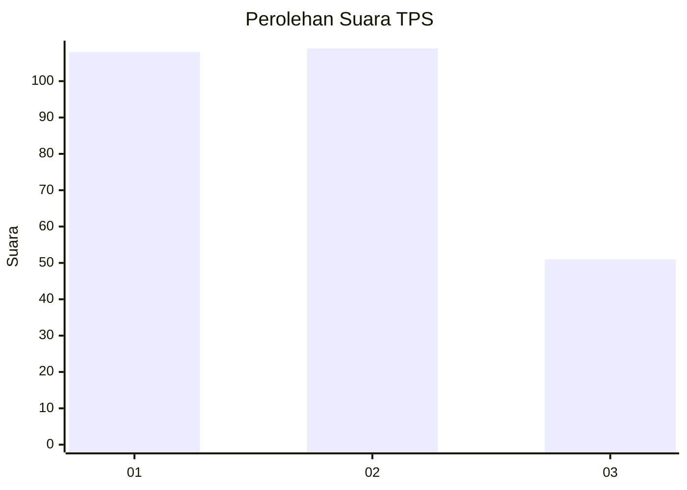
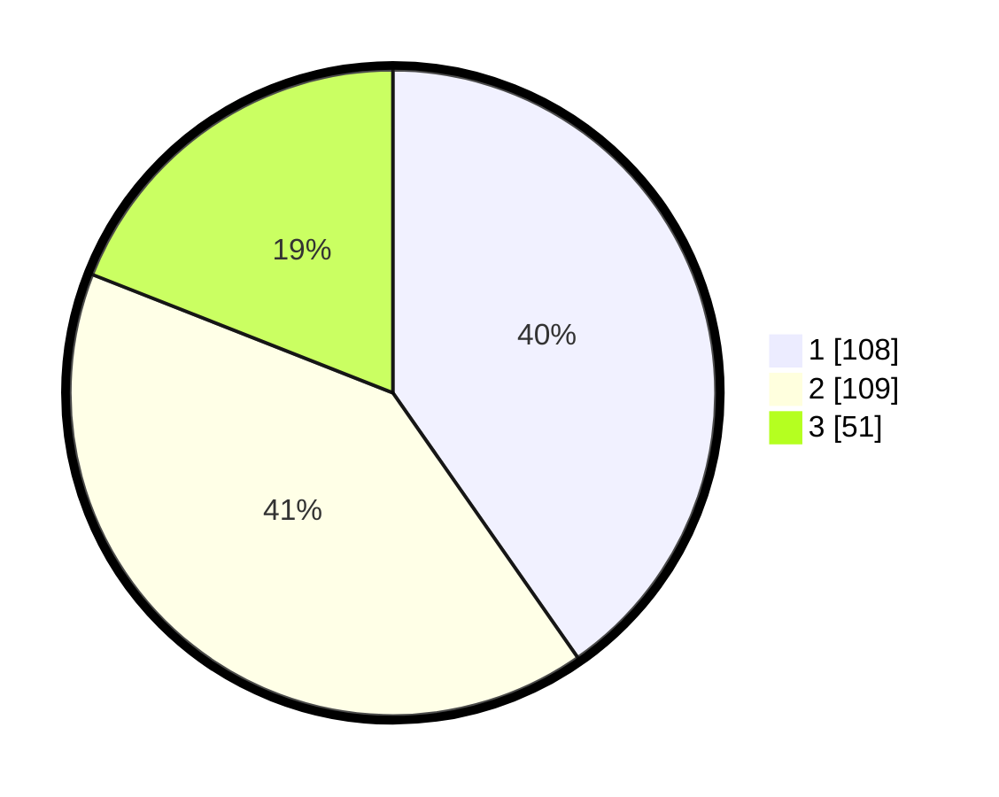

# Hasil

## Grafik

## Tabel

| No. | Nama Paslon    | Suara | Suara (raw) | Persentase |
|:--- |:-------------- | -----:| -----------:| ----------:|
| 1   | ANIES MUHAIMIN | 108   | [108][p-1]  | 40,30      |
| 2   | PRABOWO GIBRAN | 109   | [109][p-2]  | 40,67      |
| 3   | GANJAR MAHFUD  | 51    | [51][p-3]   | 19,03      |

[p-1]: https://github.com/gigit-pemilu/pemilu-2024/blob/main/pilpres/hitung-suara/sub/32-jawa-barat/sub/73-kota-bandung/sub/20-antapani/sub/1006-antapani-wetan/sub/032-tps/sub/paslon-1.txt
[p-2]: https://github.com/gigit-pemilu/pemilu-2024/blob/main/pilpres/hitung-suara/sub/32-jawa-barat/sub/73-kota-bandung/sub/20-antapani/sub/1006-antapani-wetan/sub/032-tps/sub/paslon-2.txt
[p-3]: https://github.com/gigit-pemilu/pemilu-2024/blob/main/pilpres/hitung-suara/sub/32-jawa-barat/sub/73-kota-bandung/sub/20-antapani/sub/1006-antapani-wetan/sub/032-tps/sub/paslon-3.txt

## Foto C Plano

https://sirekap-obj-formc.kpu.go.id/7217/pemilu/ppwp/32/73/20/10/06/3273201006032-20240214-234631--1eb1d055-1c84-47a2-bc36-287a452a1789.jpg

https://sirekap-obj-formc.kpu.go.id/7217/pemilu/ppwp/32/73/20/10/06/3273201006032-20240215-001411--ea84bd1f-c692-45f4-b0dd-0126791387b9.jpg

https://sirekap-obj-formc.kpu.go.id/7217/pemilu/ppwp/32/73/20/10/06/3273201006032-20240215-001228--09938221-0f2d-41ca-bf8b-b48e89eb0efd.jpg

## Metadata

| Key        | Value               |
| ---------- | ------------------- |
| Time Stamp | 2024-02-15 19:30:26 |

