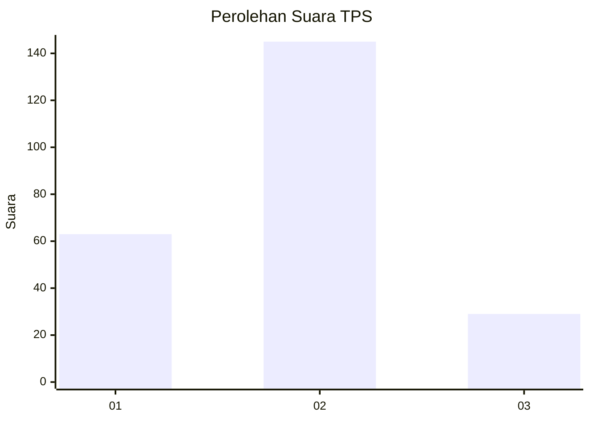
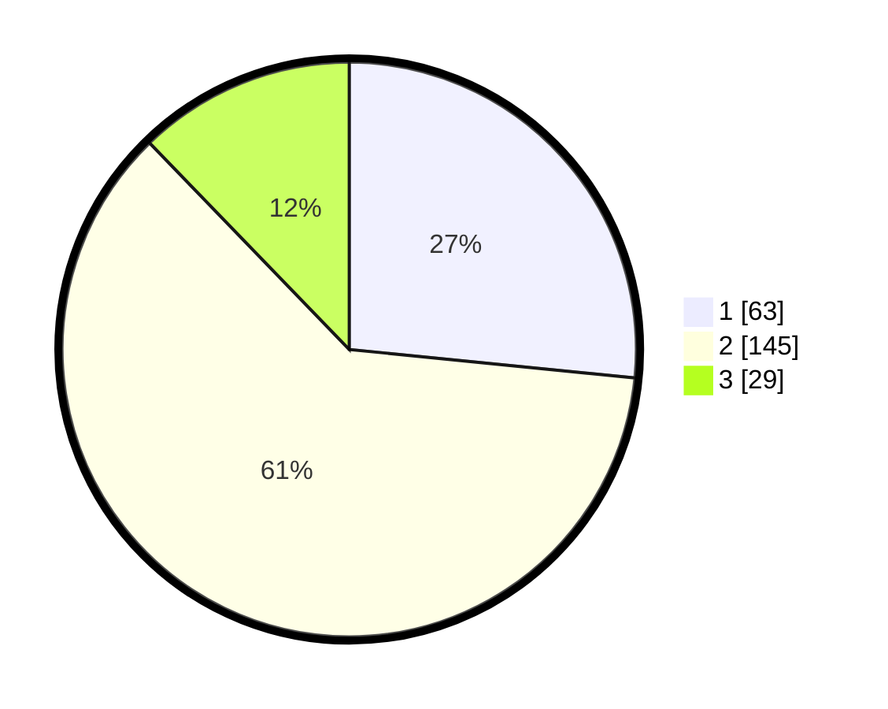

# Hasil

## Grafik

## Tabel

| No. | Nama Paslon    | Suara | Suara (raw) | Persentase |
|:--- |:-------------- | -----:| -----------:| ----------:|
| 1   | ANIES MUHAIMIN | 63    | [63][p-1]   | 26,58      |
| 2   | PRABOWO GIBRAN | 145   | [145][p-2]  | 61,18      |
| 3   | GANJAR MAHFUD  | 29    | [29][p-3]   | 12,24      |

[p-1]: https://github.com/gigit-pemilu/pemilu-2024/blob/main/pilpres/hitung-suara/sub/32-jawa-barat/sub/73-kota-bandung/sub/21-bandung-kidul/sub/1001-batununggal/sub/002-tps/sub/paslon-1.txt
[p-2]: https://github.com/gigit-pemilu/pemilu-2024/blob/main/pilpres/hitung-suara/sub/32-jawa-barat/sub/73-kota-bandung/sub/21-bandung-kidul/sub/1001-batununggal/sub/002-tps/sub/paslon-2.txt
[p-3]: https://github.com/gigit-pemilu/pemilu-2024/blob/main/pilpres/hitung-suara/sub/32-jawa-barat/sub/73-kota-bandung/sub/21-bandung-kidul/sub/1001-batununggal/sub/002-tps/sub/paslon-3.txt

## Foto C Plano

https://sirekap-obj-formc.kpu.go.id/829b/pemilu/ppwp/32/73/21/10/01/3273211001002-20240215-015453--e19026d8-8121-4760-9262-230cd12befd2.jpg

https://sirekap-obj-formc.kpu.go.id/829b/pemilu/ppwp/32/73/21/10/01/3273211001002-20240215-212343--b0356d0e-638c-4dad-b818-b157df727b6b.jpg

https://sirekap-obj-formc.kpu.go.id/829b/pemilu/ppwp/32/73/21/10/01/3273211001002-20240215-212655--2c58d6da-db01-4c5f-b955-bf33f1396d12.jpg

## Metadata

| Key        | Value               |
| ---------- | ------------------- |
| Time Stamp | 2024-02-17 17:00:04 |

