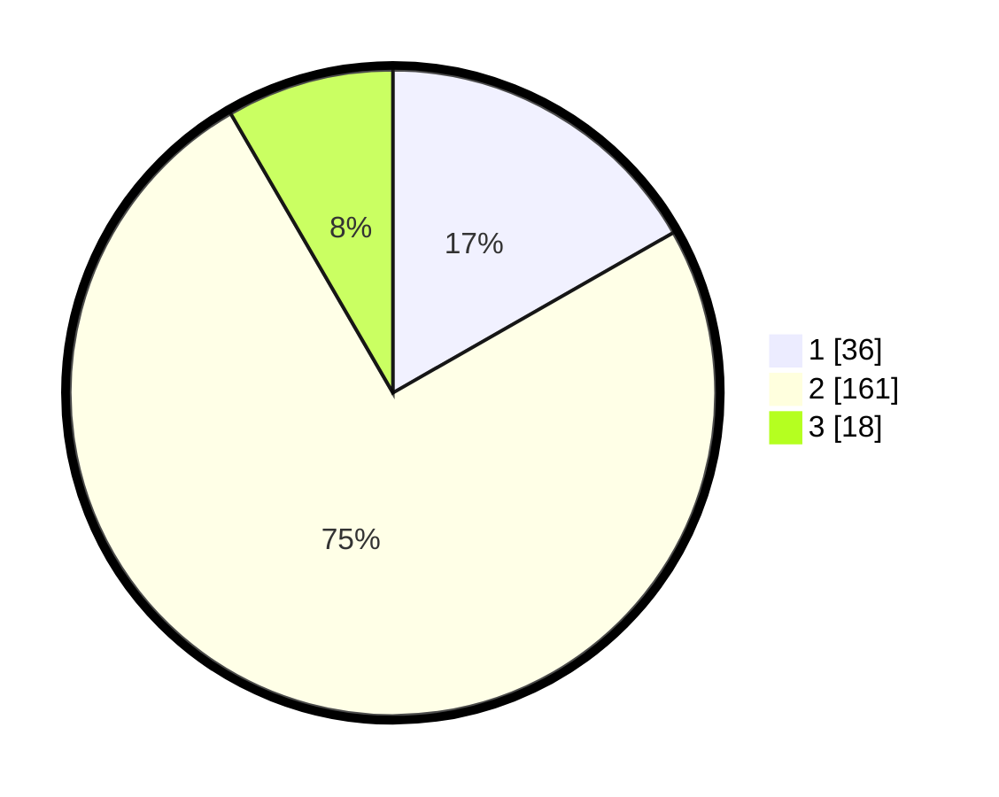

# Hasil

## Grafik

## Tabel

| No. | Nama Paslon    | Suara | Suara (raw) | Persentase |
|:--- |:-------------- | -----:| -----------:| ----------:|
| 1   | ANIES MUHAIMIN | 36    | [36][p-1]   | 16,74      |
| 2   | PRABOWO GIBRAN | 161   | [161][p-2]  | 74,88      |
| 3   | GANJAR MAHFUD  | 18    | [18][p-3]   | 8,37       |

[p-1]: https://github.com/gigit-pemilu/pemilu-2024-32-jawa-barat/blob/main/pilpres/hitung-suara/sub/32-jawa-barat/sub/73-kota-bandung/sub/22-buahbatu/sub/1001-sekejati/sub/002-tps/sub/paslon-1.txt
[p-2]: https://github.com/gigit-pemilu/pemilu-2024-32-jawa-barat/blob/main/pilpres/hitung-suara/sub/32-jawa-barat/sub/73-kota-bandung/sub/22-buahbatu/sub/1001-sekejati/sub/002-tps/sub/paslon-2.txt
[p-3]: https://github.com/gigit-pemilu/pemilu-2024-32-jawa-barat/blob/main/pilpres/hitung-suara/sub/32-jawa-barat/sub/73-kota-bandung/sub/22-buahbatu/sub/1001-sekejati/sub/002-tps/sub/paslon-3.txt

## Foto C Plano

https://sirekap-obj-formc.kpu.go.id/a023/pemilu/ppwp/32/73/22/10/01/3273221001002-20240216-224227--b46a54ca-3946-4156-8e34-54d4e3f92b41.jpg

https://sirekap-obj-formc.kpu.go.id/a023/pemilu/ppwp/32/73/22/10/01/3273221001002-20240216-221619--104a5e61-c6fa-48dd-820f-abde8a7262e2.jpg

https://sirekap-obj-formc.kpu.go.id/a023/pemilu/ppwp/32/73/22/10/01/3273221001002-20240217-133137--d8dd4a7b-866c-446b-90a0-86f132360879.jpg

## Metadata

| Key        | Value               |
| ---------- | ------------------- |
| Time Stamp | 2024-02-21 20:00:00 |

