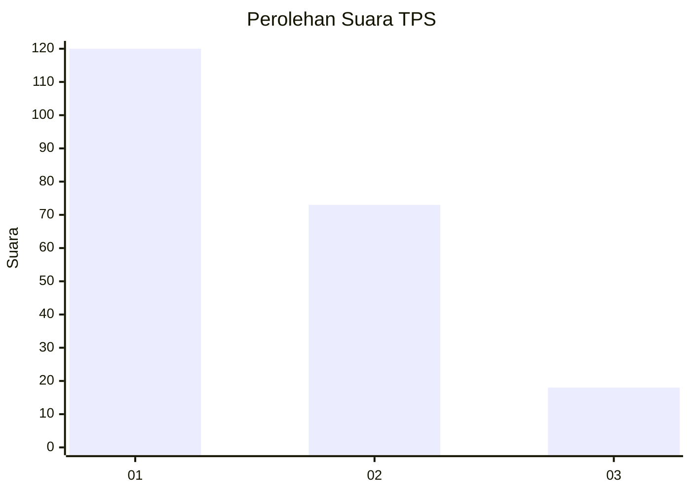
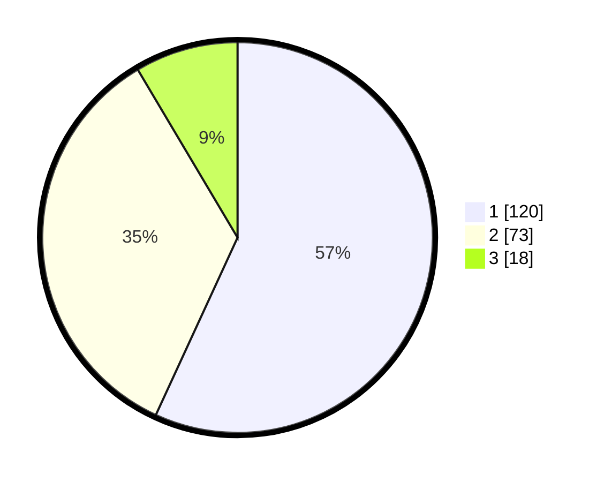

# Hasil

## Grafik

## Tabel

| No. | Nama Paslon    | Suara | Suara (raw) | Persentase |
|:--- |:-------------- | -----:| -----------:| ----------:|
| 1   | ANIES MUHAIMIN | 120   | [120][p-1]  | 56,87      |
| 2   | PRABOWO GIBRAN | 73    | [73][p-2]   | 34,60      |
| 3   | GANJAR MAHFUD  | 18    | [18][p-3]   | 8,53       |

[p-1]: https://github.com/gigit-pemilu/pemilu-2024/blob/main/pilpres/hitung-suara/sub/32-jawa-barat/sub/73-kota-bandung/sub/22-buahbatu/sub/1001-sekejati/sub/004-tps/sub/paslon-1.txt
[p-2]: https://github.com/gigit-pemilu/pemilu-2024/blob/main/pilpres/hitung-suara/sub/32-jawa-barat/sub/73-kota-bandung/sub/22-buahbatu/sub/1001-sekejati/sub/004-tps/sub/paslon-2.txt
[p-3]: https://github.com/gigit-pemilu/pemilu-2024/blob/main/pilpres/hitung-suara/sub/32-jawa-barat/sub/73-kota-bandung/sub/22-buahbatu/sub/1001-sekejati/sub/004-tps/sub/paslon-3.txt

## Foto C Plano

https://sirekap-obj-formc.kpu.go.id/711b/pemilu/ppwp/32/73/22/10/01/3273221001004-20240214-205352--51b1be6b-0c08-418e-adaf-5a2b073c5b62.jpg

https://sirekap-obj-formc.kpu.go.id/711b/pemilu/ppwp/32/73/22/10/01/3273221001004-20240214-222005--ec049163-fd50-4c81-b61e-75bdc7eca900.jpg

https://sirekap-obj-formc.kpu.go.id/711b/pemilu/ppwp/32/73/22/10/01/3273221001004-20240214-223915--fd35a914-85e3-4320-87ab-2d76ffdb474d.jpg

## Metadata

| Key        | Value               |
| ---------- | ------------------- |
| Time Stamp | 2024-02-25 11:00:00 |

