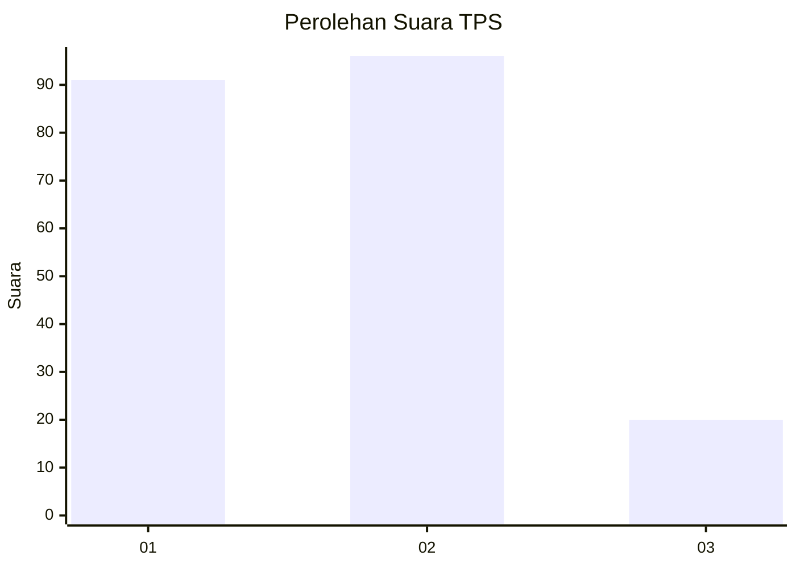
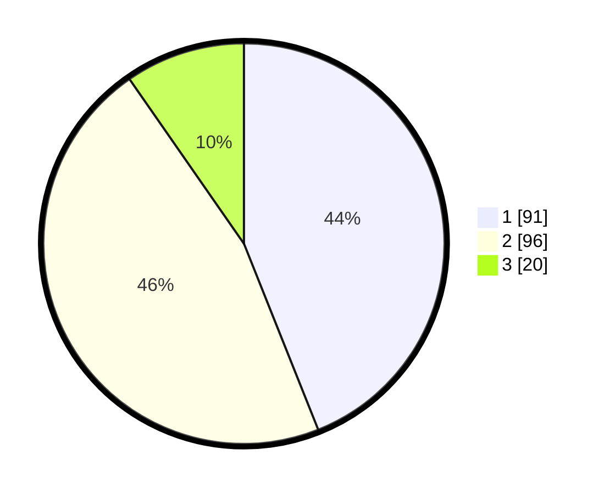

# Hasil

## Grafik

## Tabel

| No. | Nama Paslon    | Suara | Suara (raw) | Persentase |
|:--- |:-------------- | -----:| -----------:| ----------:|
| 1   | ANIES MUHAIMIN | 91    | [91][p-1]   | 43,96      |
| 2   | PRABOWO GIBRAN | 96    | [96][p-2]   | 46,38      |
| 3   | GANJAR MAHFUD  | 20    | [20][p-3]   | 9,66       |

[p-1]: https://github.com/gigit-pemilu/pemilu-2024/blob/main/pilpres/hitung-suara/sub/32-jawa-barat/sub/73-kota-bandung/sub/22-buahbatu/sub/1001-sekejati/sub/005-tps/sub/paslon-1.txt
[p-2]: https://github.com/gigit-pemilu/pemilu-2024/blob/main/pilpres/hitung-suara/sub/32-jawa-barat/sub/73-kota-bandung/sub/22-buahbatu/sub/1001-sekejati/sub/005-tps/sub/paslon-2.txt
[p-3]: https://github.com/gigit-pemilu/pemilu-2024/blob/main/pilpres/hitung-suara/sub/32-jawa-barat/sub/73-kota-bandung/sub/22-buahbatu/sub/1001-sekejati/sub/005-tps/sub/paslon-3.txt

## Foto C Plano

https://sirekap-obj-formc.kpu.go.id/84d5/pemilu/ppwp/32/73/22/10/01/3273221001005-20240214-190815--81ce9a78-f288-47e7-a7ee-7826a44b059b.jpg

https://sirekap-obj-formc.kpu.go.id/84d5/pemilu/ppwp/32/73/22/10/01/3273221001005-20240214-155514--1b139f8f-01c5-46fd-a2df-18484609cd42.jpg

https://sirekap-obj-formc.kpu.go.id/84d5/pemilu/ppwp/32/73/22/10/01/3273221001005-20240214-155708--aaeddc70-5072-4362-b322-560499d56d1b.jpg

## Metadata

| Key        | Value               |
| ---------- | ------------------- |
| Time Stamp | 2024-02-24 22:31:28 |

