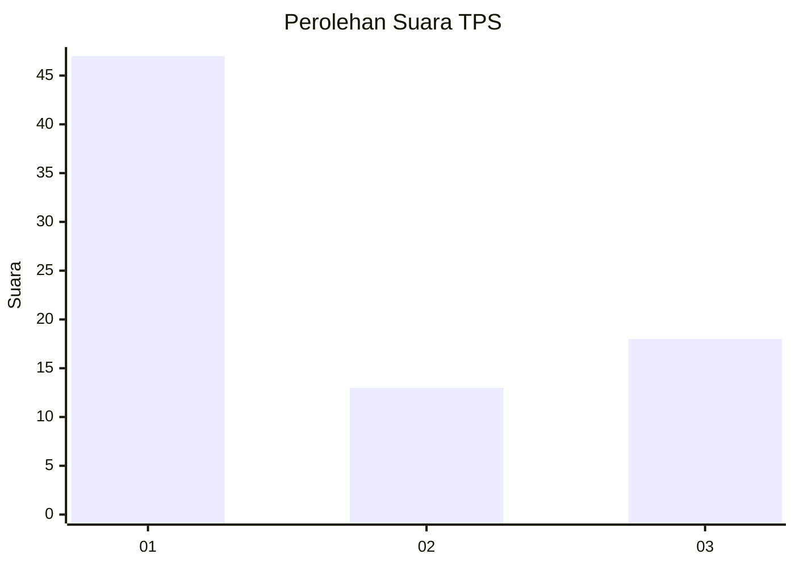
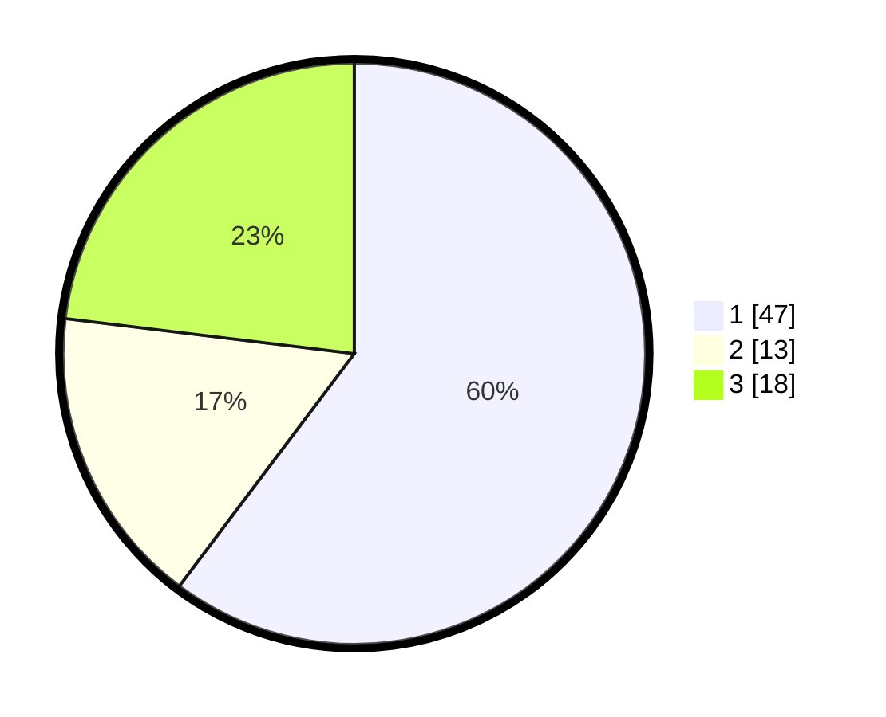

# Hasil

## Grafik

## Tabel

| No. | Nama Paslon    | Suara | Suara (raw) | Persentase |
|:--- |:-------------- | -----:| -----------:| ----------:|
| 1   | ANIES MUHAIMIN | 47    | [47][p-1]   | 60,26      |
| 2   | PRABOWO GIBRAN | 13    | [13][p-2]   | 16,67      |
| 3   | GANJAR MAHFUD  | 18    | [18][p-3]   | 23,08      |

[p-1]: https://github.com/gigit-pemilu/pemilu-2024/blob/main/pilpres/hitung-suara/sub/32-jawa-barat/sub/73-kota-bandung/sub/22-buahbatu/sub/1002-margasari/sub/050-tps/sub/paslon-1.txt
[p-2]: https://github.com/gigit-pemilu/pemilu-2024/blob/main/pilpres/hitung-suara/sub/32-jawa-barat/sub/73-kota-bandung/sub/22-buahbatu/sub/1002-margasari/sub/050-tps/sub/paslon-2.txt
[p-3]: https://github.com/gigit-pemilu/pemilu-2024/blob/main/pilpres/hitung-suara/sub/32-jawa-barat/sub/73-kota-bandung/sub/22-buahbatu/sub/1002-margasari/sub/050-tps/sub/paslon-3.txt

## Foto C Plano

https://sirekap-obj-formc.kpu.go.id/be32/pemilu/ppwp/32/73/22/10/02/3273221002050-20240216-190616--c46a2640-38c5-4dee-818b-ebdd2b05204d.jpg

https://sirekap-obj-formc.kpu.go.id/be32/pemilu/ppwp/32/73/22/10/02/3273221002050-20240216-190537--0d86e9c9-bf95-4afa-b790-45598c67cd7b.jpg

https://sirekap-obj-formc.kpu.go.id/be32/pemilu/ppwp/32/73/22/10/02/3273221002050-20240216-190659--dd6f9471-9f2a-4752-9a06-ae4f7328fe3f.jpg

## Metadata

| Key        | Value               |
| ---------- | ------------------- |
| Time Stamp | 2024-02-24 22:31:28 |

