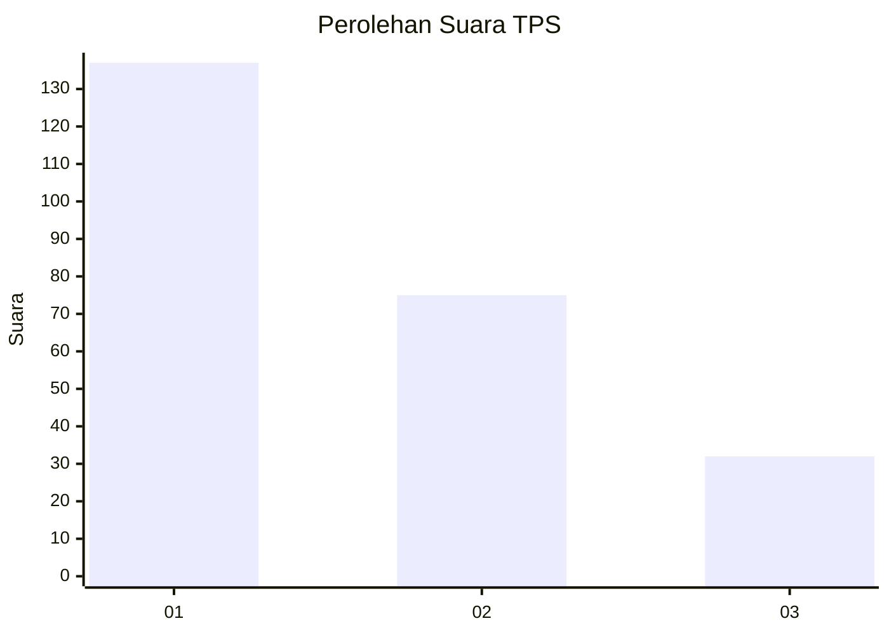
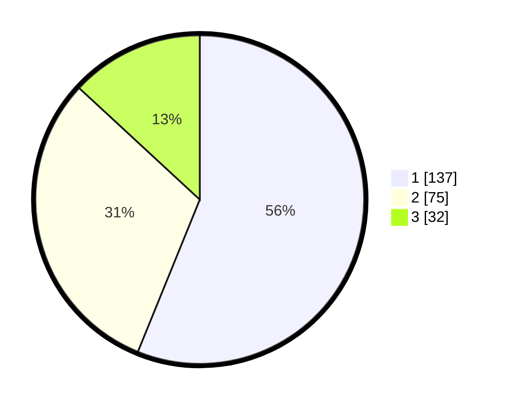

# Hasil

## Grafik

## Tabel

| No. | Nama Paslon    | Suara | Suara (raw) | Persentase |
|:--- |:-------------- | -----:| -----------:| ----------:|
| 1   | ANIES MUHAIMIN | 137   | [137][p-1]  | 56,15      |
| 2   | PRABOWO GIBRAN | 75    | [75][p-2]   | 30,74      |
| 3   | GANJAR MAHFUD  | 32    | [32][p-3]   | 13,11      |

[p-1]: https://github.com/gigit-pemilu/pemilu-2024/blob/main/pilpres/hitung-suara/sub/32-jawa-barat/sub/73-kota-bandung/sub/22-buahbatu/sub/1002-margasari/sub/059-tps/sub/paslon-1.txt
[p-2]: https://github.com/gigit-pemilu/pemilu-2024/blob/main/pilpres/hitung-suara/sub/32-jawa-barat/sub/73-kota-bandung/sub/22-buahbatu/sub/1002-margasari/sub/059-tps/sub/paslon-2.txt
[p-3]: https://github.com/gigit-pemilu/pemilu-2024/blob/main/pilpres/hitung-suara/sub/32-jawa-barat/sub/73-kota-bandung/sub/22-buahbatu/sub/1002-margasari/sub/059-tps/sub/paslon-3.txt

## Foto C Plano

https://sirekap-obj-formc.kpu.go.id/a737/pemilu/ppwp/32/73/22/10/02/3273221002059-20240215-044005--62227716-bc10-4f8d-8df5-078161690d49.jpg

https://sirekap-obj-formc.kpu.go.id/a737/pemilu/ppwp/32/73/22/10/02/3273221002059-20240215-044053--fc54e2c8-1aba-4f44-ab2c-cedbfdf29ab1.jpg

https://sirekap-obj-formc.kpu.go.id/a737/pemilu/ppwp/32/73/22/10/02/3273221002059-20240215-044210--c9987869-1e92-441d-beb0-a6a17104a978.jpg

## Metadata

| Key        | Value               |
| ---------- | ------------------- |
| Time Stamp | 2024-02-24 22:31:28 |

