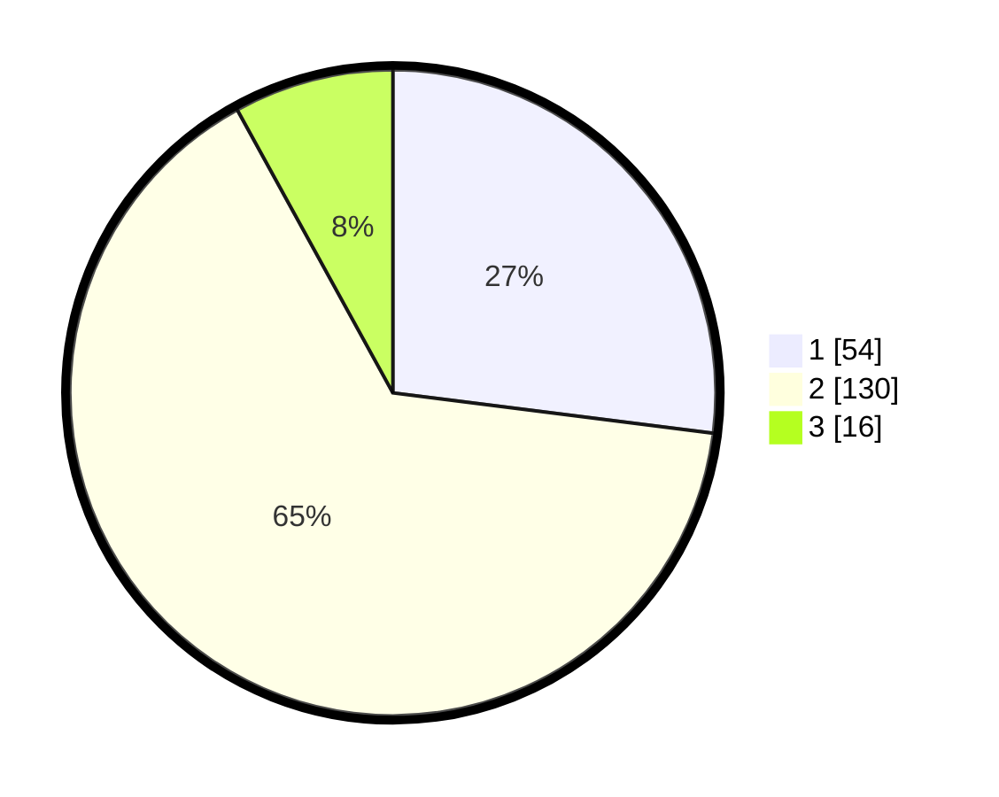

# Hasil

## Grafik

## Tabel

| No. | Nama Paslon    | Suara | Suara (raw) | Persentase |
|:--- |:-------------- | -----:| -----------:| ----------:|
| 1   | ANIES MUHAIMIN | 54    | [54][p-1]   | 27,00      |
| 2   | PRABOWO GIBRAN | 130   | [130][p-2]  | 65,00      |
| 3   | GANJAR MAHFUD  | 16    | [16][p-3]   | 8,00       |

[p-1]: https://github.com/gigit-pemilu/pemilu-2024-32-jawa-barat/blob/main/pilpres/hitung-suara/sub/32-jawa-barat/sub/73-kota-bandung/sub/23-rancasari/sub/1001-cipamokolan/sub/002-tps/sub/paslon-1.txt
[p-2]: https://github.com/gigit-pemilu/pemilu-2024-32-jawa-barat/blob/main/pilpres/hitung-suara/sub/32-jawa-barat/sub/73-kota-bandung/sub/23-rancasari/sub/1001-cipamokolan/sub/002-tps/sub/paslon-2.txt
[p-3]: https://github.com/gigit-pemilu/pemilu-2024-32-jawa-barat/blob/main/pilpres/hitung-suara/sub/32-jawa-barat/sub/73-kota-bandung/sub/23-rancasari/sub/1001-cipamokolan/sub/002-tps/sub/paslon-3.txt

## Foto C Plano

https://sirekap-obj-formc.kpu.go.id/b940/pemilu/ppwp/32/73/23/10/01/3273231001002-20240215-013643--4171dc81-4a3e-4fd6-8da7-123595d4b880.jpg

https://sirekap-obj-formc.kpu.go.id/b940/pemilu/ppwp/32/73/23/10/01/3273231001002-20240215-013657--74610cb5-33f4-49f1-a8bf-5ee46faea98e.jpg

https://sirekap-obj-formc.kpu.go.id/b940/pemilu/ppwp/32/73/23/10/01/3273231001002-20240215-013944--5687bd0a-cdd8-4db5-afdf-7c8f7b4c145d.jpg

## Metadata

| Key        | Value               |
| ---------- | ------------------- |
| Time Stamp | 2024-02-15 17:30:25 |

