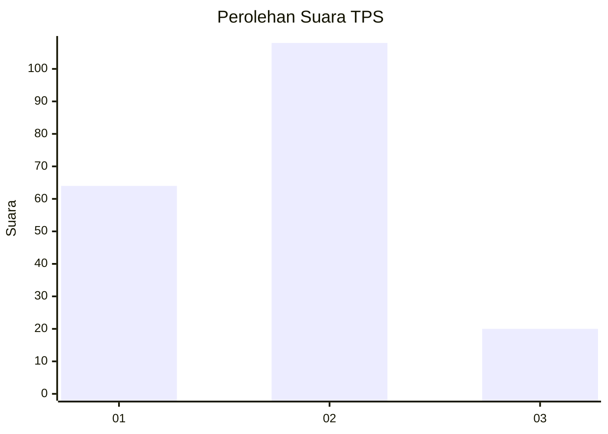
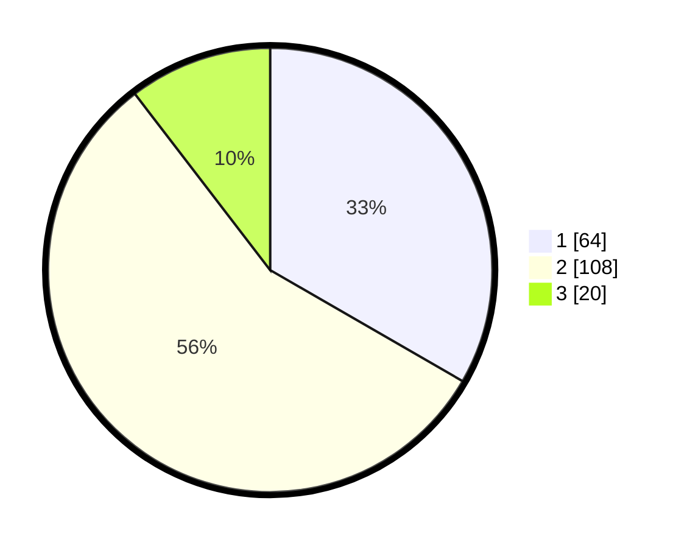

# Hasil

## Grafik

## Tabel

| No. | Nama Paslon    | Suara | Suara (raw) | Persentase |
|:--- |:-------------- | -----:| -----------:| ----------:|
| 1   | ANIES MUHAIMIN | 64    | [64][p-1]   | 33,33      |
| 2   | PRABOWO GIBRAN | 108   | [108][p-2]  | 56,25      |
| 3   | GANJAR MAHFUD  | 20    | [20][p-3]   | 10,42      |

[p-1]: https://github.com/gigit-pemilu/pemilu-2024-32-jawa-barat/blob/main/pilpres/hitung-suara/sub/32-jawa-barat/sub/73-kota-bandung/sub/23-rancasari/sub/1001-cipamokolan/sub/005-tps/sub/paslon-1.txt
[p-2]: https://github.com/gigit-pemilu/pemilu-2024-32-jawa-barat/blob/main/pilpres/hitung-suara/sub/32-jawa-barat/sub/73-kota-bandung/sub/23-rancasari/sub/1001-cipamokolan/sub/005-tps/sub/paslon-2.txt
[p-3]: https://github.com/gigit-pemilu/pemilu-2024-32-jawa-barat/blob/main/pilpres/hitung-suara/sub/32-jawa-barat/sub/73-kota-bandung/sub/23-rancasari/sub/1001-cipamokolan/sub/005-tps/sub/paslon-3.txt

## Foto C Plano

https://sirekap-obj-formc.kpu.go.id/36f1/pemilu/ppwp/32/73/23/10/01/3273231001005-20240216-093659--b5308e99-48ff-42c5-8ef6-cac9671c68f3.jpg

https://sirekap-obj-formc.kpu.go.id/36f1/pemilu/ppwp/32/73/23/10/01/3273231001005-20240216-093917--33603c67-5fc1-4a7f-84fb-1610f72fe8ed.jpg

https://sirekap-obj-formc.kpu.go.id/36f1/pemilu/ppwp/32/73/23/10/01/3273231001005-20240216-094102--e6695fb0-62fa-4b97-bfa2-bea97a2732e7.jpg

## Metadata

| Key        | Value               |
| ---------- | ------------------- |
| Time Stamp | 2024-02-16 10:00:28 |

