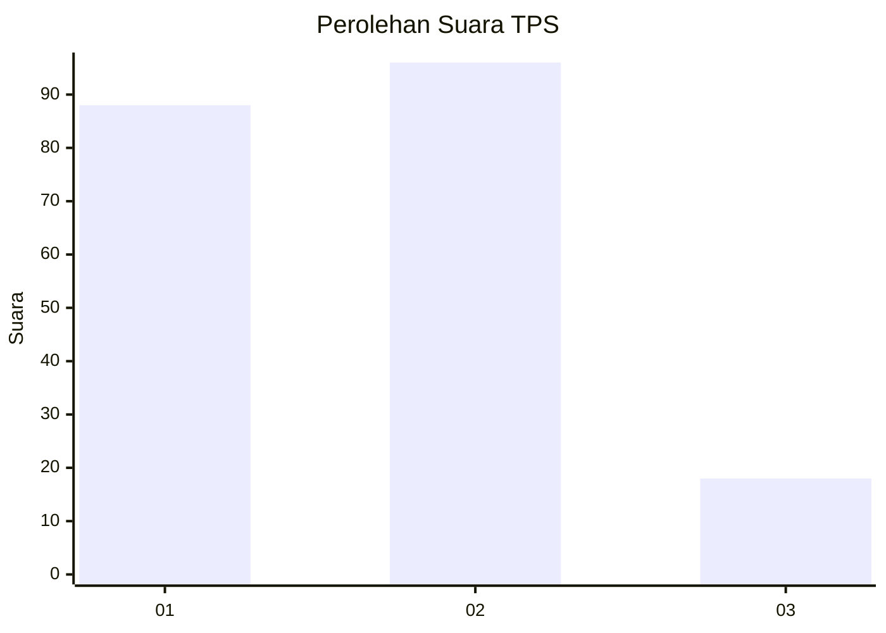
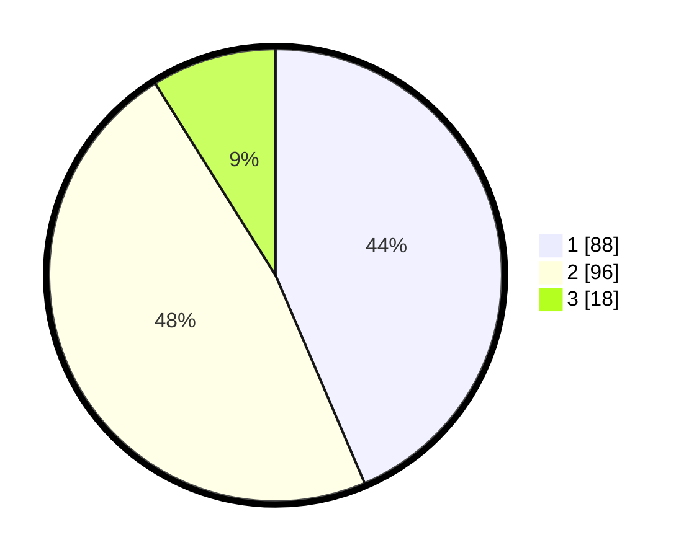

# Hasil

## Grafik

## Tabel

| No. | Nama Paslon    | Suara | Suara (raw) | Persentase |
|:--- |:-------------- | -----:| -----------:| ----------:|
| 1   | ANIES MUHAIMIN | 88    | [88][p-1]   | 43,56      |
| 2   | PRABOWO GIBRAN | 96    | [96][p-2]   | 47,52      |
| 3   | GANJAR MAHFUD  | 18    | [18][p-3]   | 8,91       |

[p-1]: https://github.com/gigit-pemilu/pemilu-2024-32-jawa-barat/blob/main/pilpres/hitung-suara/sub/32-jawa-barat/sub/73-kota-bandung/sub/24-arcamanik/sub/1001-sukamiskin/sub/001-tps/sub/paslon-1.txt
[p-2]: https://github.com/gigit-pemilu/pemilu-2024-32-jawa-barat/blob/main/pilpres/hitung-suara/sub/32-jawa-barat/sub/73-kota-bandung/sub/24-arcamanik/sub/1001-sukamiskin/sub/001-tps/sub/paslon-2.txt
[p-3]: https://github.com/gigit-pemilu/pemilu-2024-32-jawa-barat/blob/main/pilpres/hitung-suara/sub/32-jawa-barat/sub/73-kota-bandung/sub/24-arcamanik/sub/1001-sukamiskin/sub/001-tps/sub/paslon-3.txt

## Foto C Plano

https://sirekap-obj-formc.kpu.go.id/605d/pemilu/ppwp/32/73/24/10/01/3273241001001-20240215-004341--46a825a2-d445-46c4-9438-877144df6759.jpg

https://sirekap-obj-formc.kpu.go.id/605d/pemilu/ppwp/32/73/24/10/01/3273241001001-20240215-004506--75930c91-b15d-42e9-a747-0e691efd795d.jpg

https://sirekap-obj-formc.kpu.go.id/605d/pemilu/ppwp/32/73/24/10/01/3273241001001-20240215-004740--d7fc8279-1fee-4b6e-b252-71ed3e534157.jpg

## Metadata

| Key        | Value               |
| ---------- | ------------------- |
| Time Stamp | 2024-02-15 12:00:28 |

