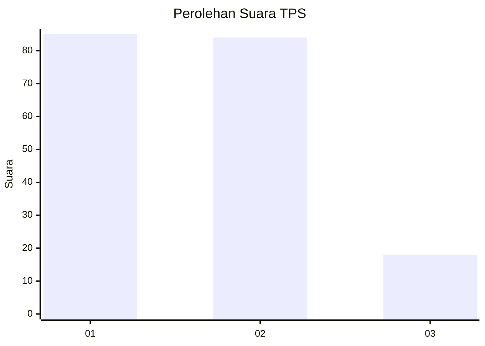
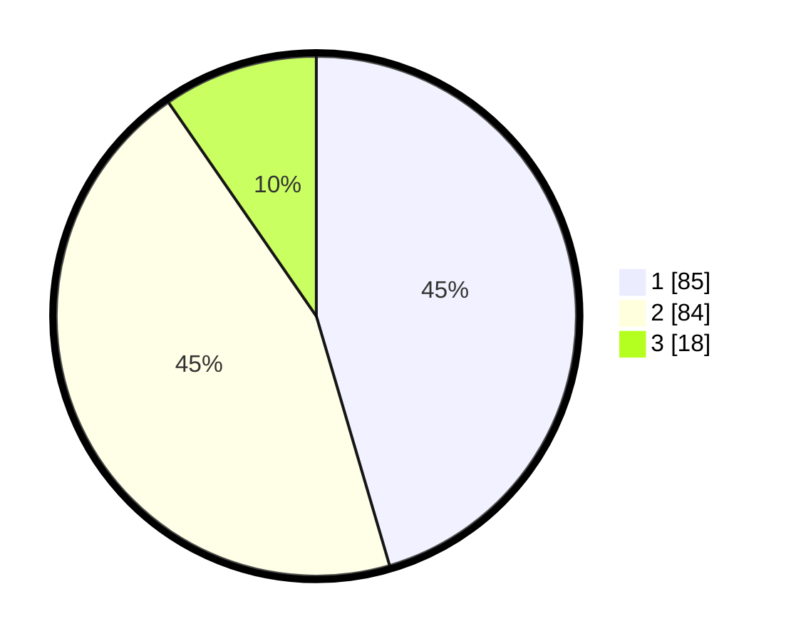

# Hasil

## Grafik

## Tabel

| No. | Nama Paslon    | Suara | Suara (raw) | Persentase |
|:--- |:-------------- | -----:| -----------:| ----------:|
| 1   | ANIES MUHAIMIN | 85    | [85][p-1]   | 45,45      |
| 2   | PRABOWO GIBRAN | 84    | [84][p-2]   | 44,92      |
| 3   | GANJAR MAHFUD  | 18    | [18][p-3]   | 9,63       |

[p-1]: https://github.com/gigit-pemilu/pemilu-2024/blob/main/pilpres/hitung-suara/sub/32-jawa-barat/sub/73-kota-bandung/sub/24-arcamanik/sub/1001-sukamiskin/sub/007-tps/sub/paslon-1.txt
[p-2]: https://github.com/gigit-pemilu/pemilu-2024/blob/main/pilpres/hitung-suara/sub/32-jawa-barat/sub/73-kota-bandung/sub/24-arcamanik/sub/1001-sukamiskin/sub/007-tps/sub/paslon-2.txt
[p-3]: https://github.com/gigit-pemilu/pemilu-2024/blob/main/pilpres/hitung-suara/sub/32-jawa-barat/sub/73-kota-bandung/sub/24-arcamanik/sub/1001-sukamiskin/sub/007-tps/sub/paslon-3.txt

## Foto C Plano

https://sirekap-obj-formc.kpu.go.id/6588/pemilu/ppwp/32/73/24/10/01/3273241001007-20240214-222656--40005c04-2c0d-495c-8ee8-9a0e653c803b.jpg

https://sirekap-obj-formc.kpu.go.id/6588/pemilu/ppwp/32/73/24/10/01/3273241001007-20240214-222827--10a681f8-72b0-4a41-9492-25c856397eb4.jpg

https://sirekap-obj-formc.kpu.go.id/6588/pemilu/ppwp/32/73/24/10/01/3273241001007-20240214-223249--899910f7-f608-404f-9ab3-b591bf1f9342.jpg

## Metadata

| Key        | Value               |
| ---------- | ------------------- |
| Time Stamp | 2024-02-15 12:00:28 |

