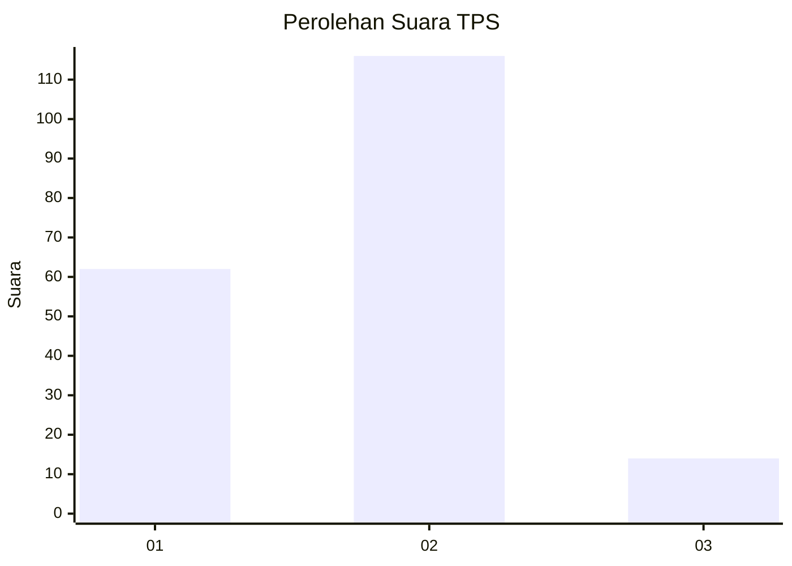
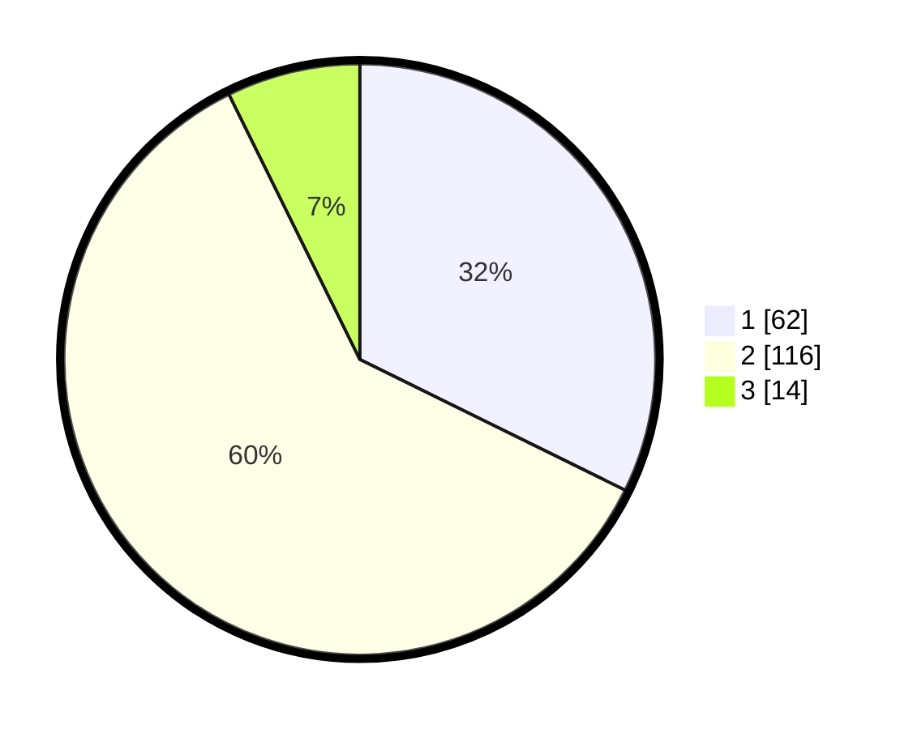

# Hasil

## Grafik

## Tabel

| No. | Nama Paslon    | Suara | Suara (raw) | Persentase |
|:--- |:-------------- | -----:| -----------:| ----------:|
| 1   | ANIES MUHAIMIN | 62    | [62][p-1]   | 32,29      |
| 2   | PRABOWO GIBRAN | 116   | [116][p-2]  | 60,42      |
| 3   | GANJAR MAHFUD  | 14    | [14][p-3]   | 7,29       |

[p-1]: https://github.com/gigit-pemilu/pemilu-2024-32-jawa-barat/blob/main/pilpres/hitung-suara/sub/32-jawa-barat/sub/73-kota-bandung/sub/24-arcamanik/sub/1001-sukamiskin/sub/008-tps/sub/paslon-1.txt
[p-2]: https://github.com/gigit-pemilu/pemilu-2024-32-jawa-barat/blob/main/pilpres/hitung-suara/sub/32-jawa-barat/sub/73-kota-bandung/sub/24-arcamanik/sub/1001-sukamiskin/sub/008-tps/sub/paslon-2.txt
[p-3]: https://github.com/gigit-pemilu/pemilu-2024-32-jawa-barat/blob/main/pilpres/hitung-suara/sub/32-jawa-barat/sub/73-kota-bandung/sub/24-arcamanik/sub/1001-sukamiskin/sub/008-tps/sub/paslon-3.txt

## Foto C Plano

https://sirekap-obj-formc.kpu.go.id/799d/pemilu/ppwp/32/73/24/10/01/3273241001008-20240215-015716--5bdafd9d-477a-4423-8606-04363513b2d4.jpg

https://sirekap-obj-formc.kpu.go.id/799d/pemilu/ppwp/32/73/24/10/01/3273241001008-20240215-020250--9309b74e-0e85-4527-b046-1e633402ea5a.jpg

https://sirekap-obj-formc.kpu.go.id/799d/pemilu/ppwp/32/73/24/10/01/3273241001008-20240215-015946--8242f5ba-6105-4c5d-9e04-593d52236534.jpg

## Metadata

| Key        | Value               |
| ---------- | ------------------- |
| Time Stamp | 2024-02-15 15:00:29 |

