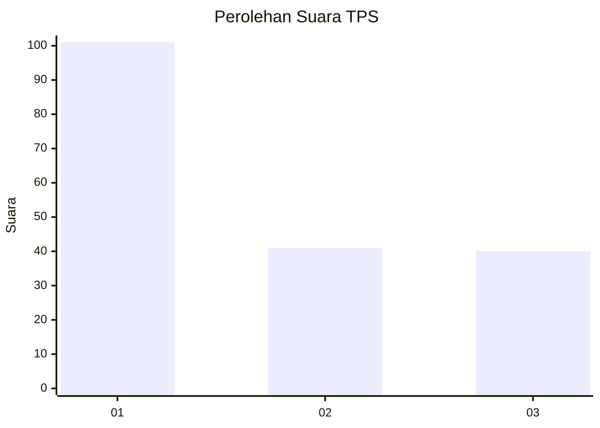
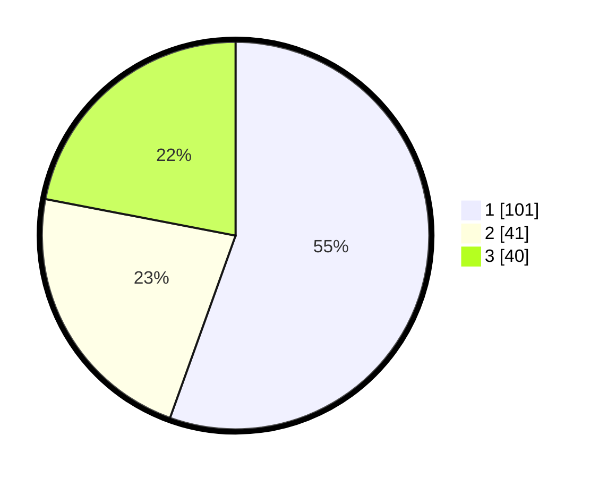

# Hasil

## Grafik

## Tabel

| No. | Nama Paslon    | Suara | Suara (raw) | Persentase |
|:--- |:-------------- | -----:| -----------:| ----------:|
| 1   | ANIES MUHAIMIN | 101   | [101][p-1]  | 55,49      |
| 2   | PRABOWO GIBRAN | 41    | [41][p-2]   | 22,53      |
| 3   | GANJAR MAHFUD  | 40    | [40][p-3]   | 21,98      |

[p-1]: https://github.com/gigit-pemilu/pemilu-2024/blob/main/pilpres/hitung-suara/sub/32-jawa-barat/sub/73-kota-bandung/sub/24-arcamanik/sub/1004-cisaranten-endah/sub/003-tps/sub/paslon-1.txt
[p-2]: https://github.com/gigit-pemilu/pemilu-2024/blob/main/pilpres/hitung-suara/sub/32-jawa-barat/sub/73-kota-bandung/sub/24-arcamanik/sub/1004-cisaranten-endah/sub/003-tps/sub/paslon-2.txt
[p-3]: https://github.com/gigit-pemilu/pemilu-2024/blob/main/pilpres/hitung-suara/sub/32-jawa-barat/sub/73-kota-bandung/sub/24-arcamanik/sub/1004-cisaranten-endah/sub/003-tps/sub/paslon-3.txt

## Foto C Plano

https://sirekap-obj-formc.kpu.go.id/96d5/pemilu/ppwp/32/73/24/10/04/3273241004003-20240214-155543--2fd1803f-95d9-4b12-b4cc-bf697151c63f.jpg

https://sirekap-obj-formc.kpu.go.id/96d5/pemilu/ppwp/32/73/24/10/04/3273241004003-20240214-155907--39bda4c6-e64e-47c7-88e7-6e848e38def6.jpg

https://sirekap-obj-formc.kpu.go.id/96d5/pemilu/ppwp/32/73/24/10/04/3273241004003-20240214-160109--4a04c75c-21b5-4f09-9fe8-93dbec338d11.jpg

## Metadata

| Key        | Value               |
| ---------- | ------------------- |
| Time Stamp | 2024-02-14 21:46:01 |

