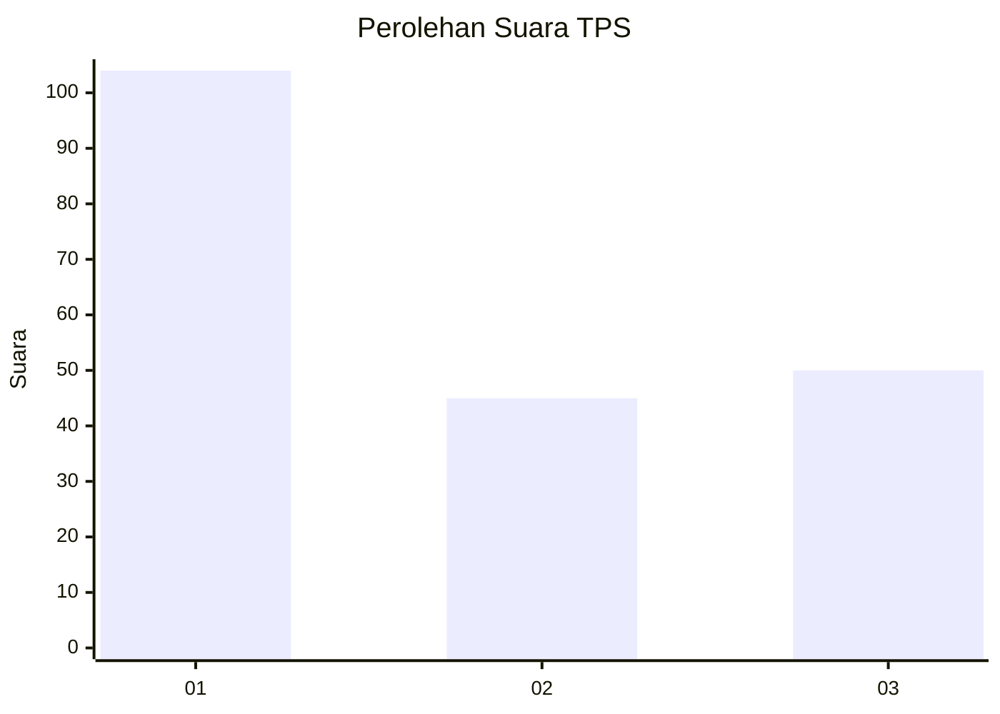
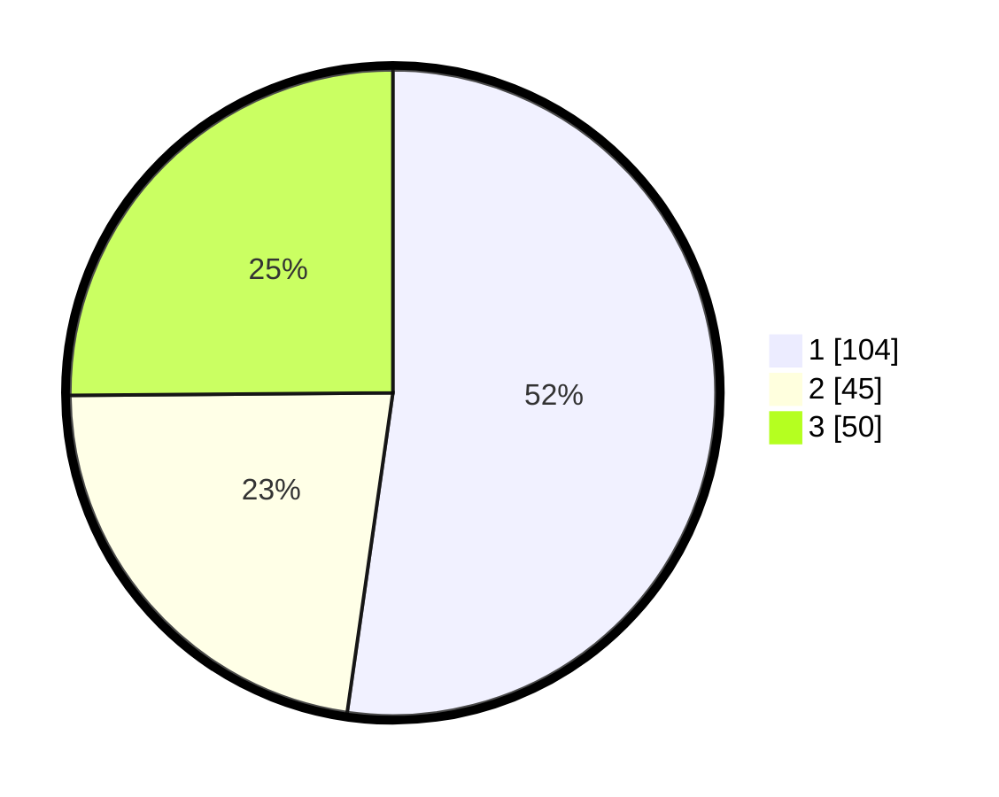

# Hasil

## Grafik

## Tabel

| No. | Nama Paslon    | Suara | Suara (raw) | Persentase |
|:--- |:-------------- | -----:| -----------:| ----------:|
| 1   | ANIES MUHAIMIN | 104   | [104][p-1]  | 52,26      |
| 2   | PRABOWO GIBRAN | 45    | [45][p-2]   | 22,61      |
| 3   | GANJAR MAHFUD  | 50    | [50][p-3]   | 25,13      |

[p-1]: https://github.com/gigit-pemilu/pemilu-2024/blob/main/pilpres/hitung-suara/sub/32-jawa-barat/sub/73-kota-bandung/sub/24-arcamanik/sub/1004-cisaranten-endah/sub/004-tps/sub/paslon-1.txt
[p-2]: https://github.com/gigit-pemilu/pemilu-2024/blob/main/pilpres/hitung-suara/sub/32-jawa-barat/sub/73-kota-bandung/sub/24-arcamanik/sub/1004-cisaranten-endah/sub/004-tps/sub/paslon-2.txt
[p-3]: https://github.com/gigit-pemilu/pemilu-2024/blob/main/pilpres/hitung-suara/sub/32-jawa-barat/sub/73-kota-bandung/sub/24-arcamanik/sub/1004-cisaranten-endah/sub/004-tps/sub/paslon-3.txt

## Foto C Plano

https://sirekap-obj-formc.kpu.go.id/1981/pemilu/ppwp/32/73/24/10/04/3273241004004-20240214-215108--99c03667-c58e-4bd7-b2f2-3e299498ddc7.jpg

https://sirekap-obj-formc.kpu.go.id/1981/pemilu/ppwp/32/73/24/10/04/3273241004004-20240214-215231--5ae09b7b-2047-4664-a9ea-e68ed9bd7c2d.jpg

https://sirekap-obj-formc.kpu.go.id/1981/pemilu/ppwp/32/73/24/10/04/3273241004004-20240214-215405--93bc51e6-92d1-47f1-8b3a-6eb9ff8cf18a.jpg

## Metadata

| Key        | Value               |
| ---------- | ------------------- |
| Time Stamp | 2024-02-15 15:00:29 |

