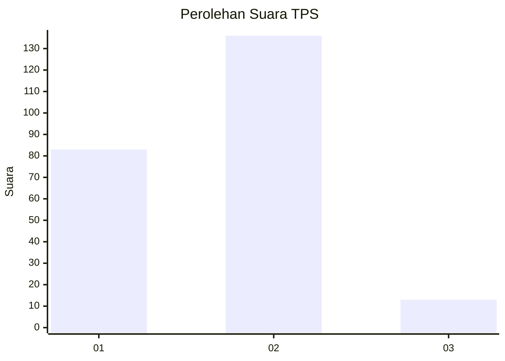
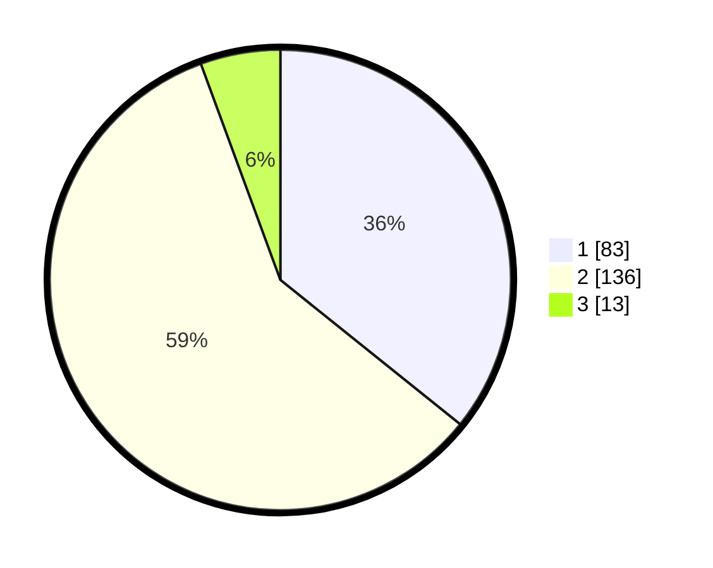

# Hasil

## Grafik

## Tabel

| No. | Nama Paslon    | Suara | Suara (raw) | Persentase |
|:--- |:-------------- | -----:| -----------:| ----------:|
| 1   | ANIES MUHAIMIN | 83    | [83][p-1]   | 35,78      |
| 2   | PRABOWO GIBRAN | 136   | [136][p-2]  | 58,62      |
| 3   | GANJAR MAHFUD  | 13    | [13][p-3]   | 5,60       |

[p-1]: https://github.com/gigit-pemilu/pemilu-2024/blob/main/pilpres/hitung-suara/sub/32-jawa-barat/sub/73-kota-bandung/sub/25-cibiru/sub/1001-palasari/sub/012-tps/sub/paslon-1.txt
[p-2]: https://github.com/gigit-pemilu/pemilu-2024/blob/main/pilpres/hitung-suara/sub/32-jawa-barat/sub/73-kota-bandung/sub/25-cibiru/sub/1001-palasari/sub/012-tps/sub/paslon-2.txt
[p-3]: https://github.com/gigit-pemilu/pemilu-2024/blob/main/pilpres/hitung-suara/sub/32-jawa-barat/sub/73-kota-bandung/sub/25-cibiru/sub/1001-palasari/sub/012-tps/sub/paslon-3.txt

## Foto C Plano

https://sirekap-obj-formc.kpu.go.id/d055/pemilu/ppwp/32/73/25/10/01/3273251001012-20240214-234948--a2d0009f-de59-4a73-a421-9128f9bec6b0.jpg

https://sirekap-obj-formc.kpu.go.id/d055/pemilu/ppwp/32/73/25/10/01/3273251001012-20240215-101046--2a080bc0-e976-4c96-84a1-94591ba44473.jpg

https://sirekap-obj-formc.kpu.go.id/d055/pemilu/ppwp/32/73/25/10/01/3273251001012-20240214-234756--1db196f5-86e8-4abe-ac62-c3b413ff1782.jpg

## Metadata

| Key        | Value               |
| ---------- | ------------------- |
| Time Stamp | 2024-02-15 15:00:29 |

