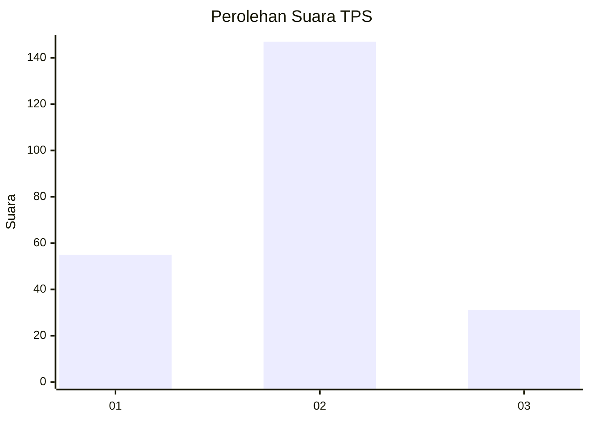
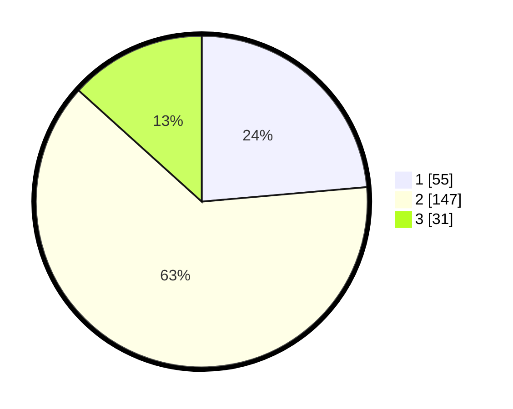

# Hasil

## Grafik

## Tabel

| No. | Nama Paslon    | Suara | Suara (raw) | Persentase |
|:--- |:-------------- | -----:| -----------:| ----------:|
| 1   | ANIES MUHAIMIN | 55    | [55][p-1]   | 23,61      |
| 2   | PRABOWO GIBRAN | 147   | [147][p-2]  | 63,09      |
| 3   | GANJAR MAHFUD  | 31    | [31][p-3]   | 13,30      |

[p-1]: https://github.com/gigit-pemilu/pemilu-2024/blob/main/pilpres/hitung-suara/sub/32-jawa-barat/sub/73-kota-bandung/sub/26-ujungberung/sub/1003-pasir-endah/sub/003-tps/sub/paslon-1.txt
[p-2]: https://github.com/gigit-pemilu/pemilu-2024/blob/main/pilpres/hitung-suara/sub/32-jawa-barat/sub/73-kota-bandung/sub/26-ujungberung/sub/1003-pasir-endah/sub/003-tps/sub/paslon-2.txt
[p-3]: https://github.com/gigit-pemilu/pemilu-2024/blob/main/pilpres/hitung-suara/sub/32-jawa-barat/sub/73-kota-bandung/sub/26-ujungberung/sub/1003-pasir-endah/sub/003-tps/sub/paslon-3.txt

## Foto C Plano

https://sirekap-obj-formc.kpu.go.id/3e5a/pemilu/ppwp/32/73/26/10/03/3273261003003-20240216-163006--442ed1e2-9829-4641-b5d8-9b122594de5c.jpg

https://sirekap-obj-formc.kpu.go.id/3e5a/pemilu/ppwp/32/73/26/10/03/3273261003003-20240216-163218--0533725c-2888-4225-aa32-27cf2883a011.jpg

https://sirekap-obj-formc.kpu.go.id/3e5a/pemilu/ppwp/32/73/26/10/03/3273261003003-20240216-165711--0cd15440-dabc-4968-9ebe-5e1fc7733cf1.jpg

## Metadata

| Key        | Value               |
| ---------- | ------------------- |
| Time Stamp | 2024-02-17 17:00:04 |

