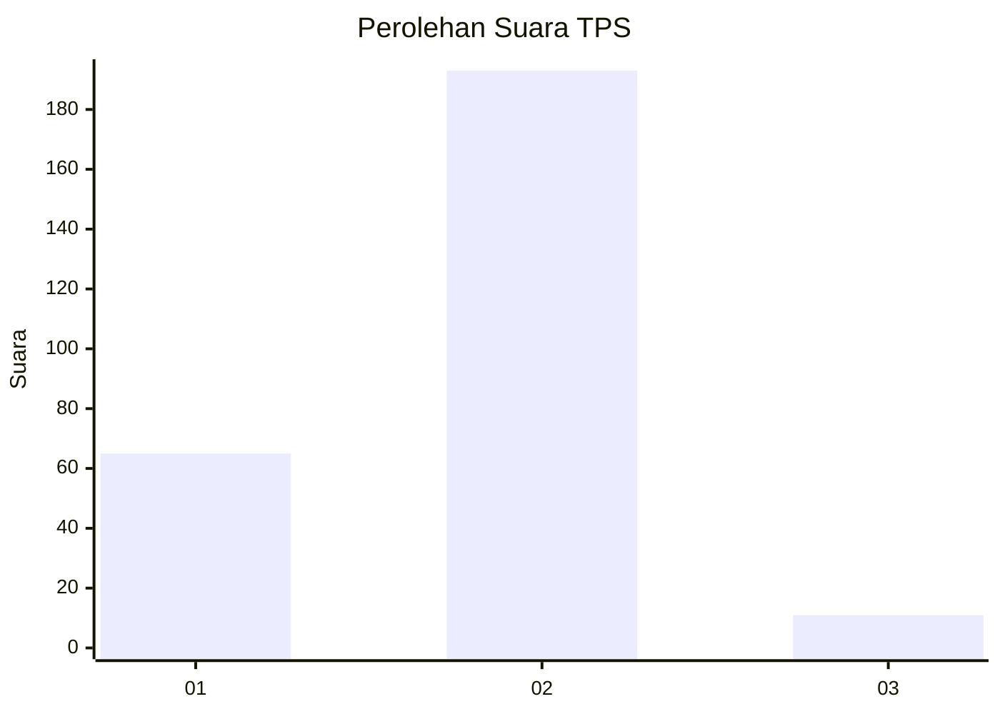

# Hasil

## Grafik

## Tabel

| No. | Nama Paslon    | Suara | Suara (raw) | Persentase |
|:--- |:-------------- | -----:| -----------:| ----------:|
| 1   | ANIES MUHAIMIN | 65    | [65][p-1]   | 24,16      |
| 2   | PRABOWO GIBRAN | 193   | [193][p-2]  | 71,75      |
| 3   | GANJAR MAHFUD  | 11    | [11][p-3]   | 4,09       |

[p-1]: https://github.com/gigit-pemilu/pemilu-2024-32-jawa-barat/blob/main/pilpres/hitung-suara/sub/32-jawa-barat/sub/73-kota-bandung/sub/27-gedebage/sub/1003-rancabolang/sub/003-tps/sub/paslon-1.txt
[p-2]: https://github.com/gigit-pemilu/pemilu-2024-32-jawa-barat/blob/main/pilpres/hitung-suara/sub/32-jawa-barat/sub/73-kota-bandung/sub/27-gedebage/sub/1003-rancabolang/sub/003-tps/sub/paslon-2.txt
[p-3]: https://github.com/gigit-pemilu/pemilu-2024-32-jawa-barat/blob/main/pilpres/hitung-suara/sub/32-jawa-barat/sub/73-kota-bandung/sub/27-gedebage/sub/1003-rancabolang/sub/003-tps/sub/paslon-3.txt

## Foto C Plano

https://sirekap-obj-formc.kpu.go.id/acf6/pemilu/ppwp/32/73/27/10/03/3273271003003-20240214-155701--06c582b3-46d6-401e-a89d-f7f416567122.jpg

https://sirekap-obj-formc.kpu.go.id/acf6/pemilu/ppwp/32/73/27/10/03/3273271003003-20240214-155408--70cac83e-458f-4185-b5bf-abbeb3658e6d.jpg

https://sirekap-obj-formc.kpu.go.id/acf6/pemilu/ppwp/32/73/27/10/03/3273271003003-20240214-155524--9a43f229-3978-45c7-b4a3-2038bf33c676.jpg

## Metadata

| Key        | Value               |
| ---------- | ------------------- |
| Time Stamp | 2024-02-14 21:46:01 |

