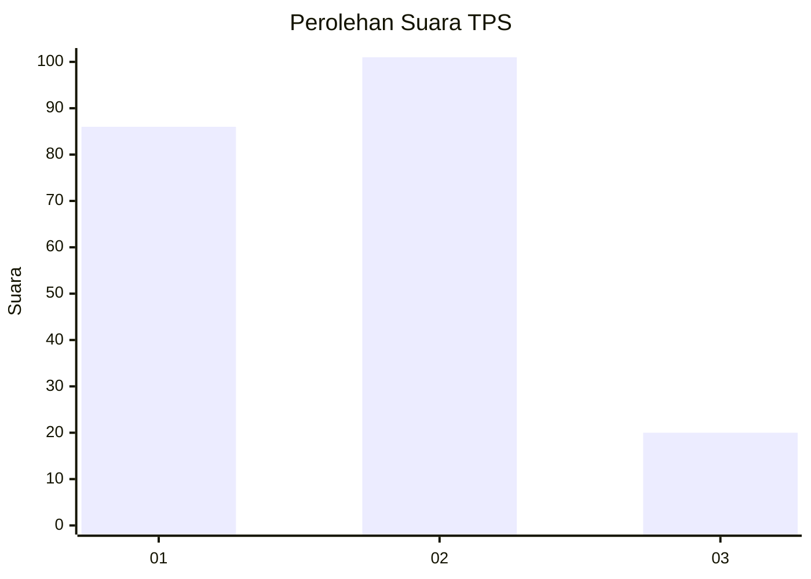
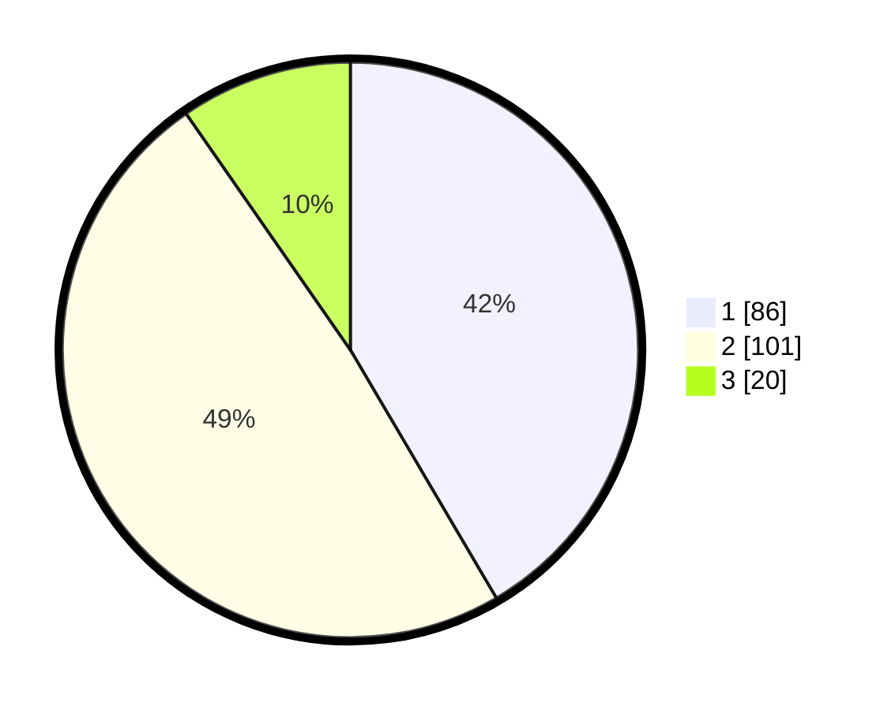

# Hasil

## Grafik

## Tabel

| No. | Nama Paslon    | Suara | Suara (raw) | Persentase |
|:--- |:-------------- | -----:| -----------:| ----------:|
| 1   | ANIES MUHAIMIN | 86    | [86][p-1]   | 41,55      |
| 2   | PRABOWO GIBRAN | 101   | [101][p-2]  | 48,79      |
| 3   | GANJAR MAHFUD  | 20    | [20][p-3]   | 9,66       |

[p-1]: https://github.com/gigit-pemilu/pemilu-2024/blob/main/pilpres/hitung-suara/sub/32-jawa-barat/sub/73-kota-bandung/sub/30-mandalajati/sub/1001-jatihandap/sub/006-tps/sub/paslon-1.txt
[p-2]: https://github.com/gigit-pemilu/pemilu-2024/blob/main/pilpres/hitung-suara/sub/32-jawa-barat/sub/73-kota-bandung/sub/30-mandalajati/sub/1001-jatihandap/sub/006-tps/sub/paslon-2.txt
[p-3]: https://github.com/gigit-pemilu/pemilu-2024/blob/main/pilpres/hitung-suara/sub/32-jawa-barat/sub/73-kota-bandung/sub/30-mandalajati/sub/1001-jatihandap/sub/006-tps/sub/paslon-3.txt

## Foto C Plano

https://sirekap-obj-formc.kpu.go.id/011a/pemilu/ppwp/32/73/30/10/01/3273301001006-20240215-034345--1e90c49d-2ea3-4da0-b373-4a303e890039.jpg

https://sirekap-obj-formc.kpu.go.id/011a/pemilu/ppwp/32/73/30/10/01/3273301001006-20240215-034712--22d6f6ce-f9b4-4849-8d19-67020a0dbb86.jpg

https://sirekap-obj-formc.kpu.go.id/011a/pemilu/ppwp/32/73/30/10/01/3273301001006-20240215-034122--b07ed36b-16dc-4f13-9ebc-27287ccc88be.jpg

## Metadata

| Key        | Value               |
| ---------- | ------------------- |
| Time Stamp | 2024-02-15 12:00:28 |

