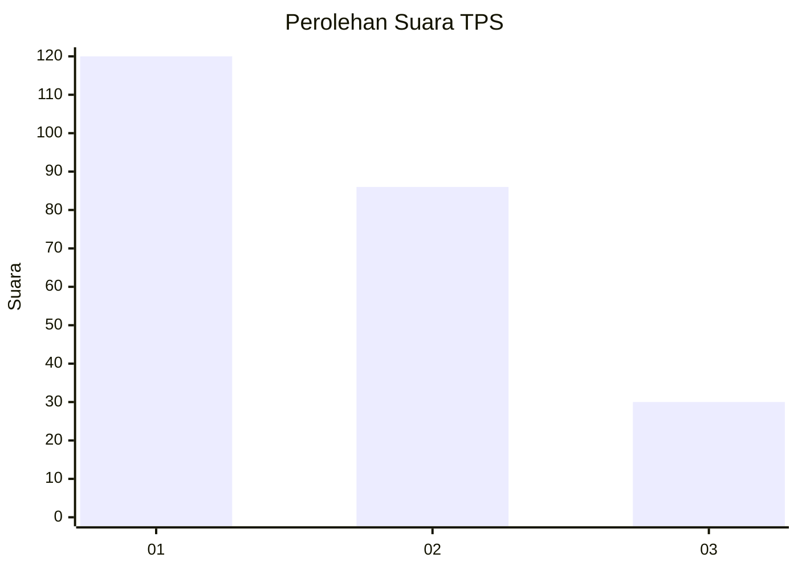
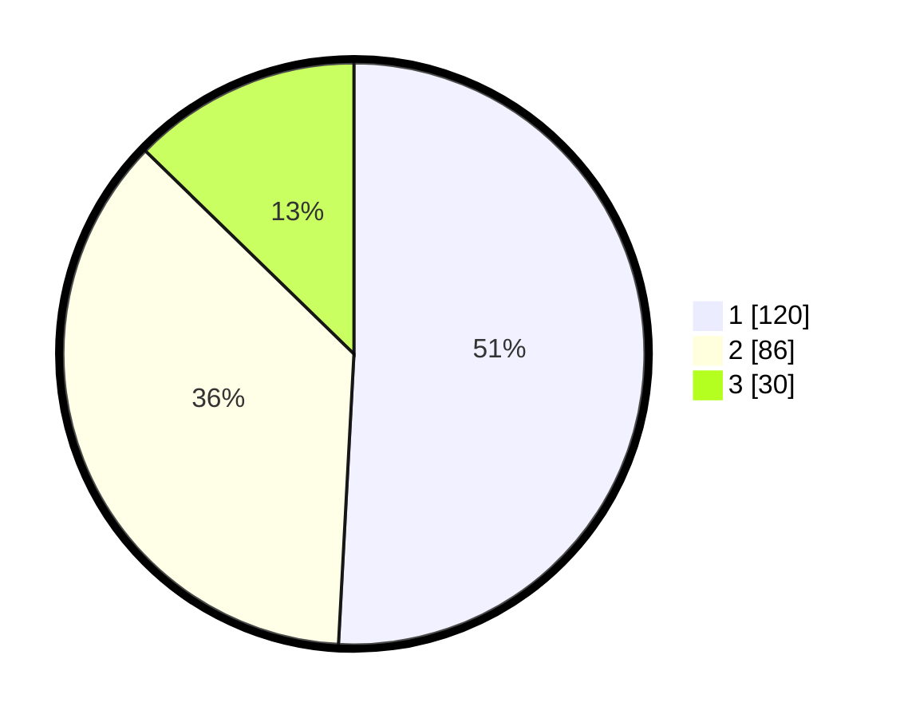

# Hasil

## Grafik

## Tabel

| No. | Nama Paslon    | Suara | Suara (raw) | Persentase |
|:--- |:-------------- | -----:| -----------:| ----------:|
| 1   | ANIES MUHAIMIN | 120   | [120][p-1]  | 50,85      |
| 2   | PRABOWO GIBRAN | 86    | [86][p-2]   | 36,44      |
| 3   | GANJAR MAHFUD  | 30    | [30][p-3]   | 12,71      |

[p-1]: https://github.com/gigit-pemilu/pemilu-2024/blob/main/pilpres/hitung-suara/sub/32-jawa-barat/sub/73-kota-bandung/sub/30-mandalajati/sub/1001-jatihandap/sub/048-tps/sub/paslon-1.txt
[p-2]: https://github.com/gigit-pemilu/pemilu-2024/blob/main/pilpres/hitung-suara/sub/32-jawa-barat/sub/73-kota-bandung/sub/30-mandalajati/sub/1001-jatihandap/sub/048-tps/sub/paslon-2.txt
[p-3]: https://github.com/gigit-pemilu/pemilu-2024/blob/main/pilpres/hitung-suara/sub/32-jawa-barat/sub/73-kota-bandung/sub/30-mandalajati/sub/1001-jatihandap/sub/048-tps/sub/paslon-3.txt

## Foto C Plano

https://sirekap-obj-formc.kpu.go.id/ee2d/pemilu/ppwp/32/73/30/10/01/3273301001048-20240215-233003--9d605dd6-976d-46e0-9628-71a9185b6e7b.jpg

https://sirekap-obj-formc.kpu.go.id/ee2d/pemilu/ppwp/32/73/30/10/01/3273301001048-20240215-233320--56e0a51c-bacc-4b51-8ff6-befaa3d0ce38.jpg

https://sirekap-obj-formc.kpu.go.id/ee2d/pemilu/ppwp/32/73/30/10/01/3273301001048-20240215-233535--8bf73dd2-3d34-4828-9e19-72d7e8fd4356.jpg

## Metadata

| Key        | Value               |
| ---------- | ------------------- |
| Time Stamp | 2024-02-19 06:16:00 |

## DATA PEMILIH TETAP

Jumlah pemilih dalam DPT: **266**.
 * L: **463**.
 * P: **843**.

## DATA PENGGUNA HAK PILIH

Jumlah pengguna hak pilih dalam DPT: **238**.
 * L: **860**.
 * P: **428**.

Jumlah pengguna hak pilih dalam DPTb: **995**.
 * L: **665**.
 * P: **7**.

Jumlah pengguna hak pilih dalam DPK: **222**.
 * L: **432**.
 * P: **225**.

Jumlah pengguna hak pilih: **241**.
 * L: **442**.
 * P: **830**.

## JUMLAH SUARA SAH DAN TIDAK SAH

JUMLAH SELURUH SUARA SAH: **236**.

JUMLAH SUARA TIDAK SAH: **5**.

JUMLAH SELURUH SUARA SAH DAN SUARA TIDAK SAH: **241**.

