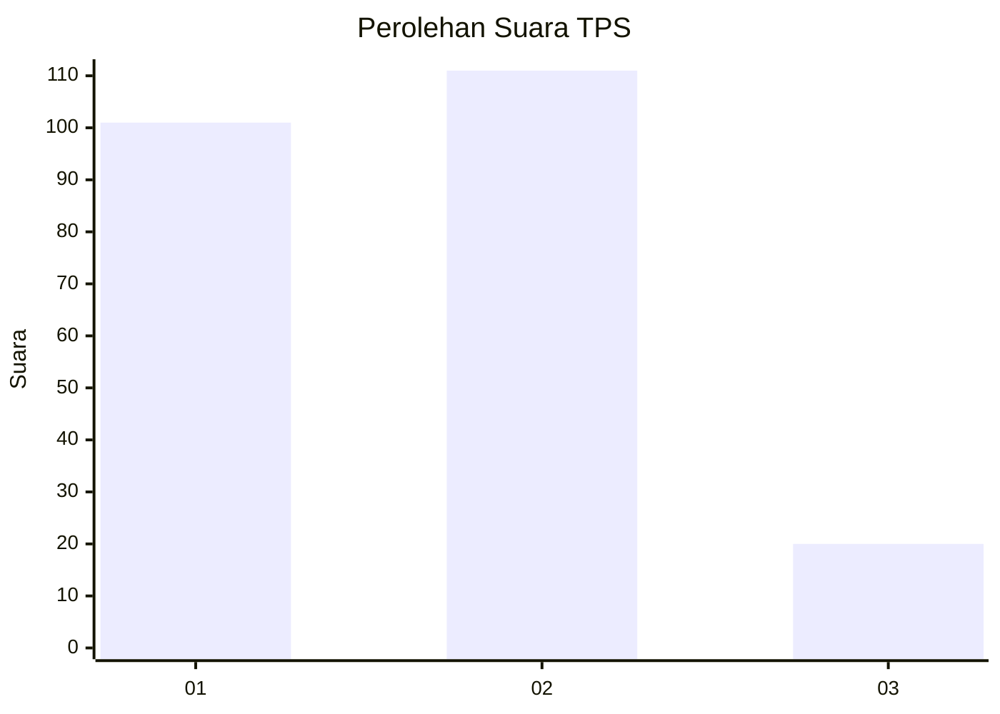
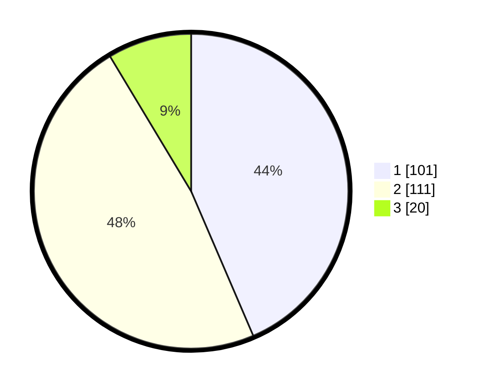

# Hasil

## Grafik

## Tabel

| No. | Nama Paslon    | Suara | Suara (raw) | Persentase |
|:--- |:-------------- | -----:| -----------:| ----------:|
| 1   | ANIES MUHAIMIN | 101   | [101][p-1]  | 43,53      |
| 2   | PRABOWO GIBRAN | 111   | [111][p-2]  | 47,84      |
| 3   | GANJAR MAHFUD  | 20    | [20][p-3]   | 8,62       |

[p-1]: https://github.com/gigit-pemilu/pemilu-2024/blob/main/pilpres/hitung-suara/sub/32-jawa-barat/sub/73-kota-bandung/sub/30-mandalajati/sub/1003-pasir-impun/sub/007-tps/sub/paslon-1.txt
[p-2]: https://github.com/gigit-pemilu/pemilu-2024/blob/main/pilpres/hitung-suara/sub/32-jawa-barat/sub/73-kota-bandung/sub/30-mandalajati/sub/1003-pasir-impun/sub/007-tps/sub/paslon-2.txt
[p-3]: https://github.com/gigit-pemilu/pemilu-2024/blob/main/pilpres/hitung-suara/sub/32-jawa-barat/sub/73-kota-bandung/sub/30-mandalajati/sub/1003-pasir-impun/sub/007-tps/sub/paslon-3.txt

## Foto C Plano

https://sirekap-obj-formc.kpu.go.id/ed1f/pemilu/ppwp/32/73/30/10/03/3273301003007-20240214-203708--22967eb9-99a4-4f30-8ecb-520db9c8d410.jpg

https://sirekap-obj-formc.kpu.go.id/ed1f/pemilu/ppwp/32/73/30/10/03/3273301003007-20240217-115819--bade58a5-7bca-4a8c-87d4-2f6ed015e97e.jpg

https://sirekap-obj-formc.kpu.go.id/ed1f/pemilu/ppwp/32/73/30/10/03/3273301003007-20240217-115210--61d56f4c-3900-40ed-834d-9c1a4675ebc1.jpg

## Metadata

| Key        | Value               |
| ---------- | ------------------- |
| Time Stamp | 2024-02-25 14:00:00 |

